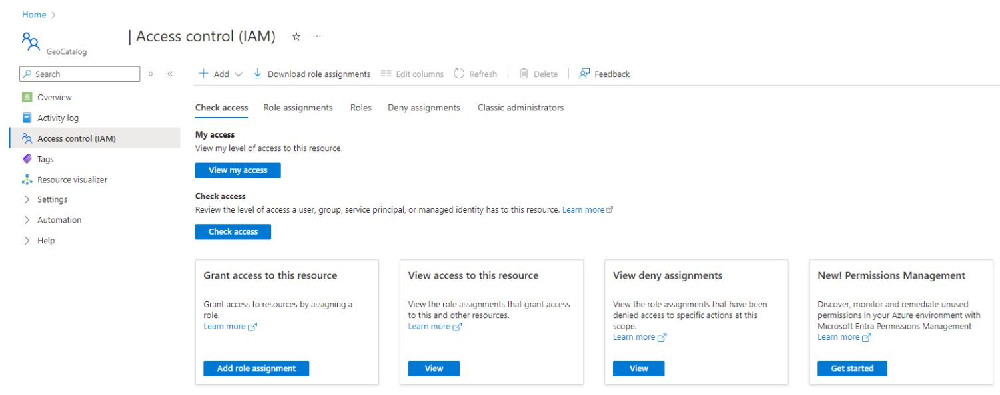
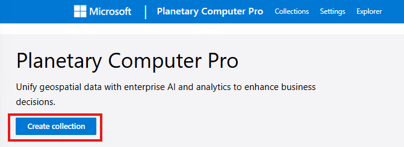
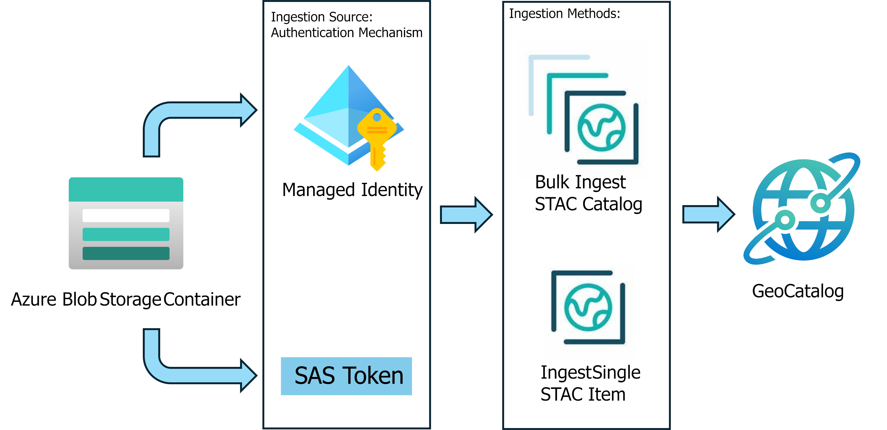
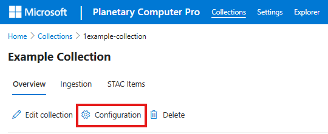
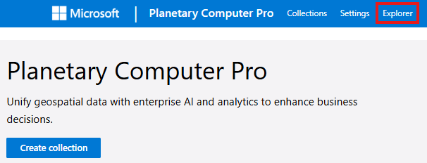

# Get started with Microsoft Planetary Computer Pro

Microsoft Planetary Computer Pro is an Azure cloud service for storing, cataloging, and securely distributing geospatial data across an enterprise. This Get Started guide assists you with the basics of deploying the service and creating your first [SpatioTemporal Asset Catalog (STAC) Collection](./stac-overview.md) to store and distribute your geospatial data. 

## Prerequisites

- An Azure account and subscription [Create an account for free](https://azure.microsoft.com/free/?WT.mc_id=A261C142F).

## Table of Contents

| Get Started                     | Deeper Dive                                   |
|-------------------------------------|-----------------------------------------|
| [Deploy a GeoCatalog Resource in your Azure Subscription](#deploy-a-geocatalog-resource-in-your-azure-subscription) | [Quickstart: Deploy a GeoCatalog Resource](./deploy-geocatalog-resource.md)            |
| [Create a STAC Collection to organize your data](#create-a-stac-collection-to-organize-your-data) | [Create a STAC Collection to organize your data](./create-collection-web-interface.md)                |
| [Ingest Data into a STAC Collection](#ingest-data-into-a-stac-collection) | [Concept: Ingestion](./ingestion-overview.md)      |
| [Configure Your STAC Collection for Visualization](#configure-your-stac-collection-for-visualization) | [Concept: STAC Collection Configuration & Visualization](./configure-collection-web-interface.md)  |
| [Connect and Build Applications with your Data](#connect-and-build-applications-with-your-data) | [Connect and Build Applications with Your Data](./build-applications-with-planetary-computer-pro.md) |

## Deploy a GeoCatalog Resource in your Azure Subscription

A Microsoft Planetary Computer Pro deployment is called a GeoCatalog and is available to deploy through the Azure portal. 

To deploy a GeoCatalog, navigate to the [Azure portal](https://portal.azure.com/) and search for "GeoCatalog"

Full details of the deployment process are available in the [Deploy GeoCatalog Quickstart](./deploy-geocatalog-resource.md).

Once the service is deployed, access to the GeoCatalog resource can be controlled through the **Access control (IAM)** tab in the left sidebar:

More details on the **GeoCatalog Administrator** and **GeoCatalog Reader** roles are available in [Manage Access](./manage-access.md) documentation.

## Create a STAC Collection to organize your data

All data managed in Microsoft Planetary Computer Pro is organized into groupings conforming to the [STAC Collection standard.](./stac-overview.md#stac-collections) 

To create a new STAC Collection, open the GeoCatalog web interface by clicking on the GeoCatalog URI link on the Resource overview page in the Azure Portal. After opening the web interface, select the **Create collection** button:

More details setting up your STAC collection can be found in the [Create Collection from the Web Interface](./create-collection-web-interface.md) and [Create Collection from the API](./create-stac-collection.md) quickstarts. 

## Ingest Data into a STAC Collection

[Ingestion](./ingestion-overview.md) is the process of copying your data from an external data store to your GeoCatalog resource and cataloging it. Data that isn't in a cloud-optimized format is converted into cloud-optimized format during ingestion. 

The recommended and most secure method for ingesting data is to have the data stored in Azure Blob Storage and for you to provide read access to Blob Storage container using Managed Identity. 

>[!WARNING]
>All data ingested into Planetary Computer Pro requires [STAC Items](./stac-overview.md#introduction-to-stac-items). 

>[!TIP]
> To accelerate the creation of STAC Items, we have a [detailed tutorial](./create-stac-item.md) and also have an open source tool called STAC Forge.

### Get your data ready for Ingestion
> [!div class="checklist"]
> * [Setup Managed Identity Access to your Azure Blob Storage](./set-up-ingestion-credentials-managed-identity.md)
> * [Create STAC Items for your data](./create-stac-item.md)
> * Ingest Your Data a [single item at a time](./add-stac-item-to-collection.md) or through [bulk ingestion](./bulk-ingestion-api.md)

## Configure Your STAC Collection for Visualization

Ingested data can be visualized both in the built-in [Data Explorer](./use-explorer.md) or through your own applications. 

>[!NOTE]
> A STAC Collection must be configured to support visualization before it is visible in the Data Explorer. 

Planetary Computer Pro's Tiler service [requires configuration](./collection-configuration-concept.md) to properly display your ingested data. All of these configuration options are available under the **Configuration** tab in the STAC Collection view:

### Get your STAC Collection ready for Visualization
> [!div class="checklist"]
> * [Review Supported Data Types](./supported-data-types.md)
> * [Configure Mosaic Settings](./mosaic-configurations-for-collections.md)
> * [Setup Rendering](./render-configuration.md)
> * [Adjust Tile Settings](./tile-settings.md)

## Connect and Build Applications with your Data

Once data has been ingested, it's available for use in [applications inside and outside of Microsoft Planetary Computer Pro](./build-applications-with-planetary-computer-pro.md). 

Data that is [configured for visualization](./configure-collection-web-interface.md) can be searched and viewed through the [Data Explorer tab](./use-explorer.md).  

Data can also be accessed directly using the [GeoCatalog APIs](/rest/api/planetarycomputer). For details on establishing permissions for your applications, review the [Application Authentication](./application-authentication.md) documentation. 

Planetary Computer Pro supports [connecting collections to ESRI's ArcGIS Pro Service](./create-connection-arc-gis-pro.md) to enable GIS-type work flows. 

## Get help

1. Review the [rest of the documentation](/azure/planetary-computer) for relevant articles
2. [Check out Microsoft Q&A](https://learn.microsoft.com/answers/tags/133/azure) to ask a question or find answers from others
3. [File a Support Ticket](https://azure.microsoft.com/support/create-ticket)

## Next steps

To get started with an end-to-end workflow, try this interactive tutorial:

> [!div class="nextstepaction"]
> [Using the Planetary Computer Pro APIs to Ingest and Visualize Data](./api-tutorial.md)
