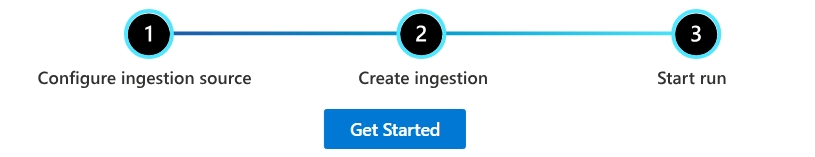
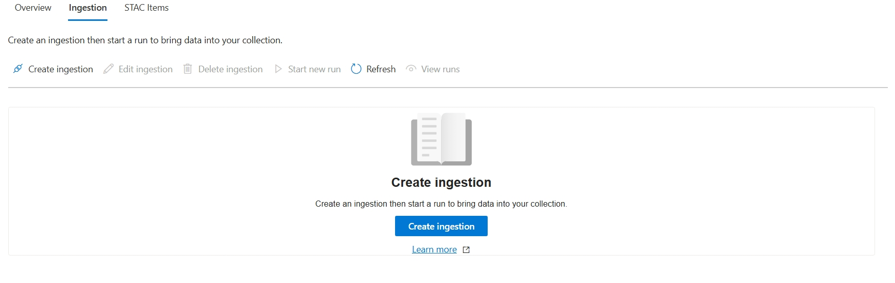
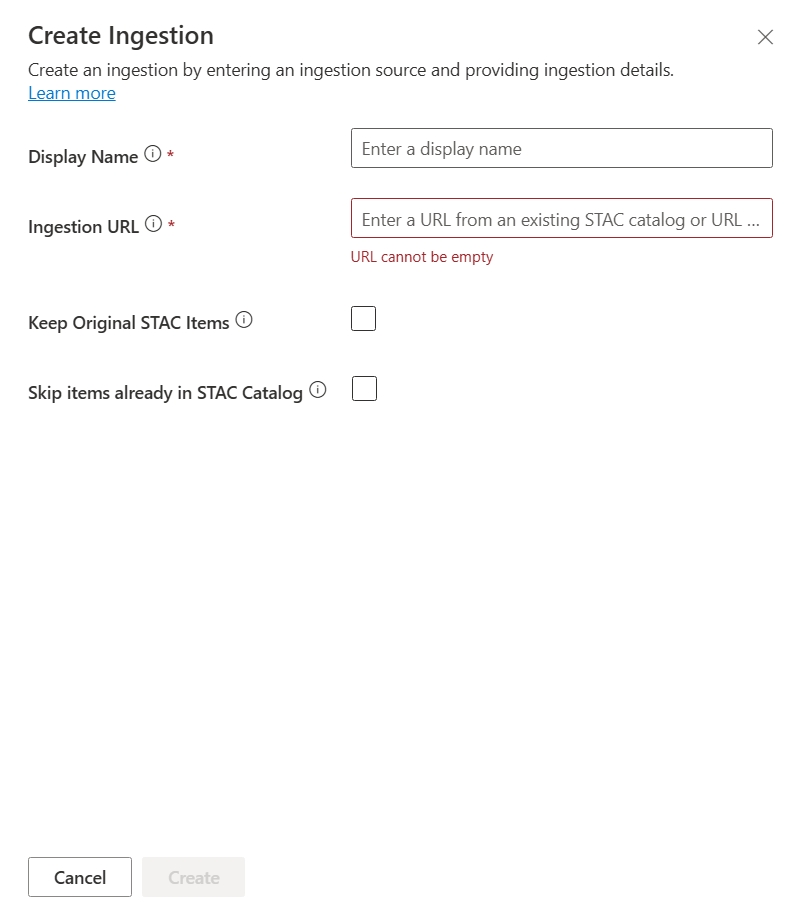
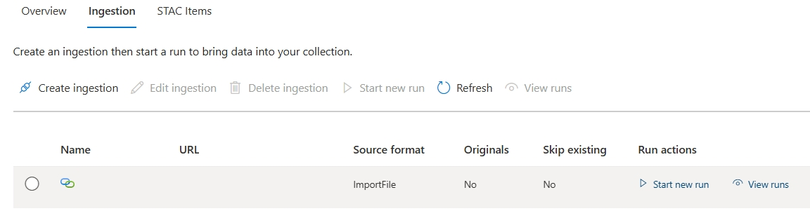
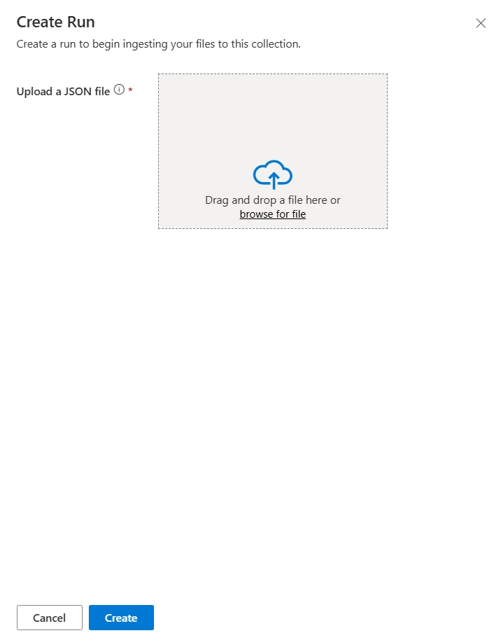
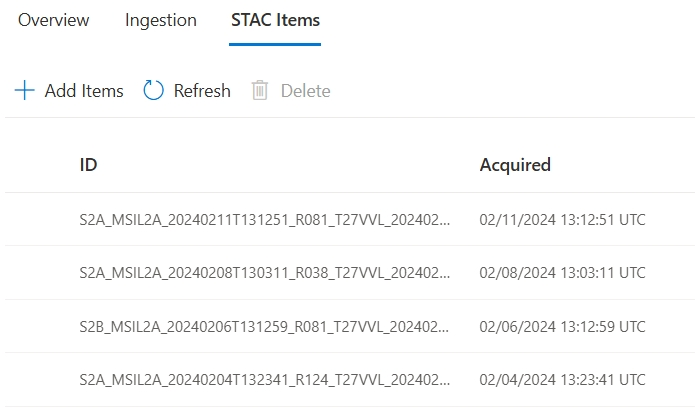

# Quickstart: Ingest data using the Microsoft Planetary Computer Pro web interface

This quickstart explains how to ingest data into your collection using the Microsoft Planetary Computer Pro web interface. This approach is ideal if you're less comfortable using APIs, and want to use a graphical user interface to manage your geospatial data and navigate Planetary Computer Pro.

## Prerequisites

Before using this quickstart, you need:

- An Azure account with an active subscription. Use the link [Create an account for free](https://azure.microsoft.com/free/?WT.mc_id=A261C142F).
- An active GeoCatalog instance. Use the link to [Create a GeoCatalog](./deploy-geocatalog-resource.md).
- An Azure blob storage container with:
  - A geospatial dataset in a supported format. See [Supported data types](./supported-data-types.md) for more information.
  - Associated STAC metadata for the dataset. See [Create STAC Item](./create-stac-item.md) for more information.
- A web browser to access the Planetary Computer Pro web interface.
- A collection created using the [Quickstart: Create a collection with the Microsoft Planetary Computer Pro web interface](./create-collection-web-interface.md) or the [Quickstart: Create a STAC collection with Microsoft Planetary Computer Pro GeoCatalog](./create-stac-collection.md).

## Configure your ingestion source

Once you create a collection, you're ready to ingest data. The first step, however, is to configure your ingestion source. You can do this by navigating to the **Settings** page. For more information on ingestion sources, see [Ingestion sources](./ingestion-source.md).

### Configure your ingestion source in the **Settings** page

Whether you want to use managed identity or a shared access signature, you can  configure you ingestion source by following the steps outlined in [Configure an ingestion source in Microsoft Planetary Computer Pro using managed identity](./set-up-ingestion-credentials-managed-identity.md) or [Configure an ingestion source in Microsoft Planetary Computer Pro using a shared access signature](./set-up-ingestion-credentials-sas-tokens.md). 

## Create ingestion

Now that you have configured an ingestion source, refer to the following steps to create an ingestion:

1. Navigate to the collection in which you want to ingest data. 

> [!NOTE] 
> If you have not already ingested data into your collection, a graphic showing the 3 steps to get started appears on the **Overview** tab, '1. Configure ingestion source, 2. Create ingestion, 3. Start run,' along with a **Get started** button.

2. Select the **Get started** button, and you're taken to the **Ingestion** tab of the collection.
     

    > [!NOTE]
    > If you already ingested data into this collection, and want to create another ingestion, you can navigate to the **Ingestion** tab of the collection.

3. If you haven't yet configured an ingestion source, a graphic appears prompting you to do so. Select the **Create ingestion source** button to navigate to the **Settings** page where you can configure your ingestion source. If you have already configured an ingestion source, you'll see a graphic prompting you to **Create ingestion**. Select the **Create ingestion** button to open the **Create ingestion** panel.
    

4. To create your ingestion, input a Display Name and Ingestion URL (URL of the STAC catalog json organizing your STAC items). You can also check the boxes to 'Keep Original STAC items' or 'Skip items already in STAC catalog.' You may or may not want to check those boxes depending on your use cases or whether you already ingested data into this collection.
    

5. Once you have filled out all the fields, select **Create** to create your ingestion.

6. After you define and authenticate your ingestion path, which can be seen in your list of ingestions in your collection, you still need to start an ingestion run in order to pull your data in. Select the **Start new run** button from the **Run actions** column to open the **Create run** panel.
    

7. Select **Create** to start the run, which will bring you back to the **Ingestion** tab, where you can select the **View runs** button to see the status of your ingestion. 
    

8. When the ingestion run is complete, the **STAC items** tab in your collection displays your list of STAC items that have been ingested, with columns for the item ID and acquisition date. 
    

## Troubleshooting

If you encounter issues during the ingestion process, such as failures in creating an ingestion source, starting a run, or if items don't appear as expected, refer to the following resources:

- [Troubleshooting data ingestion in Microsoft Planetary Computer Pro](./troubleshooting-ingestion.md): Provides guidance on diagnosing common ingestion problems.
- [Error codes: Microsoft Planetary Computer Pro ingestion](./error-codes-ingestion.md): Lists common error codes and their meanings.

## Next steps

Once you have ingested data, it's time to configure the STAC Collection so you can visualize your data in the Explorer. 

> [!div class="nextstepaction"]
> [Quickstart: Configure a collection with the Microsoft Planetary Computer Pro web interface](./configure-collection-web-interface.md)
