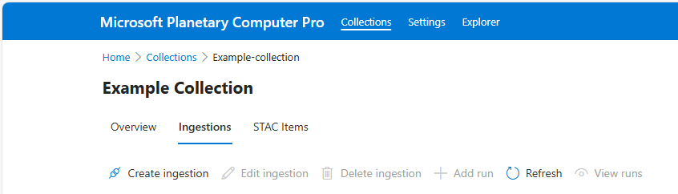

# Ingest data into Microsoft Planetary Computer Pro

Microsoft Planetary Computer (MPC) Pro ingestion capabilities allow users to bring their own data into a cloud-enabled platform effective at indexing, storing, and querying geospatial assets at scale. Data ingested and stored in an MPC Pro GeoCatalog uses the SpatioTemporal Asset Catalog (STAC) open-standard to index, query, and retrieve geospatial data. For more information on STAC, see [STAC overview](./stac-overview.md).

## Prerequisites

- [Azure account with an active subscription](https://azure.microsoft.com/free/?ref=microsoft.com&utm_source=microsoft.com&utm_medium=docs&utm_campaign=visualstudio)
- [Deployed GeoCatalog resource](./deploy-geocatalog-resource.md)

## Ingestion Sources

[Ingestion sources](./ingestion-source.md) are representations of the location and authentication mechanisms required to ingest data into a GeoCatalog resource. Users can list and configure ingestion sources in the **Settings** tab of the Data Plane UI or using the GeoCatalog API. Once the ingestion source is set, data stored in that location is available for secure ingestion into your Geocatalog.

### Supported Storage Types

MPC Pro supports ingestion of geospatial assets from the following storage sources: 

* Azure Blob Storage with Managed Identity and SAS Tokens
* Public URLs 
* S3 buckets with signed keys

All ingestion workflows require [STAC Metadata](./stac-overview.md) to be available for the data you wish to ingestion. 

## Ingestion Methods

Once an ingestion credential for a blob storage container or public URL is provided to MPC Pro, you can ingest existing STAC collections, STAC items, and assets that are stored within that container into MPC Pro.
MPC Pro must have access to both the STAC collection JSON and the geospatial assets (images, data, etc.) that the STAC collection STAC items point to. 

There are two available ingestion methods depending on use case: bulk ingestion and single item ingestion. Each can be done through Data Plane UI or the API.

### Bulk Ingestion

Bulk ingestion allows users to automatically ingest an existing STAC Collection, including its collection JSON file,  associated STAC Items, and the underlying STAC assets (images, data, etc.). Bulk ingestion quickly moves these artifacts into a GeoCatalog by specifying the data source (for example, Blob Storage), connection URL, and item type. Bulk Ingestion uses these inputs and parameters to execute an ingestion workflow. See [Bulk Ingestion API](./bulk-ingestion-api.md).

During the ingestion process, GEOTIFF, JPEG, JPEG2000, PNG, and TIFF files are transformed to COGs (Cloud Optimized GeoTIFFs), but users can select an option to copy original files as well. Bulk ingestion also supports cloud optimization for various data cube formats; see [Data cube Overview](./datacube-overview.md) Users can also select to skip certain items in the catalog. Bulk ingestion can be performed through the Data Plane UI, or the bulk ingestion API.

### Single Item Ingestion

Given a preexisting STAC collection within a GeoCatalog, users can ingest new or update existing STAC items and their associated assets using MPC Pro's Data Plane UI, or the API. In contrast to MPC Pro's Bulk Ingestion feature, Single Item ingestion is intended for low-latency imports or updates vs large data migrations.

 

## Related content

- [STAC Overview](./stac-overview.md)
- [Ingestion sources](./ingestion-source.md)
- [Add STAC Items to a Collection with GeoCatalog and Python](./add-stac-item-to-collection.md)
- [Bulk Ingestion API](./bulk-ingestion-api.md)