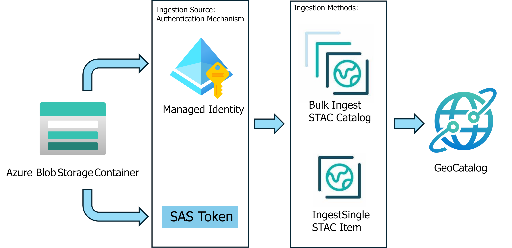

# Ingest data into Microsoft Planetary Computer Pro

Microsoft Planetary Computer Pro ingestion capabilities allow users to bring their own data into a cloud-enabled platform effective at indexing, storing, and querying geospatial assets at scale. Data ingested and stored in an Planetary Computer Pro GeoCatalog uses the SpatioTemporal Asset Catalog (STAC) open-standard to index, query, and retrieve geospatial data. For more information on STAC, see [STAC overview](./stac-overview.md).

This diagram provides an overview of how the various elements in the ingestion service work together:

## Prerequisites

- [Azure account with an active subscription](https://azure.microsoft.com/free/?ref=microsoft.com&utm_source=microsoft.com&utm_medium=docs&utm_campaign=visualstudio)
- [Deployed GeoCatalog resource](./deploy-geocatalog-resource.md)

## Ingestion Sources

[Ingestion sources](./ingestion-source.md) are representations of the location and authentication mechanisms required to ingest data into a GeoCatalog resource. Users can list and configure ingestion sources in the **Settings** tab of the web interface or using the GeoCatalog API. Once the ingestion source is set, data stored in that location is available for secure ingestion into your GeoCatalog.

### Supported Storage Types

Planetary Computer Pro supports ingestion of geospatial assets from the following storage sources: 

* Azure Blob Storage with Managed Identity and SAS Tokens
* Public URLs 
* S3 buckets with signed keys

>[!WARNING]
>All data ingested into Planetary Computer Pro requires [STAC Items](./stac-overview.md#introduction-to-stac-items). 

>[!TIP]
> To accelerate the creation of STAC Items, we have a [detailed tutorial](./create-stac-item.md) and also have an open source tool called [STAC Forge](https://github.com/Azure/microsoft-planetary-computer-pro/tree/main/tools/stacforge-functions).

## Ingestion Methods

When you provide an ingestion source, such as a blob storage container or public URL, Planetary Computer Pro can access your data. You can ingest STAC collections, STAC items, and assets stored in the specified location into Planetary Computer Pro. The GeoCatalog resource must have access to both the STAC collection JSON and the geospatial assets (images, data, etc.) that the STAC collection STAC items point to. 

During the ingestion process, GEOTIFF, JPEG, JPEG2000, PNG, and TIFF files are transformed to [COGs (Cloud Optimized GeoTIFFs)](https://cogeo.org/), but users can select an option to copy original files as well. 

>[!NOTE]
> Data already in COG format isn't transformed.

Ingestion also supports cloud optimization for various data cube formats; see [Data cube Overview](./data-cube-overview.md) Users can also select to skip certain items in the catalog. 

There are two available ingestion methods depending on use case: [bulk ingestion](#bulk-ingestion) and [single item ingestion](#single-item-ingestion). Each can be done through the web interface or the API.

### Bulk Ingestion

Bulk ingestion allows users to automatically ingest an existing STAC Collection, including its collection JSON file,  associated STAC Items, and the underlying STAC assets (images, data, etc.). Bulk ingestion quickly moves these artifacts into a GeoCatalog by specifying the data source (for example, Blob Storage), connection URL, and item type. Bulk Ingestion uses these inputs and parameters to execute an ingestion workflow. For more information about bulk ingestion, see [Ingest data into GeoCatalog with the Bulk Ingestion API](./bulk-ingestion-api.md). 

### Single Item Ingestion

Given a preexisting STAC collection within a GeoCatalog, users can ingest new or update existing STAC items and their associated assets using Planetary Computer Pro's web interface, or the API. In contrast to Planetary Computer Pro's Bulk Ingestion feature, Single Item ingestion is intended for low-latency imports or updates vs large data migrations. For more information about bulk ingestion, see [Add STAC Items to a Collection](./add-stac-item-to-collection.md).

## Next steps
Learn more about how to setup an Ingestion Source:

> [!div class="nextstepaction"]
> [Ingestion Sources](./ingestion-source.md)

## Related content

- [Configure an ingestion source for Microsoft Planetary Computer Pro using managed identity](./set-up-ingestion-credentials-managed-identity.md)
- [Add STAC Items to a Collection with GeoCatalog and Python](./add-stac-item-to-collection.md)
- [Ingest data into GeoCatalog with the Bulk Ingestion API](./bulk-ingestion-api.md)