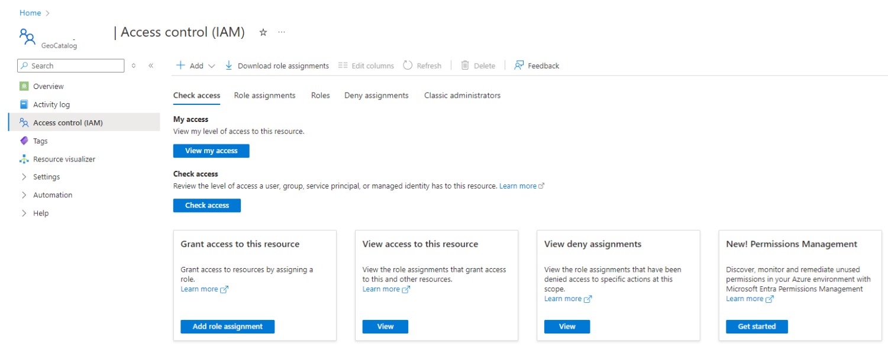

# Manage access for Microsoft Planetary Computer Pro

This article shows you how to manage identities in [Microsoft Entra ID](/entra/fundamentals/whatis), and how to configure role-based access control (RBAC) for Microsoft Planetary Computer Pro. This process allows the user to assign specific GeoCatalog resource access permissions to Microsoft Entra identities.

## Prerequisites

- Azure account with an active subscription - [create an account for free](https://azure.microsoft.com/free/?ref=microsoft.com&utm_source=microsoft.com&utm_medium=docs&utm_campaign=visualstudio)
- An existing [GeoCatalog resource](./deploy-geocatalog-resource.md)

## Create and Manage Users

Create and manage your users list by following the Microsoft Entra ID [create, invite, and delete users](/entra/fundamentals/how-to-create-delete-users) how-to article. Once your users are created, you need to grant proper permissions to them to access a GeoCatalog resource with the assignment of one or more RBAC roles. 

Planetary Computer Pro defines two GeoCatalog resource specific roles, in addition to Azure built in roles:

| **Role**                          | **Description**                                                                                     | **Allows RBAC Management?** |
|------------------------------------|-----------------------------------------------------------------------------------------------------|----------------------|
| **GeoCatalog Administrator**       | Allows the user to read, write, and delete data inside a GeoCatalog                                 | No                   |
| **GeoCatalog Reader**              | Allows the user to only read GeoCatalogs data.                                                          | No                   |
| **Owner**                          | Azure built-in role that grants full access to all resources, including the ability to manage RBAC.  | Yes                  |
| **User Access Administrator**      | Azure built-in role that allows management of user access to Azure resources.                      | Yes                  |
| **Role Based Access Control Administrator** | Azure built-in role that allows management of RBAC assignments and permissions.                   | Yes                  |

> [!NOTE]
> **Owner** is also a **GeoCatalog Administrator**.

## Assigning Role Based Access Control to a user

You can use the Azure portal to assign RBAC roles to Planetary Computer Pro users. This section demonstrates how to use the GeoCatalog **Access Control (IAM)** controls to assign the **GeoCatalog Administrator** role to one or more users.

1. Within Azure portal, go to your GeoCatalog resource **Access control (IAM)** tab in the left sidebar:

    

1. Select **Add** > **Add role Assignment**. 
1. Select **GeoCatalog Administrator** from the list of **Job function roles**, and then select the **Next** button at the bottom of the page:

    

1. Select the radio button of **User, group, or service principal**:

    

1. Select **Select members**
1. Search for the user on the **Select members** pane that appears on the right-hand side. Select a name or identity from the list to add it to the list of **Selected Members**. Repeat this step for each of the users that need to be assigned this role. 
1. When all the users for whom you need to assign this role are selected, use the **Select** button at the bottom of the pane to close the pane.

1. Select **Next** at the bottom of the page.
1. Verify the information, then complete the assignment by selecting **review + assign**.

Now the selected users are able to access the GeoCatalog resource, either through Azure portal or APIs.

## Related content

- [Configure Application Authentication for Microsoft Planetary Computer Pro](./application-authentication.md)