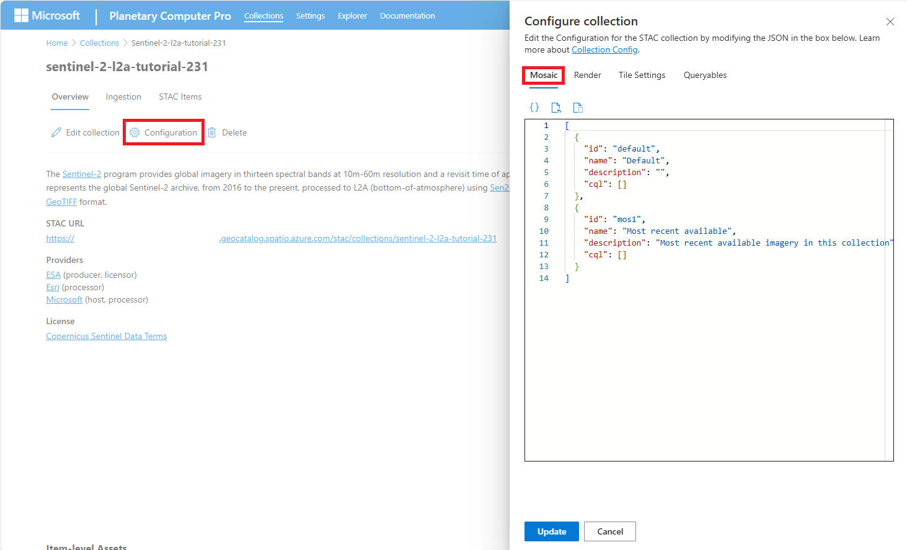

# Mosaic configurations for collections in Microsoft Planetary Computer Pro

Within each GeoCatalog STAC (SpatioTemporal Asset Catalog) collection, a **mosaic** specifies the search criteria used to retrieve and visualize STAC items within the Explorer web interface. For example, a mosaic might be configured to only return items that are from a specified date range or items that have less than a particular percentage cloud cover. One or more mosaics are created and managed by the user by editing the mosaic configuraiton for within each STAC collection.

## Prerequisites

Before you can configure a mosaic, ensure the following prerequisite steps are complete:

1.  **STAC Collection Exists:** You created a [STAC collection in Planetary Computer Pro](./create-stac-collection.md).
2.  **Data Ingested:** You [added STAC items](./add-stac-item-to-collection.md) containing the geospatial data assets you want to visualize into the collection.

## Components in a Mosaic

A STAC collection's mosaic configuration objects is a list of individual specific search criteria, each called a mosaic. Each individual mosaic includes:

- `id`: A unique identifier for the mosaic  
- `name`: A human-readable title  
- `description`: Info about the mosaic  
- `cql`: A [CQL2](https://github.com/stac-api-extensions/filter) (Common Query Language) expression that defines the search parameters for STAC items to be found and visualized

## Configuring Mosaics from the Collection Page

On a collection's landing page, select the **Configuration** button to open the _Edit Collection Config_ pane.

Inside this pane, navigate to the **Mosaics** tab.

[  ](media/mosaic-configuration-screenshot.png#lightbox)

The mosaic configurations for a collection are visible as a JSON object list, where each object represents a named mosaic configuration. 

## Example Mosaic Configurations used in Open Planetary Computer

### From Sentinel-2 L2A Collection [View on Planetary Computer](https://planetarycomputer.microsoft.com/dataset/sentinel-2-l2a)

A mosaic configuration with these mosaics from the Sentinel-2 L2A colleciton would enable three different ways to visualize Sentinel-2 imagery in the Explorer interface: 
1. ```id: "most_recent"```: Most recent STAC Items (any cloud cover), 
1. ```id: "recent_low_cloud"```: Most recent STAC Items with low (less than or equal to 10%) cloud cover, and 
1. ```id: "jun_aut2022_low_cloud"```: STAC Items from between June - August 2022 with low (less than or equal to 10%) cloud cover.

```json
[
  {
    "id": "most_recent",
    "name": "Most recent (any cloud cover)",
    "description": "",
    "cql": []
  },
  {
    "id": "recent_low_cloud",
    "name": "Most recent (low cloud)",
    "description": "Less than 10% cloud cover",
    "cql": [{"op":"<=",
            "args": [{"property": "eo:cloud_cover"}, 10]}]
  },
  {
    "id": "jun_aug2022_low_cloud",
    "name": "Jun - Aug, 2022 (low cloud)",
    "description": "",
    "cql": [{"op":"anyinteracts",
            "args": [ {"property": "datetime"},
                      {"interval": ["2022-06-01", "2022-08-31T23:59:59Z"]} ]},
            {"op": "<=",
            "args": [{"property": "eo:cloud_cover"}, 10]}]
  }
]
```

### USDA Cropland Data Layers Collection [View on Planetary Computer](https://planetarycomputer.microsoft.com/dataset/usda-cdl)

Each collection may have its own set of properties that can be used in the `cql` for a specific search criteria. This mosaic configuration specifies a mosaic with `cql` that filters items based on their `usda_cdl:type` property. In this case, the mosaic specifies a filter for data of `usda_cdl:type:` equal to `cropland`. By default, the items returned from the search are sorted by recency. 

```python
[
  {
    "id": "usda_cdl_cropland",
    "name": "Most recent cropland",
    "description": "Most recent cropland data",
    "cql": [{"op":"=",
          "args": [ {"property": "usda_cdl:type"}, "cropland"]}]
  }
]
```

## Related content

- [Render configuration for Microsoft Planetary Computer Pro](./render-configuration.md)
- [Tile settings for Microsoft Planetary Computer Pro](./tile-settings.md)
- [Queryables for Microsoft Planetary Computer Pro Data Explorer custom search filters](./queryables-for-explorer-custom-search-filter.md)
