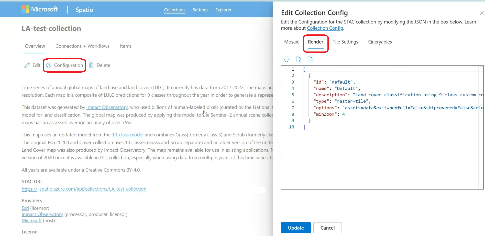

# Configure render settings for visualizing data in Microsoft Planetary Computer Pro

To visualize geospatial data using the Microsoft Planetary Computer Pro data explorer or the Tiler API, you must define one or more **render configurations** for each of your SpatioTemporal Asset Catalog (STAC) collections. A render configuration specifies how the data assets within your STAC items are combined, processed, and styled to create map tiles.

This guide walks you through the process of creating render configurations, from understanding prerequisites to configuring advanced options. Planetary Computer Pro's rendering capabilities are built upon the open-source [TiTiler](https://developmentseed.org/titiler/) project.

## Prerequisites

Before you can configure rendering, ensure the following prerequisite steps are complete:

1.  **STAC Collection Exists:** You created a [STAC collection in Planetary Computer Pro](./create-stac-collection.md).
2.  **Data Ingested:** You [added STAC items](./add-stac-item-to-collection.md) containing the geospatial data assets you want to visualize into the collection.

## Process to build a Render Configuration
| Step | Title                                                                                             | Description                                                                                                |
| :--- | :------------------------------------------------------------------------------------------------ | :--------------------------------------------------------------------------------------------------------- |
| 1    | [Define `item_assets` in your Collection JSON](#step-1-define-item_assets-in-your-collection-json) | First, you need to ensure your STAC collection JSON includes a well-defined [`item_assets`](./stac-overview.md#item-assets) section that describes the common assets within your items. |
| 2    | [Understand Your Data and Visualization Goal](#step-2-understand-your-data-and-visualization-goal) | Next, determine the type of data you're working with and decide how you want it to appear visually (single-band colormap, multi-band RGB). |
| 3    | [Construct the Render Configuration Object](#step-3-construct-the-render-configuration-object)     | Now, create the basic JSON structure that holds one or more render configurations for the Explorer UI.         |
| 4    | [Define the `options` String - Core Parameters](#step-4-define-the-options-string---core-parameters) | Configure the essential TiTiler parameters within the `options` string to select the correct assets or bands and apply basic styling like colormaps or rescaling. |
| 5    | [Add Advanced `options` Parameters (As Needed)](#step-5-add-advanced-options-parameters-as-needed) | Optionally, enhance your visualization by adding advanced TiTiler features like expressions, algorithms, color correction, or custom colormaps using the `options` string. |
| 6    | [Add the Render Configuration to Your Collection](#step-6-add-the-render-configuration-to-your-collection) | Finally, apply the render configuration list you created to your STAC collection using either the web interface or the API.      |

## Step 1: Define `item_assets` in your Collection JSON

The item_assets field in your collection JSON is essential for rendering because it provides a consolidated description of the assets contained within the collection's items. The rendering engine and the Explorer web application use the item_assets field to understand the available data for visualization without inspecting individual items. It declares the keys (names) of the assets, such as `image`, `red`, `NIR`, or `elevation`, which are then referenced by the render configurations. Additionally, item_assets can include STAC extension metadata like `eo:bands` for multi-band assets, facilitating the selection of specific bands for rendering. The Explorer uses this information to populate menus and understand the overall data structure.

**Example `item_assets` for a 4-band NAIP asset:**

```json
{
  "item_assets": {
    "image": {
      "type": "image/tiff; application=geotiff; profile=cloud-optimized",
      "roles": [
        "data"
      ],
      "title": "RGBIR COG tile",
      "eo:bands": [
        {
          "name": "Red",
          "common_name": "red",
          "description": "Red band, 610-680 nm"
        },
        {
          "name": "Green",
          "common_name": "green",
          "description": "Green band, 510-600 nm"
        },
        {
          "name": "Blue",
          "common_name": "blue",
          "description": "Blue band, 420-530 nm"
        },
        {
          "name": "NIR",
          "common_name": "nir",
          "description": "Near-infrared band, 830-920 nm"
        }
      ]
    }
  },
  // ... other collection properties ...
}
```
For more information about `item_assets`, see the [Item Assets section in the STAC Overview](./stac-overview.md#item-assets). Also refer to the official [STAC Item Assets Extension specification](https://github.com/stac-extensions/item-assets).

Ensure your STAC collection JSON includes this section before proceeding. You can update your collection definition via the [API](./create-stac-collection.md) or the [web interface](./configure-collection-web-interface.md).

## Step 2: Understand Your Data and Visualization Goal

Before building the configuration, determine how you want to visualize your data:

| Data Type                 | Description                                                              | Example                                                              | Visualization Goal                                                                                             |
| :------------------------ | :----------------------------------------------------------------------- | :------------------------------------------------------------------- | :------------------------------------------------------------------------------------------------------------- |
| **Single-Band Data**      | Each pixel has one value.                                                | elevation, temperature, land cover classification, calculated index  | Map these single values to a color range or discrete colors using a **colormap**.                              |
| **Multi-Band Data**       | Data has multiple bands per pixel.                                       | RGB satellite imagery, multi-spectral data                           | Combine three specific bands to represent the Red, Green, and Blue channels of the output image.               |
| **Derived Data (Expressions)** | Calculate a new value  from one or more bands/assets.        | Normalized Difference Vegitaiton Index (NDVI) from Red and NIR bands                                          | Define a mathematical **expression** and visualize the result (single-band with colormap or multi-band directly). |
| **Derived Data (Algorithms)** | Calculate a new value across pixels.        | Hillshade shows contours of elevation data                                          | Use a mathematical **algorithm** to transform data into a visualization. |
| **Data Cubes (GRIB/NetCDF)** | Data stored in GRIB or NetCDF formats with multiple variables and dimensions. | time, pressure levels                                                | Select a specific variable and potentially a slice through other dimensions (like time) for 2D visualization. |

## Step 3: Construct the Render Configuration Object

Render configurations are defined as a list of JSON objects (or Python dictionaries if using the API). Each object in the list represents one visualization option that will appear in the [Explorer dropdown](./use-explorer.md#Select-a-different-render-configuration).

**Basic Structure:**

```json
[
  {
    "id": "unique-render-id",
    "name": "Human-Readable Name for UI",
    "description": "Optional: More details about this render.",
    "type": "raster-tile", // Usually "raster-tile"
    "options": "key1=value1&key2=value2...", // The core TiTiler parameters
    "minZoom": 8 // Optional: Minimum map zoom level to display this layer
  },
  {
    // ... another render configuration object ...
  }
]
```

*   `id`: A unique machine-readable identifier for this render option within the collection.
*   `name`: The display name shown in the Explorer UI.
*   `description`: Optional text providing more context.
*   `type`: Typically `"raster-tile"`.
*   `options`: A string containing URL query parameters (`key=value` pairs separated by `&`) that control the TiTiler rendering engine. This is where most customization happens.
*   `minZoom`: Optional integer specifying the minimum map zoom level at which this layer becomes visible. Useful for managing performance with high-resolution data.

Using the same structure, it's possible to have multiple render configurations for the same data so data can be visualized in multiple ways. 

## Step 4: Define the `options` String - Core Parameters

The `options` string is the heart of the render configuration. It uses a `key=value&key=value` format. Here are the most common parameters:

### 1. Identifying Assets/Bands

| Parameter | Description | Use Case | Example |
| :-------- | :---------- | :------- | :------ |
| `assets={asset_key}` | Specifies the asset(s) to use, where `{asset_key}` matches a key defined in your collection's `item_assets`. | **Single-band** rendering using one asset | `assets=elevation` |
| | | **Three-band** rendering using three *separate* single-band assets (order determines R, G, B) | `assets=B04&assets=B03&assets=B02` |
| | | Rendering using a **single multi-band asset** | `assets=image` (often used with `asset_bidx`) |
| `asset_bidx={asset_key}\|{band_index1},{band_index2},...` | Selects specific band indexes *from within* a single multi-band asset specified by `assets`. Band indexes are typically 1-based. | **Three-band** RGB from bands 1, 2, 3 of asset `image` | `assets=image&asset_bidx=image\|1,2,3` |
| | | **Three-band** False Color Infrared (NIR, Red, Green) from bands 4, 1, 2 of asset `image` | `assets=image&asset_bidx=image\|4,1,2` |
| | | **Single-band** rendering using only band 4 of asset `image` | `assets=image&asset_bidx=image\|4` |

### 2. Styling Single-Band Data

| Parameter | Description | Example |
| :-------- | :---------- | :------ |
| `colormap_name={name}` | Applies a predefined named colormap. Common examples: `viridis`, `plasma`, `gray`, `rdylgn`. See [supported colormaps](./supported-colormaps.md). | `assets=elevation&colormap_name=viridis` |
| `rescale={min_val},{max_val}` | Stretches or compresses the data values to fit the full range of the colormap. Values outside this range are clamped to the min/max colors. | Map elevation values from 100 m to 1500 m across the full colormap: `assets=elevation&colormap_name=viridis&rescale=100,1500` |

### 3. Styling Multi-Band (RGB) Data

| Parameter | Description | Example |
| :-------- | :---------- | :------ |
| RGB bands order | RGB bands are implicitly defined by the order in `assets` (for separate assets) or `asset_bidx` (for bands within an asset). | See examples in the Identifying Assets/Bands table |
| `rescale={min_val},{max_val}` | *(Optional)* Can be used to scale the input values of the R, G, B bands before mapping them to the 0-255 display range. Useful if your source data isn't already 8-bit. | `assets=B04&assets=B03&assets=B02&rescale=0,3000` |
| `color_formula={formula_string}` | *(Optional)* Applies color correction formulas. | See advanced options in next section. |

## Step 5: Add Advanced `options` Parameters (As Needed)

Beyond the basics, TiTiler offers many advanced parameters via the `options` string:

### 1. Expressions

| Parameter | Description | Format/Values | Example |
| :-------- | :---------- | :------------ | :------ |
| `expression={formula}` | Define a mathematical formula using asset keys as variables | Standard operators (`+`, `-`, `*`, `/`) and parentheses | `expression=(B08-B04)/(B08+B04)` |
| `asset_as_band=true` | Required when expression uses multiple *single-band* assets | `true` or `false` | `expression=(B08-B04)/(B08+B04)&asset_as_band=true` |

**Examples**
- Single-band result example: `expression=(B08-B04)/(B08+B04)&asset_as_band=true&colormap_name=rdylgn&rescale=-1,1`
- Multi-band expressions use semicolons: `expression=B04*1.5;B03*1.1;B02*1.3&asset_as_band=true`
- When using `expression`, you generally don't need `assets` or `asset_bidx`

### 2. Algorithms

| Parameter | Description | Format/Values | Example |
| :-------- | :---------- | :------------ | :------ |
| `algorithm={name}` | Apply a predefined pixel processing algorithm | `hillshade`, `contours`, `terrarium`, `terrainrgb`, `normalizedIndex` | `algorithm=hillshade` |
| `algorithm_params={json_string}` | Parameters for the algorithm (URL-encoded JSON) | Varies by algorithm | `algorithm_params=%7B%22azimuth%22%3A%20315%2C%20%22angle_altitude%22%3A%2045%7D` |
| `buffer={integer}` | Add pixel buffer around tiles (often needed for algorithms) | Integer value | `buffer=3` |

**Example** `assets=elevation&algorithm=hillshade&colormap_name=gray&buffer=3&algorithm_params=%7B%22azimuth%22%3A%20315%2C%20%22angle_altitude%22%3A%2045%7D`

For details on specific algorithms, see the [TiTiler Algorithm documentation](https://developmentseed.org/titiler/examples/notebooks/Working_with_Algorithm/) and [Mapbox Hillshade](https://docs.mapbox.com/style-spec/reference/layers/#hillshade)

### 3. Color Correction (for RGB / Three-band output)

| Parameter | Description | Format | Example |
| :-------- | :---------- | :----- | :------ |
| `color_formula={formula_string}` | Apply color adjustments | Space-separated string with Gamma, Saturation, and/or Sigmoidal adjustments | `color_formula=Gamma RGB 2.5 Saturation 1.4 Sigmoidal RGB 15 0.35` |

**Format details:**
- `Gamma {BANDS} {VALUE}` - Adjust brightness 
- `Saturation {PROPORTION}` - Adjust color intensity
- `Sigmoidal {BANDS} {CONTRAST} {BIAS}` - Adjust contrast

For more information about color correction, see the [TiTiler documentation](https://developmentseed.org/titiler/user_guide/rendering/#color-formula).

### 4. Custom Colormaps (for single-band output)

| Parameter | Description | Format | Example |
| :-------- | :---------- | :----- | :------ |
| `colormap={json_string}` | Define a custom colormap | URL-encoded JSON mapping data values to RGBA lists `[R,G,B,Alpha]` | `colormap={\"1\":[54,124,20,255],\"2\":[28,67,0,255],\"3\":[94, 91, 32, 255],\"4\":[234, 99, 32, 255],\"5\":[237, 232, 60, 255],\"6\":[236, 31, 175, 255],\"7\":[19, 0,239, 255], \"8\":[209, 3, 0, 255]}` |

**Example decodes to:** Maps value 1 to dark green, 2 to very dark green, 3 to olive green, 4 to orange-red, 5 to yellow, 6 to pink/magenta, 7 to blue-violet, and 8 to red.

### 5. Data Handling

| Parameter | Description | Example |
| :-------- | :---------- | :------ |
| `nodata={value}` | Specify pixel value to make transparent | `nodata=0` or `nodata=-9999` or `nodata=nan` |
| `unscale={true\|false}` | Apply scale/offset from GeoTIFF metadata | `unscale=true` |

### 6. Performance / Tiling Behavior

| Parameter | Description | Format | Example |
| :-------- | :---------- | :----- | :------ |
| `maxItemsPerTile={integer}` | Limit number of STAC items per tile | Integer | `maxItemsPerTile=20` |
| `skipcovered={true\|false}` | Skip items covered by others | `true` or `false` | `skipcovered=true` |
| `exitwhenfull={true\|false}` | Stop processing when tile is fully covered | `true` or `false` | `exitwhenfull=true` |
| `time_limit={seconds}` | Maximum time for rendering a tile | Integer (seconds) | `time_limit=10` |

### 7. Data Cube Parameters (GRIB/NetCDF)

| Parameter | Data Type | Description | Example |
| :-------- | :-------- | :---------- | :------ |
| `subdataset_bands={band_index}` | GRIB | Select specific message/band | `assets=grib_data&subdataset_bands=1&colormap_name=jet&rescale=273,300` |
| `subdataset_name={variable_name}` | NetCDF | Select variable to visualize | `assets=netcdf_data&subdataset_name=temperature` |
| `datetime={timestamp}` | NetCDF | Select time slice (ISO 8601) | `datetime=2023-10-26T12:00:00Z` |

**Full NetCDF example:** `assets=netcdf_data&subdataset_name=temperature&datetime=2023-10-26T12:00:00Z&colormap_name=viridis&rescale=0,30`

## Step 6: Add the Render Configuration to Your Collection

Once you construct your render configuration list (one or more JSON objects), add it to your STAC collection:

**Using the Web Interface:**

1.  Navigate to your collection in the Planetary Computer Pro portal.
2.  Select the **Configuration** button.
3.  Go to the **Render** tab.
4.  Paste your JSON list into the editor.
5.  Save the changes by selecting **Update**.

[  ](media/render-configuration-web-interface.png#lightbox)

For more information on configuring collections, see [Configure a collection with the web interface](./configure-collection-web-interface.md). 

**Using the API:**

Define a collection render configuration using the [create stac collection render options](https://learn.microsoft.com/rest/api/planetarycomputer/data-plane/stac-collection-render-options/create) endpoint. The following is an example of using this endpoint using the REST API with Python:

```python
import requests
import json
import azure.identity

geocatalog_url = <your geocatalog url>
collection_id = <your collection id>

credential = azure.identity.AzureCliCredential()
token = credential.get_token("https://geocatalog.spatio.azure.com")
headers = {
    "Authorization": f"Bearer {token.token}"
}

response = requests.post(
    f"{geocatalog_url}/stac/collections/{collection_id}/configurations/render-options",
    json=render_config, # Your list of render config dicts
    headers=headers,
    params={"api-version": "2025-04-30-preview"} # Use the appropriate API version
)

if response.status_code == 200:
    print("Render configuration updated successfully.")
    print(response.json())
else:
    print(f"Error updating render configuration: {response.status_code}")
    print(response.text)

```
For more information on using the STAC Collection API, see [Create a STAC collection (API examples)](./create-stac-collection.md). 

## Examples

Here are various examples of the `options` string and the full render configuration object:

**1. Single-Band Biomass Change with Colormap and Rescale:**

```json
 {
    "id": "biomass-change",
    "name": "Biomass Change from prior year (tonnes)",
    "description": "Annual estimates of changes (gains and losses) in aboveground woody biomass.",
    "type": "raster-tile",
    "options": "assets=biomass_change_wm&colormap_name=spectral&rescale=-5000,5000",
    "minZoom": 2
  }
```

**2. Three-Band Natural Color (RGB) from separate assets:**

```json
 {
    "id": "natural-color",
    "name": "Natural color",
    "description": "True color composite of visible bands (B04, B03, B02)",
    "type": "raster-tile",
    "options": "assets=B04&assets=B03&assets=B02&nodata=0&color_formula=Gamma RGB 3.2 Saturation 0.8 Sigmoidal RGB 25 0.35",
    "minZoom": 9
  }
```

**3. Three-Band False Color (NIR, R, G) from bands within a single asset:**

```json
{
    "id": "color-infrared",
    "name": "Color infrared",
    "description": "Highlights healthy (red) and unhealthy (blue/gray) vegetation.",
    "type": "raster-tile",
    "options": "assets=image&asset_bidx=image|4,1,2&color_formula=Sigmoidal RGB 15 0.35",
    "minZoom": 12
  }
```

**4. NDVI Calculation using Expression:**

```json
{
    "id": "normalized-difference-veg-inde",
    "name": "Normalized Difference Veg. Index (NDVI)",
    "description": "Normalized Difference Vegetation Index (B08-B04)/(B08+B04), darker green indicates healthier vegetation.",
    "type": "raster-tile",
    "options": "nodata=0&expression=(B08-B04)/(B08+B04)&rescale=-1,1&colormap_name=rdylgn&asset_as_band=true",
    "minZoom": 9
  }
```

**5. Hillshade Algorithm:**

```json
{
    "id": "hillshade",
    "name": "Hillshade",
    "description": "Terrain visualization based on elevation.",
    "type": "raster-tile",
    "options": "assets=data&colormap_name=gray&algorithm=hillshade&buffer=3&algorithm_params=%7B%22azimuth%22%3A%20315%2C%20%22angle_altitude%22%3A%2045%7D",
    "minZoom": 7
  }
```

**6. NetCDF Temperature Visualization:**

```json
{
    "id": "pr-1950-07-07",
    "name": "Precipitation (1950-07-07)",
    "description": "Precipitation from NetCDF data.",
    "type": "raster-tile",
    "options": "assets=cmip&rescale=0,0.01&colormap_name=viridis&subdataset_name=pr&datetime=1950-07-07T00:00:00",
    "minZoom": 4
  }
```

## Reference: All `options` Parameters

The `options` string accepts the following key-value pairs (refer to [TiTiler documentation](https://developmentseed.org/titiler/endpoints/stac/) for the most up-to-date details):

| Parameter        | Type | Description | Example Usage |
| ---------------- | ---- | ----------- | ------------- |
| `assets`           | str | Asset key(s) from `item_assets`. Repeat key for multiple assets. | `assets=B04&assets=B03&assets=B02` |
| `expression`       | str | Math expression using asset keys. | `expression=(B08-B04)/(B08+B04)` |
| `asset_bidx`       | str | Band indexes for a multi-band asset. Format: `{asset_key}|{idx1},{idx2},...` | `asset_bidx=image|4,1,2` |
| `asset_as_band`    | bool | Treat assets in `expression` as single bands. Required when expression uses multiple assets. | `asset_as_band=true` |
| `colormap_name`    | str | Predefined TiTiler colormap name. | `colormap_name=viridis` |
| `colormap`         | str | URL-encoded JSON defining a custom colormap. | `colormap=%7B%221%22%3A%5B...%5D%7D` |
| `rescale`          | str | Comma-separated min, max values for data scaling. | `rescale=0,3000` |
| `color_formula`    | str | Space-separated color correction formula (Gamma, Saturation, Sigmoidal). | `color_formula=Gamma RGB 2.2 Saturation 1.1` |
| `nodata`           | str/float/int | Pixel value to treat as no data (transparent). | `nodata=0` or `nodata=-9999.0` or `nodata=nan` |
| `unscale`          | bool | Apply scale/offset from GeoTIFF metadata. | `unscale=true` |
| `algorithm`        | str | Name of a TiTiler processing algorithm. | `algorithm=hillshade` |
| `algorithm_params` | str | URL-encoded JSON string with parameters for the algorithm. | `algorithm_params=%7B%22azimuth%22%3A315%7D` |
| `buffer`           | float | Pixel buffer around tiles (often needed for algorithms). | `buffer=3` |
| `maxItemsPerTile`  | int | Max STAC items to process per tile. | `maxItemsPerTile=20` |
| `skipcovered`      | bool | Skip items fully obscured by others. | `skipcovered=true` |
| `exitwhenfull`     | bool | Stop processing a tile once fully covered. | `exitwhenfull=true` |
| `time_limit`       | int | Max processing time (seconds) per tile. | `time_limit=10` |
| `subdataset_bands` | int | Band/message index for GRIB data. | `subdataset_bands=1` |
| `subdataset_name`  | str | Variable name for NetCDF data. | `subdataset_name=temperature` |
| `datetime`         | str | ISO 8601 timestamp for selecting time slice in NetCDF. | `datetime=2023-10-26T12:00:00Z` |
| `resampling`       | str | Resampling method (`nearest`, `bilinear`). | `resampling=nearest` |


## Related content

- [Configure a collection with the Microsoft Planetary Computer Pro web interface](./configure-collection-web-interface.md)
- [Mosaic configurations for collections](./mosaic-configurations-for-collections.md)
- [Tile settings for collections](./tile-settings.md)
- [Queryables for custom search filters](./queryables-for-explorer-custom-search-filter.md)
- [Visualize data cube assets (GRIB/NetCDF)](./visualize-assets.md)
- [STAC Overview](./stac-overview.md)
- [TiTiler Documentation](https://developmentseed.org/titiler/)


