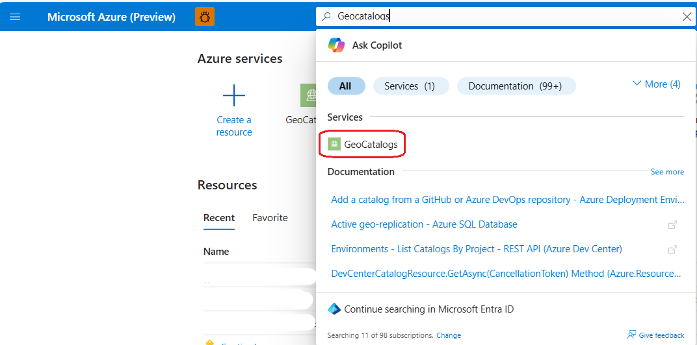

--- 
title: Configure Managed Identity for Sources in Microsoft Planetary Computer Pro
description: Learn how to add credentials and ingest data into Microsoft Planetary Computer Pro using managed identities.
author: prasadko
ms.author: prasadkomma
ms.service: planetary-computer-pro
ms.topic: how-to
ms.date: 05/08/2025

#customer intent: Help customers understand how ingestion sources work and how to add them ahead of an ingestion.
ms.custom:
  - build-2025
---

# Configure an ingestion Source for Microsoft Planetary Computer Pro using managed identity

Loading new data into a Microsoft Planetary Computer Pro GeoCatalog is called [**ingestion**](./ingestion-overview.md). Before you can ingest new data into a GeoCatalog you need to provide it credentials, or [ingestion sources](./ingestion-source.md), so it may securely access that data. 

  
In this guide, you learn how to:

> [!div class="checklist"]
> - [Create a user assigned managed identity](#create-a-user-assigned-managed-identity)
> - [Assign your managed identity the Storage Blob Data Reader role](#assign-your-managed-identity-the-storage-blob-data-reader-role)
> - [Associate a user assigned managed identity to a GeoCatalog](#associate-the-user-assigned-managed-identity-to-your-geocatalog-resource)
> - [Configure an ingestion source](#configure-an-ingestion-source)

All four steps are required to configure your GeoCatalog resource to read data from an external ingestion source. 

## Prerequisites

- A Microsoft Planetary Computer Pro GeoCatalog deployed to your Azure Subscription. See [Deploy a GeoCatalog resource](./deploy-geocatalog-resource.md).

- An Azure Blob container setup with the correct permissions to assign managed identities. See [Create an Azure storage account](/azure/storage/common/storage-account-create?tabs=azure-portal).

## Managed identity vs. SAS tokens

[Managed identities](/entra/identity/managed-identities-azure-resources/overview) provide an automatically managed identity in Microsoft Entra ID for applications to use when connecting to resources that support Microsoft Entra authentication.

[Shared Access Signatures (SAS)](/azure/storage/common/storage-sas-overview) create cryptographic credentials for access to a resource such as Azure Blob Storage. 

Managed identities are a more secure, automated mechanism for establishing persistent access to a storage account and are the recommended approach for providing secure access to Azure Blob Storage for data ingestion. 

Managed identities only work within a single Microsoft Entra tenant, therefore the SAS Token approach is useful when moving data from storage that is in a storage account outside of your tenant. 
>[!WARNING]
> GeoCatalog ingestion sources are tied to a Blob Container. When creating an ingestion source using either a managed identity or SAS token, a Blob Container URL must be provided. SAS tokens using the root storage URL aren't permitted. 

This guide shows how to create an GeoCatalog ingestion source using a managed identity. If SAS token approach is more appropriate for your use case, see how to [setup ingestion credentials using SAS](./set-up-ingestion-credentials-sas-tokens.md).

## Create a user assigned managed identity

Navigate to the [Azure portal](https://portal.azure.com/) to create a new managed identity resource. In the search bar, search for **managed identities**. 

Select the **Create** button to begin the process. In the dialogue, assign the managed identity to a Subscription, Resource Group, and Region. Once you complete these selections, click **Review + create** and then the **Create** button. 

Next, you need to associate this managed identity to your GeoCatalog. 

## Assign your managed identity the Storage Blob Data Reader role

Within the Azure portal, navigate to the storage account that contains the data you want to ingest into your GeoCatalog. Once at that resource, select the **Access Control (IAM)** button in the sidebar and then select **"Add the assignment"** button.   

Next, search for the **Storage Blob Data Reader** role in the search bar. Select the **Storage Blob Data Reader** and press the **Next** button. 

In the Members pane, select **managed identity**, which opens a new side bar. Select the **Subscription** where you created the user assigned managed identity in the previous steps, and then select **User assigned managed identity**. Select the user assigned managed identity and select the **Select** button to continue. 

There are two dialogues to review your selection. Review your selection and select the **Review + Assign** Button each time. 

## Associate the user assigned managed identity to your GeoCatalog resource

### Associate using the Azure portal
To associate your new managed identity with your GeoCatalog complete the following steps:

1. Sign in to the Azure portal.

2. Use the search bar to search for **GeoCatalogs**. Select **GeoCatalogs** from under the list of Services.

3. Use the filters to find your GeoCatalog and select it.

4. In the side bar, select **Identity** under the Security field. Once in this window, select the blue **Add user assigned managed identity** button

5. Select the user assigned managed identity you created in the earlier step, and select the blue **Add** button to complete this process.
   

Next, you will give your GeoCatalog read access to the blob storage account where your data is located using this managed identity. 

## Configure an ingestion source

In this final step you will create a new GeoCatalog ingestion source using your user assigned managed identity. 

1. Navigate to your GeoCatalog resource landing page and select the "Settings" tab. 

2. Select the **Create ingestion source** button, which opens a new sidebar.

3. Select the **managed identity** button.

4. Input the URL of the container in the storage account containing the data you wish to ingest.

    > [!IMPORTANT] 
    > You must input the entire URL including the container. It isn't possible to link only the base storage account. 

5. Select the managed identity with read access to this Azure Blob Storage account. 

6. Press the **Create** button to complete the process

Your GeoCatalog is now configured to read data from this Azure Blob Storage Container using your new managed identity.

## Next steps

Now that you have set up managed identity, it's time to ingest data. 

For Single Item Ingestion:

> [!div class="nextstepaction"]
> [Adding an Item to a STAC Collection](./add-stac-item-to-collection.md)

For Bulk Ingestion:
> [!div class="nextstepaction"]
> [Ingest data into GeoCatalog with the Bulk Ingestion API](./bulk-ingestion-api.md)

## Related content

- [Ingestion overview](./ingestion-overview.md)
- [Ingestion sources](./ingestion-source.md)
- [Set up ingestion credentials using SAS tokens](./set-up-ingestion-credentials-sas-tokens.md)
