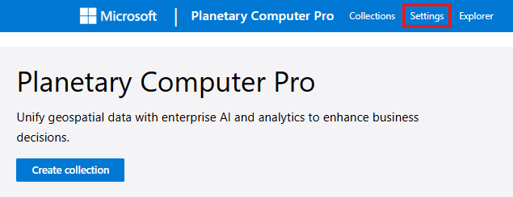

# Set up an ingestion source for Microsoft Planetary Computer Pro using SAS tokens

Loading new data into the Microsoft Planetary Computer Pro GeoCatalog resource is called **ingestion.** A GeoCatalog needs permissions, or ingestion sources, to access data that is stored externally to the GeoCatalog resource.
  
In this guide, you learn how to:

- Create a ingestion source through Azure portal
- Create a ingestion source through the Microsoft Planetary Computer Pro API using the Azure Python SDK

## Prerequisites

- A Microsoft Planetary Computer Pro GeoCatalog deployed to your Azure Subscription. See [Deploy a GeoCatalog resource](./deploy-geocatalog-resource.md).

- An Azure Blob container setup with the correct permissions to assign managed identities and to request a SAS Token. See [Create an Azure storage account](/azure/storage/common/storage-account-create?tabs=azure-portal).

## Managed identity vs. SAS tokens

[Managed identities](/entra/identity/managed-identities-azure-resources/overview) provide an automatically managed identity in Microsoft Entra ID for applications to use when connecting to resources that support Microsoft Entra authentication.

[Shared Access Signatures (SAS)](/azure/storage/common/storage-sas-overview) create cryptographic credentials for access to a resource such as Azure Blob Storage. 

Managed identities are a more secure, automated mechanism for establishing persistent access to a storage account and are the recommended approach for providing secure access to Azure Blob Storage for data ingestion. 

Managed identities only work within a single Microsoft Entra tenant, therefore the SAS Token approach is useful when moving data from storage that is in a storage account outside of your tenant.
Data ingestion is specific to a Blob Container, and SAS tokens from the root storage resource aren't permitted. 

## Set up an ingestion source through the UI

SAS tokens can be obtained multiple ways; in this guide, we do so using the [Azure portal](https://portal.azure.com/).
Azure Storage Explorer is also an alternative UI-driven approach which works on a local machine. See [Azure Storage Explorer](https://azure.microsoft.com/products/storage/storage-explorer/?msockid=06a2c34a3959646b380ed330385d65fb)

### Navigate to your storage resource

In the Azure portal, find the Storage Resource containing the Azure Blob Container with the data you wish to ingest into Planetary Computer Pro. In the Resource settings, select the **"Containers"** setting under **"Data Storage"**.

[ ](media/select-containers.png#lightbox)

### Select your blob container and request a SAS Token

Select the specific container you wish to ingest, in this example we're selecting the "test" container. 

[  ](media/select-test.png#lightbox)

Select the **"Shared access tokens"** setting and open the configuration settings.

[  ](media/generate-sas-token.png#lightbox)

Ensure these settings are set up correctly:
* Permissions = **Read** (verify no other options are selected)
* Validity of SAS Token covers time required to ingest data (the best security practice is to have this token valid no more than seven days)

Once the settings are verified, select the **"Generate SAS Token and URL"** button. You see two elements generated: the **Blob SAS Token** and the **Blob SAS URL**. Keep your window/tab open as you'll need this information for the next section. 

### Navigate to settings

Use the URL of your Planetary Computer Pro to navigate to the landing page and select the **"Settings"** tab from the navigation bar. 

[  ](media/settings-link.png#lightbox)

### Create your ingestion source

* Select the **Create ingestion source** button
* Enter the URL of your Blob Container in the **Container URL** field
    * Only include the URL and don't include the key. The format of the URL should be:

        `https://(Storage Resource Name).blob.core.windows.net/(Blob Container Name)`
* Cut and paste the SAS Token into the **Credential Token** field.
    * A SAS token looks like a query string. Include all the text starting with the `?` symbol: 
    
        *Example:* `?sv=<signed-version>&ss=<signed-services>&srt=<signed-resource-types>&sp=<signed-permissions>&se=<signed-expiry-time>&st=<signed-start-time>&spr=<signed-protocol>&sig=<signature>`
* Select the **Create** button

[  ](media/sas-token-input.png#lightbox)

Your ingestion source is now set up to support ingesting data!

If your ingestion expires or you need to add SAS tokens for a different Blob Container, repeat the previous process. 

## Set up ingestion source for SAS Tokens through the API

Ingestion sources can also be set through the API using the Azure SDK [Storage Service](/rest/api/storageservices/create-user-delegation-sas) and the Planetary Computer API. See [ingestion sources](/rest/api/planetarycomputer/data-plane/ingestion-sources) API documentation.

The following block of code imports required libraries and sets up key variables.

- Replace `<your_container_url>` with the Azure Blob Container URL containing the data you wish to ingest.
- Replace `<your_geocatalog_url>` with your Planetary Computer Pro resource endpoint URL.
- Replace `<token_duration_in_hours>` with how many hours you want the SAS token to be valid (default is 168 hours, which is 7 days).

```python
import requests
from azure.identity import AzureCliCredential
from datetime import datetime, timedelta, timezone
import azure.storage.blob
from urllib.parse import urlparse

###################################

# Set Key Variables Here
## The Planetary Computer Pro App ID. Do not change.
MPCPRO_APP_ID = "https://geocatalog.spatio.azure.com"

## The API version. Do not change.
API_VERSION = "2025-04-30-preview"

## Replace with the URL of the Blob Container
CONTAINER_URL = "<your_container_url>" # e.g., "https://youraccount.blob.core.windows.net/yourcontainer"

## Replace with the URL of your GeoCatalog Resource
GEOCATALOG_URL = "<your_geocatalog_url>" # e.g., "https://yourgeocatalog.randomid.region.geocatalog.spatio.azure.com/"

## Replace with the desired duration of the token in hours (default: 168 hours = 7 days)
EXPIRATION_HOURS = <token_duration_in_hours> # e.g., 7 * 24
```

The next block of code uses the Azure SDK to request a SAS token for the specified Blob Container.

```python
# Parse the container URL
parsed_url = urlparse(CONTAINER_URL)
account_url = f"{parsed_url.scheme}://{parsed_url.netloc}"
account_name = parsed_url.netloc.split(".")[0]
container_name = parsed_url.path.lstrip("/")

# Login to Azure using the Azure CLI
credential = azure.identity.AzureCliCredential()

# Setup Blob Service Client
with azure.storage.blob.BlobServiceClient(
        account_url=account_url,
        credential=credential,
    ) as blob_service_client:
        now = datetime.now(timezone.utc).replace(microsecond=0)
        key = blob_service_client.get_user_delegation_key(
            key_start_time=now + timedelta(hours=-1),
            key_expiry_time=now + timedelta(hours = EXPIRATION_HOURS), )

# Generate the SAS token
sas_token = azure.storage.blob.generate_container_sas(
    account_name=account_name,
    container_name=container_name,
    user_delegation_key=key,
    permission=azure.storage.blob.ContainerSasPermissions(
        read=True,
        list=True,
    ),
    start=now + timedelta(hours=-1),
    expiry=now + timedelta(hours = EXPIRATION_HOURS),)
```

The next block of code uses the Planetary Computer Pro API to post the credential.

```python
# Obtain an access token
credential = AzureCliCredential()
access_token = credential.get_token(f"{MPCPRO_APP_ID}/.default")

# Payload for the POST request
payload = {
    "sourceType": "SasToken",
    "connectionInfo": {
        "containerUrl": CONTAINER_URL,
        "sasToken": sas_token,
    },
}

# STAC Collection API endpoint
endpoint = f"{GEOCATALOG_URL}/inma/ingestion-sources"

# Make the POST request
response = requests.post(
    endpoint,
    json=payload,
    headers={"Authorization": f"Bearer {access_token.token}"},
    params={"api-version": API_VERSION},
)

# Print the response
if response.status_code == 201:
    print("Ingestion source created successfully")
else:
    print(f"Failed to create ingestion: {response.text}")
```

## Next steps
Now that you have setup managed identity, its time to ingest data. 

For Single Item Ingestion:

> [!div class="nextstepaction"]
> [Adding an Item to a STAC Collection](./add-stac-item-to-collection.md)

For Bulk Ingestion:
> [!div class="nextstepaction"]
> [Ingest data into GeoCatalog with the Bulk Ingestion API](./bulk-ingestion-api.md)

## Related content

- [Ingestion overview](./ingestion-overview.md)
- [Ingestion sources](./ingestion-source.md)
- [Set up ingestion credentials using SAS tokens](./set-up-ingestion-credentials-sas-tokens.md)
