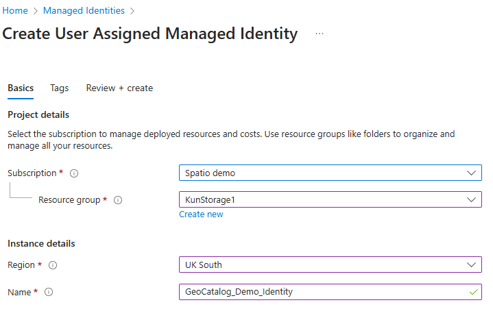
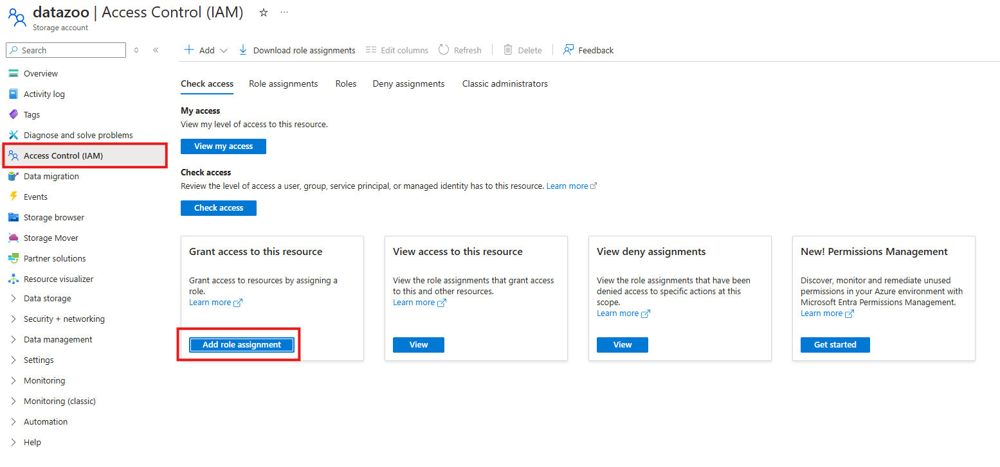
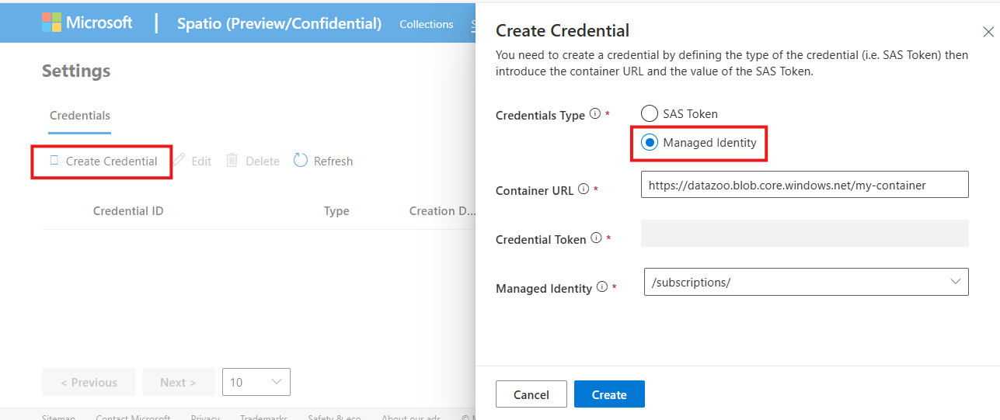

# Setup Ingestion Credentials for Microsoft Planetary Computer Pro using managed identity

Loading new data into the Microsoft Planetary Computer Pro GeoCatalog resource is called **ingestion.** A GeoCatalog needs permissions, or ingestion Sources, to access data that is stored externally to the GeoCatalog resource.
  
In this guide, you learn how to:

- [Create a user assigned managed identity](#create-a-user-assigned-managed-identity)
- [Give a user assigned managed identity Storage Blob Data Reader to Azure Blob Storage](#give-a-user-assigned-managed-identity-storage-blob-data-reader-to-azure-blob-storage)
- [Associate a user assigned managed identity to a GeoCatalog](#associate-the-user-assigned-managed-identity-with-your-geocatalog-resource)
- [Setup an ingestion source](#setup-an-ingestion)

All four steps are required to setup your GeoCatalog resource to read data from an external ingestion source. 

## Prerequisites

- A Microsoft Planetary Computer Pro GeoCatalog deployed to your Azure Subscription. See [Deploy a GeoCatalog resource](./deploy-geocatalog-resource.md).

- An Azure Blob container setup with the correct permissions to assign managed identities. See [Create an Azure storage account](/azure/storage/common/storage-account-create?tabs=azure-portal).

## Managed identity vs. SAS tokens

[Managed identities](/entra/identity/managed-identities-azure-resources/overview) provide an automatically managed identity in Microsoft Entra ID for applications to use when connecting to resources that support Microsoft Entra authentication.

[Shared Access Signatures (SAS)](/azure/storage/common/storage-sas-overview) create cryptographic credentials for access to a resource such as Azure Blob Storage. 

Managed identities are a more secure, automated mechanism for establishing persistent access to a storage account and are the recommended approach for providing secure access to Azure Blob Storage for data ingestion. 

Managed identities only work within a single Microsoft Entra tenant, therefore the SAS Token approach is useful when moving data from storage that is in a storage account outside of your tenant. Data ingestion is specific to a Blob Container, and SAS tokens from the root storage resource aren't permitted. 

This guide show how to use the managed identity approach. If SAS tokens are more appropriate for your use case, see how to [setup ingestion credentials using SAS](./setup-ingestion-credentials-sas-tokens.md).

## Create a user assigned managed identity

Navigate to the [Azure portal](https://portal.azure.com/) to create a new managed identity resource. In the search bar, search for **managed identities**. 

Select the **Create** button to begin the process. In the dialogue, you'll have the opportunity to assign the managed identity to a Subscription, Resource Group and Region. Once you have entered the data, select the **Review + create** and then the **Create** button. 

Next, we associate this managed identity to our Geocatalog. 

## Give a user assigned managed identity Storage Blob Data Reader to Azure Blob Storage

Navigate back to the Azure Portal and go to the storage resource you wish to use to ingest data into Microsoft Planetary Computer Pro. Once at that resource, select the **Access Control (IAM)** button in the sidebar and then select **"Add the assignment"** button.   

Next, search for the **"Storage Blob Data Reader"** role inside the search reader. Select the **"Storage Blob Data Reader"** and press the **"Next"** button. 

In the Members pane, select **"managed identity"**, which pops up a new side bar. Select the **Subscription** where you created the user assigned managed identity in the previous steps, and then select **User assigned managed identity**. Select the user assigned managed identity and select the **Select** button to continue. 

There are two dialogues to review your selection. Review your selection and select the **"Review + Assign"** Button each time. 

## Associate the user assigned managed identity to your Geocatalog resource

### Associate using the Azure Portal

1. Login to the Azure Portal.

1. Use the search bar to search for "GeoCatalogs". Select "Geocatalogs" from under the list of Services.

1. Use the filters to find your GeoCatalog and select it.

1. In the side bar, select **Identity** under the Security field. Once in this window, select the blue **Add user assigned managed identity** button

1. Select the user assigned managed identity you created in the earlier step, and select the blue **Add** button to complete this process.

1. Next, we give that user assigned managed identity read access to the blob storage where data is being read from. 

## Setup an ingestion source

The final step sets up an ingestion source, or a credential with the user assigned managed identity. 

1. Navigate to your GeoCatalog resource landing page and select the "Settings" tab. 

1. Select the **Create Credential** button, which opens a new sidebar to Create a Credential.

1. Select the **managed identity** button.

1. Input the URL of the container in the storage account containing the data you wish to ingest.

    > [!NOTE] 
    > You must input the URL of the container, not the URL of the storage account fails* 

1. Select the managed identity associated with this Azure Blob Storage account. 

1. Press the **Create** button to complete the process

Your credential is now set up to support ingestions.

## Related content

- [Ingestion overview]()