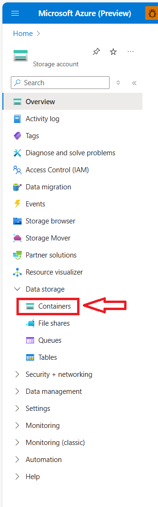
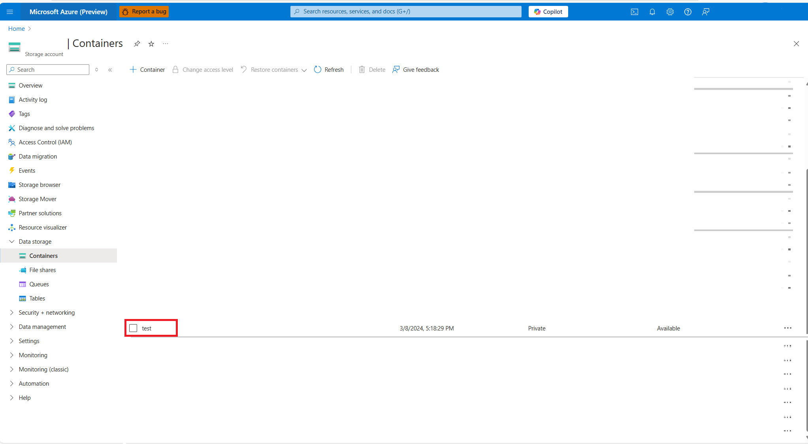

# Setup ingestion credentials for Microsoft Planetary Computer using SAS tokens

Loading new data into the Microsoft Planetary Computer GeoCatalog resource is called **ingestion.** A GeoCatalog needs permissions, or ingestion sources, to access data that is stored externally to the GeoCatalog resource.
  
In this guide, you learn how to:

- Setup credentials through Azure portal
- Setup credentials through the Microsoft Planetary Computer API using the Azure Python SDK

## Prerequisites

- A Microsoft Planetary Computer GeoCatalog deployed to your Azure Subscription. See [Deploy a GeoCatalog resource](./deploy-geocatalog-resource.md).

- An Azure Blob container setup with the correct permissions to assign managed identities and to request a SAS Token. See [Create an Azure storage account](/azure/storage/common/storage-account-create?tabs=azure-portal).

## Managed identity vs. SAS tokens

[Managed identities](/entra/identity/managed-identities-azure-resources/overview) provide an automatically managed identity in Microsoft Entra ID for applications to use when connecting to resources that support Microsoft Entra authentication.

[Shared Access Signatures (SAS)](/azure/storage/common/storage-sas-overview) create cryptographic credentials for access to a resource such as Azure Blob Storage. 

Managed identities are a more secure, automated mechanism for establishing persistent access to a storage account and are the recommended approach for providing secure access to Azure Blob Storage for data ingestion. 

Managed identities only work within a single Microsoft Entra tenant, therefore the SAS Token approach is useful when moving data from storage that is in a storage account outside of your tenant.
Data ingestion is specific to a Blob Container, and SAS tokens from the root storage resource aren't permitted. 

## Set up credentials through the UI

SAS tokens can be obtained multiple ways; in this guide, we do so using the [Azure portal](https://portal.azure.com/).
Azure Storage Explorer is also an alternative UI-driven approach which works on a local machine. See [Azure Storage Explorer](https://azure.microsoft.com/products/storage/storage-explorer/?msockid=06a2c34a3959646b380ed330385d65fb)

### Navigate to your storage resource

In the Azure portal, find the Storage Resource containing the Azure Blob Container with the data you wish to ingest into Microsoft Planetary Computer. In the Resource settings, select the **"Containers"** setting under **"Data Storage"**.



### Select your blob container and request a SAS Token

Select the specific container you wish to ingest, in this example we're selecting the "test" container. 



Select the **"Shared access tokens"** setting and open the configuration settings.


Ensure these settings are set up correctly:
* Permissions = **Read** (verify no other options are selected)
* Validity of SAS Token covers time required to ingest data (the best security practice is to have this token valid no more than seven days)

Once the settings are verified, select the **"Generate SAS Token and URL"** button. You see two elements generated: the **Blob SAS Token** and the **Blob SAS URL**. Keep your window/tab open as you'll need this information for the next section. 

### Navigate to Microsoft Planetary Computer Settings

Use the URL of your Microsoft Planetary Computer to navigate to the landing page and select the **"Settings"** tab from the navigation bar. 

NEED NEW SCREENSHOT.


### Create your credentials

* Select the **Create Credential** button
* Enter the URL of your Blob Container in the **Container URL** field
    * Only include the URL and don't include the key. The format of the URL should be `https://(Storage Resource Name).blob.core.windows.net/(Blob Container Name)`
* Cut and paste the SAS Token into the **Credential Token** field
* Select the **Create** button

NEED NEW SCREENSHOT


Your credential is now set up to support ingestions.

NEED NEW SCREENSHOT


If your credential expires or you need to add credentials for a different Blob Container, repeat the previous process. 

## Set up credentials through the API

Credentials can also be set through the API using the Azure SDK [Storage Service](/rest/api/storageservices/create-user-delegation-sas) and the Planetary Computer API. See ["POST /api/ingestion-sources."](https://studious-adventure-rr7p9rv.pages.github.io/#tag/IngestionSources/paths/~1api~1ingestion-sources/post)

The following block of code imports required libraries and sets up key variables. 

- Change **CONTAINER_URL** to be the Azure Blob Container URL containing the data you wish to ingest. 
- Change **GEOCATALOG_URL** to be your Microsoft Planetary Computer resource endpoint. 
- Change **EXPIRATION_HOURS** to how many hours you want the credential to be alive (default is 7 days / 168 hours)

```python
import requests
from azure.identity import AzureCliCredential
from datetime import datetime, timedelta, timezone
import azure.storage.blob
from urllib.parse import urlparse

###################################

# Set Key Variables Here
## The Spatio App ID. Do not change.
SPATIO_APP_ID = "https://geocatalog.spatio.azure.com"

## The API version. Do not change.
API_VERSION = "2024-01-31-preview"

## The URL of the Blob Container, replace the default with your specific container url
CONTAINER_URL = "https://datazoo.blob.core.windows.net/test"

## The URL of your GeoCatalog Resource, replace the default with your specific url
GEOCATALOG_URL = "https://tc-demo.bxfqdqh5dagmbgez.uksouth.geocatalog.spatio.azure.com/"

## Set the duration of the token in hours, default 168 hours (7 days)
EXPIRATION_HOURS = 7 * 24
```

The next block of code uses the Azure SDK to request a SAS Token for the specified Blob Container.

```python
# Parse the container URL
parsed_url = urlparse(CONTAINER_URL)
account_url = f"{parsed_url.scheme}://{parsed_url.netloc}"
account_name = parsed_url.netloc.split(".")[0]
container_name = parsed_url.path.lstrip("/")

# Login to Azure using the Azure CLI
credential = azure.identity.AzureCliCredential()

# Setup Blob Service Client
with azure.storage.blob.BlobServiceClient(
        account_url=account_url,
        credential=credential,
    ) as blob_service_client:
        now = datetime.now(timezone.utc).replace(microsecond=0)
        key = blob_service_client.get_user_delegation_key(
            key_start_time=now + timedelta(hours=-1),
            key_expiry_time=now + timedelta(hours = EXPIRATION_HOURS), )

# Generate the SAS Token
sas_token = azure.storage.blob.generate_container_sas(
    account_name=account_name,
    container_name=container_name,
    user_delegation_key=key,
    permission=azure.storage.blob.ContainerSasPermissions(
        read=True,
        list=True,
    ),
    start=now + timedelta(hours=-1),
    expiry=now + timedelta(hours = EXPIRATION_HOURS),)
```

The next block of code uses the Microsoft Planetary Computer API to post the credential.

```python
# Obtain an access token
credential = AzureCliCredential()
access_token = credential.get_token(f"{SPATIO_APP_ID}/.default")

# Payload for the POST request
payload = {
    "sourceType": "SasToken",
    "connectionInfo": {
        "containerUrl": CONTAINER_URL,
        "sasToken": sas_token,
    },
}

# STAC Collection API endpoint
endpoint = f"{GEOCATALOG_URL}/api/ingestion-sources"

# Make the POST request
response = requests.post(
    endpoint,
    json=payload,
    headers={"Authorization": f"Bearer {access_token.token}"},
    params={"api-version": API_VERSION},
)

# Print the response
if response.status_code == 201:
    print("Ingestion source created successfully")
else:
    print(f"Failed to create ingestion: {response.text}")
```

## Related content

- [Ingestion overview]()