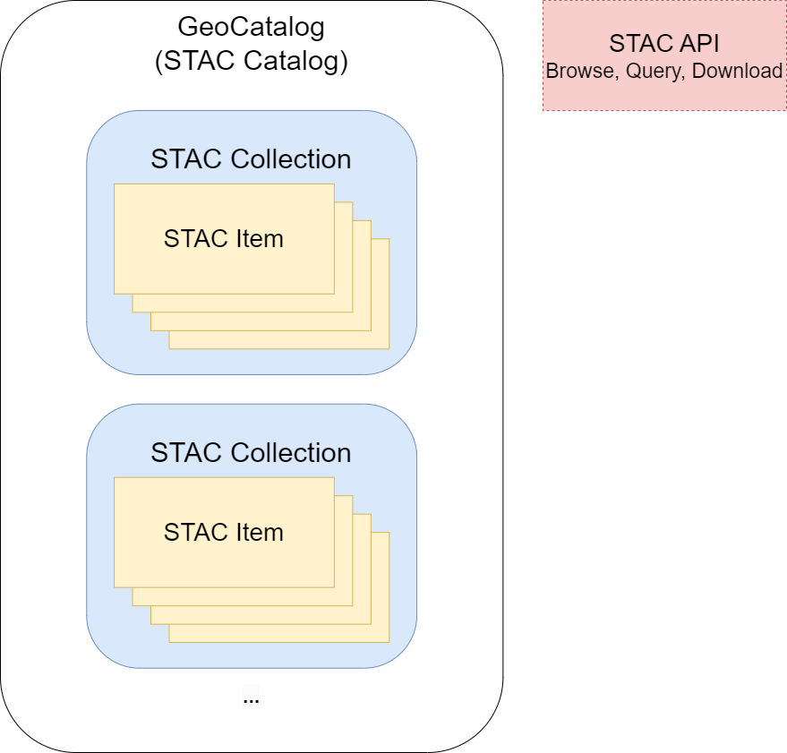

# STAC overview for Microsoft Planetary Computer Pro

This article provides an overview of the SpatioTemporal Asset Catalog (STAC) specification and how it's used by Microsoft Planetary Computer Pro.

## STAC specification

The STAC specification is an open, community-driven standard that makes it easy to find, combine, and use geospatial data. STAC provides a common structure for describing and cataloging "spatiotemporal assets." This means you can use it to index and organize data across both space and time.

As a result, STAC enables organizations to make their geospatial assets accessible to a broad range of users. STAC catalogs can be used to organize many types of geospatial asset data, including:

- Satellite, aerial, and drone imagery
- LIDAR and SAR data
- Full Motion Video
- Hyperspectral data
- Other derived data formats

Additionally, STAC can be used with existing and emerging cloud-native data formats such as Cloud Optimized GeoTIFFs (COGs) and GeoParquet.

Since its release in 2018, many organizations quickly adopted STAC to organize their spatial data. These organizations include satellite operators, government agencies, civil society groups, and commercial companies.

The STAC specification consists of four complementary standards for describing geospatial assets, organizing those assets into groups, and making those assets searchable via common APIs. Specifically, these STAC standards include:

- [STAC Catalog](https://github.com/radiantearth/stac-spec/tree/master/catalog-spec)
- [STAC Collection](https://github.com/radiantearth/stac-spec/tree/master/collection-spec)
- [STAC Items](https://github.com/radiantearth/stac-spec/tree/master/item-spec)
- [STAC API](https://github.com/radiantearth/stac-api-spec/)

Planetary Computer Pro uses the STAC specification across all aspects of data management.

[  ](media/stac-summary.png#lightbox)

## STAC catalogs

### Introduction to GeoCatalogs

The Planetary Computer Pro service allows you to [create a GeoCatalog resource](./deploy-geocatalog-resource.md) in your Azure subscription, to [ingest](./ingestion-overview.md), manage, search, and distribute geospatial datasets. A GeoCatalog is an Azure resource that, from a STAC API perspective, is logically equivalent to a STAC Catalog. A STAC Catalog is the top-level object in the STAC hierarchy that logically groups STAC collections and STAC Items. You can see the STAC Catalog JSON for a specific GeoCatalog using the JSON web viewer by going to `https://<your geocatalog uri>/json-api?path=/`. Refer to [STAC Catalog Spec](https://github.com/radiantearth/stac-spec/tree/master/catalog-spec) to learn more about the STAC Catalog specification.

A GeoCatalog is defined using the following information:

| Field | Description |
| ---------- | ---------- |
| Subscription | Azure subscription where a GeoCatalog instance is deployed |
| Resource Group | Azure resource group where a GeoCatalog instance is deployed |
| Name | Name of a GeoCatalog instance |
| Region | Azure region where a GeoCatalog instance is deployed.|

Currently, Planetary Computer Pro can deploy GeoCatalogs in the following Azure regions:

- East US
- North Central US
- West Europe
- Canada Central

A GeoCatalog can be provisioned using the Azure portal or the Azure Rest API. To learn how to deploy a GeoCatalog into your Azure subscription, read [create a GeoCatalog resource](./deploy-geocatalog-resource.md).

## STAC collections

### Introduction to collections

A GeoCatalog allows you to create collections to store and organize geospatial datasets on Azure. A STAC collection is used to describe a group of STAC Items that share properties and metadata, such as a common geographic area or sensor. Refer to the [STAC collection Spec](https://github.com/radiantearth/stac-spec/tree/master/collection-spec) to learn more about the STAC collection concept.

### Collection definition

Planetary Computer Pro adheres to the STAC collection specification which defines a set of common fields to describe the dataset and included Items.

Within a collection, you can specify the type and structure of data stored in that collection. You can also add [render configuration settings](./render-configuration.md) to visualize data within the collection using Planetary Computer Pro's Explorer.

Collections in GeoCatalog are defined in JSON format and include the following fields:

| Field | Description |
| ------------- | ------------- |
| ID | Required - Identifier for the collection that is unique across the provider. |
| Type | Required - STAC element type; must be "collection." |
| Title | Short descriptive one-line title for the collection. |
| Description | Required - Detailed multi-line description to fully explain the collection. |
| Licenses | Required - collection's licenses. |
| Extent | Required - Describes the spatial (longitude/latitude) and temporal (date range) extents of the collection. |
| Providers | Any of the organizations that captures or processes the content of the collection. |
| Summaries | List of key-value pairs that provide an overview of the properties of the included Items. |
| Collection Assets | Data files directly associated with the collection, for example, a thumbnail image. |
| [Item Assets](#item-assets) | Details information about the datafiles that are included in the collection's Items. For more information, see [Item Assets](#item-assets). |
| Links | Required - List of link objects to resources and related URLs. |
| Keywords | List of keywords describing the collection. |
| STAC Version | Required - STAC version used by the collection. |

### Item assets

The `item_assets` fiel, at the collection level, provides a way to determine what assets (data files) are available in any child Item. The listed assets in this field don't imply that all assets are available for all Items (it should be the union of the available assets, not the intersection of the available assets). This field is enabled in a GeoCatalog via the [item_assets extension](https://github.com/stac-extensions/item-assets) of the STAC specification. The items assets extension is required if you want to visualize Items in the GeoCatalog Explorer.

The `item_assets` field is itself an object, with at least two of the following fields:

| Field | Type | Description |
| ------------- | ------------- | ----------- |
| title | string | The displayed title for clients and users. |
| description | string | A description of the Asset providing more details, such as how it was processed or created. |
| type | string | [Media type](https://github.com/radiantearth/stac-spec/tree/v1.0.0-rc.1/catalog-spec/catalog-spec.md#media-types) of the asset. |
| roles | list of strings | The semantic roles of the asset, similar to the use of rel in links. |

### Collection JSON examples

The following example shows a minimal collection JSON. For more fields, refer to the [STAC collection specification](https://github.com/radiantearth/stac-spec/blob/master/collection-spec/collection-spec.md).

```json
{
  "id": "example-collection",
  "type": "Collection",
  "title": "Example collection",
  "description": "An example collection",
  "license": "CC-BY-4.0",
  "extent": {
    "spatial": {
      "bbox": [
        [
          -180,
          -90,
          180,
          90
        ]
      ]
    },
    "temporal": {
      "interval": [
        [
          "2018-01-01T00:00:00Z",
          "2018-12-31T23:59:59Z"
        ]
      ]
    }
  },
  "links": [],
  "stac_version": "1.0.0"
}
```

For a slightly more complex example JSON, check out [this example describing an open dataset from the National Agriculture Imagery Program (NAIP)](https://planetarycomputer.microsoft.com/api/stac/v1/collections/naip).

### Collection configuration

In order to visualize collections in the GeoCatalog Explorer, there are several configurations that must be defined, including:

- [Mosaic definition](./mosaic-configurations-for-collections.md)
- [Render configuration](./render-configuration.md)
- [Tile settings](./tile-settings.md)
- [Queryable fields](./queryables-for-explorer-custom-search-filter.md)

## STAC items

### Introduction to STAC items

A GeoCatalog allows you to store and organize geospatial datasets into collections. A STAC Item is the core object in a GeoCatalog's collection, containing metadata for a scene and links to assets from that scene (such as a satellite image). An Item's metadata allows GeoCatalog to search and query spatial assets. Refer to [STAC Item Spec](https://github.com/radiantearth/stac-spec/tree/master/item-spec) to learn more about the STAC Items.

### Item definition

The Planetary Computer Pro adheres to the STAC Item Specification which defines a set of common fields to describe an Item, such as time range and the assets related to the Item. Items are defined in JSON format and can be flexibly expanded to include more metadata.

A valid STAC Item requires the following fields:

| Field | Description |
| ------------- | ------------- |
| ID | Required - identifier for the Item that is unique across the Item's parent collection |
| Type | Required - GeoJSON Object type; must be "Feature" |
| Geometry | Required - defines the full footprint of the asset represented by this Item as a GeoJSON Geometry Object |
| Bounding Box | Required - coordinates of the bounding box of the asset represented by this Item |
| Properties | Required - Other metadata for the Item |
| Assets | Required - data assets associated with the Item, each with a unique key |
| Collection | Required - ID of the Item's parent collection |
| Links | Required - List of link objects to resources and related URLs |
| STAC Version | Required - STAC version used by the Item |

[Common metadata](https://github.com/radiantearth/stac-spec/blob/master/commons/common-metadata.md) for Items beyond these required fields includes date and time, licenses, providers, instrument, and more.

### Item JSON example

The following example shows a basic item JSON.

```json
{
  "stac_version": "1.0.0",
  "stac_extensions": [],
  "type": "Feature",
  "id": "20201211_223832_CS2",
  "bbox": [
    172.91173669923782,
    1.3438851951615003,
    172.95469614953714,
    1.3690476620161975
  ],
  "geometry": {
    "type": "Polygon",
    "coordinates": [
      [
        [
          172.91173669923782,
          1.3438851951615003
        ],
        [
          172.95469614953714,
          1.3438851951615003
        ],
        [
          172.95469614953714,
          1.3690476620161975
        ],
        [
          172.91173669923782,
          1.3690476620161975
        ],
        [
          172.91173669923782,
          1.3438851951615003
        ]
      ]
    ]
  },
  "properties": {
    "datetime": "2020-12-11T22:38:32.125000Z"
  },
  "collection": "simple-collection",
  "links": [
    {
      "rel": "collection",
      "href": "./collection.json",
      "type": "application/json",
      "title": "Simple example collection"
    },
    {
      "rel": "root",
      "href": "./collection.json",
      "type": "application/json",
      "title": "Simple example collection"
    },
    {
      "rel": "parent",
      "href": "./collection.json",
      "type": "application/json",
      "title": "Simple example collection"
    }
  ],
  "assets": {
    "visual": {
      "href": "[URL]",
      "type": "image/tiff; application=geotiff; profile=cloud-optimized",
      "title": "3-Band Visual",
      "roles": [
        "visual"
      ]
    },
    "thumbnail": {
      "href": "[URL]",
      "title": "Thumbnail",
      "type": "image/jpeg",
      "roles": [
        "thumbnail"
      ]
    }
  }
}
```

## STAC extensions

Currently, a GeoCatalog automatically adds the following extensions to all ingested collections:

- [item-assets](https://github.com/stac-extensions/item-assets)
- [table](https://github.com/stac-extensions/table)

STAC extensions may also be used at the STAC Item level. Users are free to add any other STAC extensions they want, but GeoCatalog doesn't currently validate the extensions.

For a full list of STAC extensions, including the maturity of each one, see [the STAC extensions page on GitHub](https://stac-extensions.github.io/).

## STAC API

The Planetary Computer Pro's APIs conform to the [STAC API specification](https://github.com/radiantearth/stac-api-spec/), making it possible for you to quickly and easily search petabyte-scale datasets to find specific data assets that meet your needs. Once these assets are identified, you can view or download the assets using GeoCatalog's APIs.

## Next steps

> [!div class="nextstepaction"]
> [Get started with Microsoft Planetary Computer Pro](./get-started-planetary-computer.md)

## Related content

- [Create a STAC Collection with the Microsoft Planetary Computer Pro web interface](./create-collection-web-interface.md)
- [Create a STAC Item in Microsoft Planetary Computer Pro](./create-stac-item.md)
