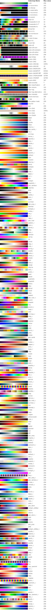

# Supported colormaps in Microsoft Planetary Computer Pro

The Microsoft Planetary Computer Pro [Explorer](./use-explorer.md) allows GeoCatalog users to visualize the geospatial datasets in their collections. In order to properly render these datasets, Planetary Computer Pro uses user-specified collection [render configurations](./render-configuration.md). These render configurations support various colormaps, which map geospatial raster data values to color channels. The user can specify the use of any of these supported named colormaps when creating their collection render configuration. The user can also define a customized colormap.

## Use cases

Colormaps are used to map single-band, or single dimension, raster data from its native scale into a color spectrum.  Planetary Computer Pro render configurations support a large number of these colorrmaps for rendering raaster data. The following image provides a comprehensive list of the available colormaps by name, a sample representative spectrum of that colormap, and the maximum value map corresponding to that colormap. 

## Related content

- [Using Data Explorer](./use-explorer.md)
- [Render Configuration](./render-configuration.md)
- [Create a STAC Collection](./create-stac-collection.md)
