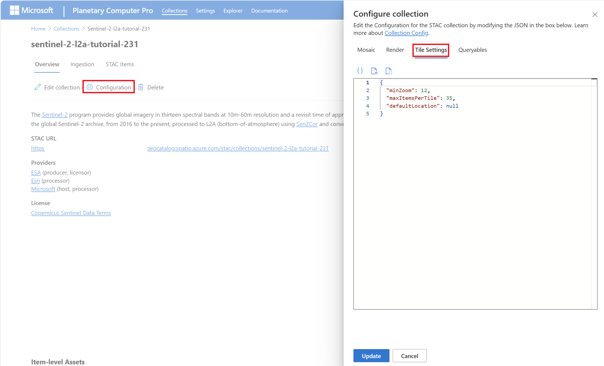

# Tile settings in Microsoft Planetary Computer Pro

For each SpatioTemporal Access Catalog (STAC) collection in Microsoft Planetary Computer Pro, you can configure the tile settings, which determine the default location and minimum zoom level when visualizing mosaics in the Data Explorer.

In this article, see where to find and modify tile settings for Microsoft Planetary Computer Pro.

## Prerequisites

Before you can configure tile settings, ensure the following prerequisite steps are complete:

1.  **STAC Collection Exists:** You created a [STAC collection in Planetary Computer Pro](./create-stac-collection.md).
2.  **Data Ingested:** You [added STAC items](./add-stac-item-to-collection.md) containing the geospatial data assets you want to visualize into the collection.

## Find tile settings

The tile settings are found by going to the Collection page and selecting the Configuration button.

[  ](media/tile-configuration-screenshot.png#lightbox)

The settings are in the form of a JSON object with the following properties:

| Property           | Type     | Description                                                                                      |
|--------------------|----------|--------------------------------------------------------------------------------------------------|
| `minZoom`          | Integer (int32); maximum: 24 | Minimum zoom level at which the Explorer UI renders items from the collection. For mor information, see [Zoom Levels](/azure/azure-maps/zoom-levels-and-tile-grid).             |
| `maxItemsPerTile`  | Integer (int32)  | Maximum number of items that can be rendered per tile.                                           |
| `defaultLocation`  | DefaultLocation Object   | Specifies the default map center coordinates and zoom level when the collection opens in the Explorer.|

The `defaultLocation` object has the following properties:

| Property      | Type                | Description                                                                 |
|---------------|---------------------|-----------------------------------------------------------------------------|
| `zoom`        | Integer (int32)     | The default zoom level when the collection opens in the Explorer.           |
| `coordinates` | Array of float [2]  | The default map center as `[latitude, longitude]` in decimal degrees.       |


### Example tile settings

```JSON
{
  "minZoom": 12,
  "maxItemsPerTile": 35,
  "defaultLocation": {
    "zoom": 12,
    "coordinates": [
      8.9637,
      -79.5437
    ]
  }
}
```

### Tuning Performance

It's recommended to pair a higher minimum zoom level with high resolution imagery. This setting will help avoid experiencing higher latency when using the Explorer when at low zoom levels. Low resolution imagery can have lower min zoom levels without issue.

> [!NOTE]
> The effective minimum zoom level for a given map view is the greater of the minimum zoom level for the [render configuration](./render-configuration.md) and the tile settings. For example, if the tile setting `minZoom` level is set to `6` but the render configuration `minZoom` level is set to `12`, the explorer does not start rendering tiles until zoom level 12.
  


## Related content

- [Mosaic configurations for collections in Microsoft Planetary Computer Pro](./mosaic-configurations-for-collections.md)
- [Render configuration for Microsoft Planetary Computer Pro](./render-configuration.md)
- [Queryables for Microsoft Planetary Computer Pro Data Explorer custom search filters](./queryables-for-explorer-custom-search-filter.md)
