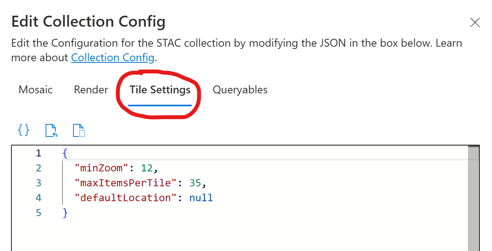
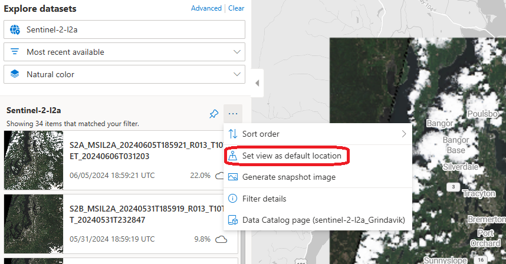

# Tile settings in Microsoft Planetary Computer Pro

For each collection in Microsoft Planetary Computer Pro, you can configure the tile settings, which determine the default location and minimum zoom level when visualizing mosaics in the Data Explorer.

In this article, see where to find and modify tile settings for Microsoft Planetary Computer Pro.

## Prerequisites

- You have a [STAC collection with Microsoft Planetary Computer Pro GeoCatalog](./create-collection-web-interface.md)

## Find tile settings

The tile settings are found by going to the Collection page and selecting the Configuration button.

[  ](media/tile-settings-1.png#lightbox)

The settings are in the form of a JSON object.

### Example tile settings

```JSON
{
  "minZoom": 12,
  "maxItemsPerTile": 35,
  "defaultLocation": {
    "zoom": 12,
    "coordinates": [
      8.9637,
      -79.5437
    ]
  }
}
```

### Zoom level

High resolution imagery should have a high min zoom level to avoid experiencing latency when using the explorer. Low resolution imagery can have lower min zoom levels without issue.

> [!NOTE]
> Planetary Computer tile settings zoom must be configured as integers, even though the Explorer interface supports zooming to non-integer levels.
 
### Default location

The `defaultLocation` field lets you specify the zoom level and center coordinates used when your collection first opens in the Data Explorer. For example:

```JSON
{
  "defaultLocation": {
    "zoom": 12,
    "coordinates": [
      8.9637,
      -79.5437
    ]
  }
}
```

> [!NOTE]
> In the list of items, there's a menu item called "Set view as default location".  This isn't currently enabled.

[  ](media/tile-settings-save-view-as.png#lightbox)

## Related content

- [Mosaic configurations for collections in Microsoft Planetary Computer Pro](./mosaic-configurations-for-collections.md)
- [Render configuration for Microsoft Planetary Computer Pro](./render-configuration.md)
- [Queryables for Microsoft Planetary Computer Pro Data Explorer custom search filters](./queryables-for-explorer-custom-search-filter.md)
