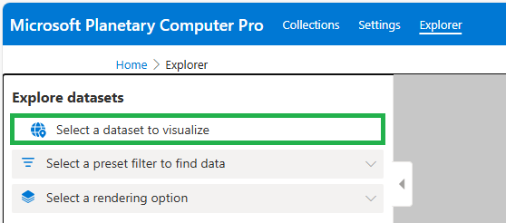
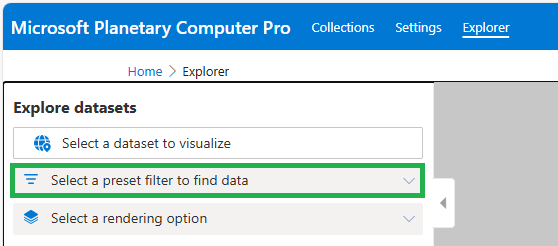

# Quickstart: Use the Microsoft Planetary Computer Pro Explorer

This quickstart provides instructions on how to interact with the Microsoft Planetary Computer Pro Explorer.

## Prerequisites

* An Azure account with an active subscription; [create an account for free.](https://azure.microsoft.com/free/?ref=microsoft.com&utm_source=microsoft.com&utm_medium=docs&utm_campaign=visualstudio)
* An [Azure Microsoft Planetary Computer Pro GeoCatalog](./deploy-geocatalog-resource.md)
* A Geocatalog collection with:
  * Item assets defined in the collection's JSON. Learn how to [create a collection](./create-stac-collection.mdd).
  * Items ingested. Learn how to [ingest STAC items](./ingestion-source).
  * Visualization configurations set:
    * [Create a Render Configuration](./render-configuration.md).
    * [Configure Colleciton Tile Settings](./tile-settings.md).
    * [Mosaic Configuration](./mosaic-configurations-for-collections.md)
    * [Queryables Configuration](./queryables-for-explorer-custom-search-filter.md)

## Open a GeoCatalog

1. Sign in to Azure Portal
1. In the Azure Portal search box, enter GeoCatalogs. Select GeoCatalogs in the search results.
1. In the GeoCatalogs page, select the GeoCatalog you want to explore.
1. In the GeoCatalog's "Resource" page, under the Essentials section, follow the GeoCatalog URI link to open the GeoCatalog collection Manager.

## Launch the Data Explorer

The Data Explorer can be opened in two ways:

1. Select Data Explorer in the navigation bar, **or** select a valid collection to explore.
1. From the collection overview page, click Launch in Explorer. This loads this collection in the Explorer.

> [!NOTE]
> If the "Launch In Explorer" button is grey, you must [Create a Render Configuration](./render-configuration.md).

## Select a dataset to explore

1. Select a dataset to visualize.
2. Browse your available collections and select a collection.

## Filter a dataset

The Explorer dynamically filters your collections items and displays them in the results panel, or on the map based on the map location, mosaic definition, render configuration, and queryables.

### Filter by location

You can filter the resulting items based on location.

1. Zoom in or out on the map to show different items.
1. Search for a location using the map controls.

### Apply a mosaic definition

Applying a mosaic definition in the Explorer automatically filters the collection's items based on the mosaic's query. For example, a mosaic can filter for all items collected in the year 2022.

1. Select the filter box to show a dropdown of available mosaic definitions.
2. Select a mosaic definition to show items in the mosaic's query results.

### Select a different render configuration

 At least one render configuration is required to visualize a collection's items in Explorer. If you have multiple, you can change how the item layers are rendered on the map. For example, a render configuration could render the data as natural color, color infrared, or short wave infrared.

1. Select the Render Configuration dropdown to show the list of available render configurations.
2. Select a render configuration to render that item's layer on the map.

### Use advanced filtering

Advanced filtering allows you to expose the queryables you defined for the collection and build custom queries that filter the collection's items.

1. Select Advanced.
2. Select filters to expose the list of available queryables. Select the checkbox to add a queryable to your filter.
3. For each queryable, select the value or range to be applied in your filter.

## Manipulate the map

### Use map controls

The Explorer supports native map controls on the top right side of the map to rotate, zoom in and out, change the basemap style, search for a location, and update map settings.

### Pin an item layer to the map

You can visualize multiple query results at once by pinning layers to the map.

1. After querying and filtering the collection items to your desired results, select the pin icon to the right of the dataset name in the Explore Datasets side-panel.
1. Upon pinning these query results, this layer is added to the list of map layers, displayed in the lower right corner of the map, and your query results are cleared.

### Manipulate the map layers

You can manipulate current or pinned map layers.

1. Select the layers icon in the bottom left corner of the map.
1. To show or hide a layer, select the eye icon.
1. To change the opacity of a layer, select the circle icon and use the layer opacity slider.
1. To change the order of the layers, select the three dots icon and select Move layer up or Move layer down.
1. To edit the layer and filter options, select the three dots icon and select Edit layer and filter options.

> [!NOTE]
> The minimum zoom defined in your render configuration determines the map zoom level at which the rendering option should start being valid. If you don't see your item assets on the map, you may need to zoom in further.

## Select an item's code sample

The Explorer provides a Python code sample for each item in the catalog, enabling the user retrieve that item from their Python environment of choice, for example, a Python Notebook. 

1. From the item results panel, select the item of interest.
1. Select the brackets icon to expose the code sample.
1. Select Copy to copy the code sample to paste into your Python environment.

## Add a collection thumbnail

You can set a thumbnail for a collection, the image that represents that collection in your collections Overview page. You

1. In the Explorer, select a collection to display.
1. Select your desired item asset to display on the map.
1. Zoom in to your desired area.
1. Select the three dots icon to the right of the dataset name in the Explore Datasets side-panel and select "Generate Snapshot Image".
1. Select Draw export area and draw a rectangular area on the map.
1. Select an image size.
1. Select Generate image.
1. After the image is prepared, select the three dots icon on the image and select Set as collection thumbnail.

## Related content

* [Create a GeoCatalog](./deploy-geocatalog-resource.md)
* [Create a collection](./create-stac-collection.md)
* [Ingest STAC items](./ingestion-source.md)
* [Create a Render Configuration](./render-configuration.md)
* [Configure collection Tile Settings](./tile-settings.md)
* [Mosaic Configuration](./mosaic-configurations-for-collections.md)
* [Queryables Configuration](./queryables-for-explorer-custom-search-filter.md)