# Quickstart: Use the Microsoft Planetary Computer Pro Explorer

In this Quickstart, you learn how to interact with the Microsoft Planetary Computer Pro Explorer. The Explorer is the easiest way for Planetary Computer Pro users to visualize and interact with their data. 

## Prerequisites

* An Azure account with an active subscription; [create an account for free.](https://azure.microsoft.com/free/?ref=microsoft.com&utm_source=microsoft.com&utm_medium=docs&utm_campaign=visualstudio)
* An [Azure Microsoft Planetary Computer Pro GeoCatalog](./deploy-geocatalog-resource.md)
* A collection with:
  * Item assets defined in the collection's JSON. Learn how to [create a collection](./create-stac-collection.md).
  * SpatioTemporal Access Catalog (STAC) items ingested. Learn how to [ingest STAC items](./ingestion-source.md).
  * A collection configuration defined for visualization per the guidelines provided in [Configure a collection with the Microsoft Planetary Computer Pro web interface](./configure-collection-web-interface.md)

## Open the Microsoft Planetary Computer Pro web interface

Open the Microsoft Planetary Computer Pro web interface by following the instructions in [Create a collection with the Microsoft Planetary Computer Pro web interface](./create-collection-web-interface.md).

## Launch the Planetary Computer Pro Explorer

The Explorer can be opened in two ways:

* Select the **Explorer** tab in the navigation bar, **or** 
* Select a valid collection to explore from the **Collections** tab.
    
    From the collection's **Overview** tab, select **Launch in Explorer** on the right side below the **Spatial extents** map. This loads the collection in the Explorer.
    
[ 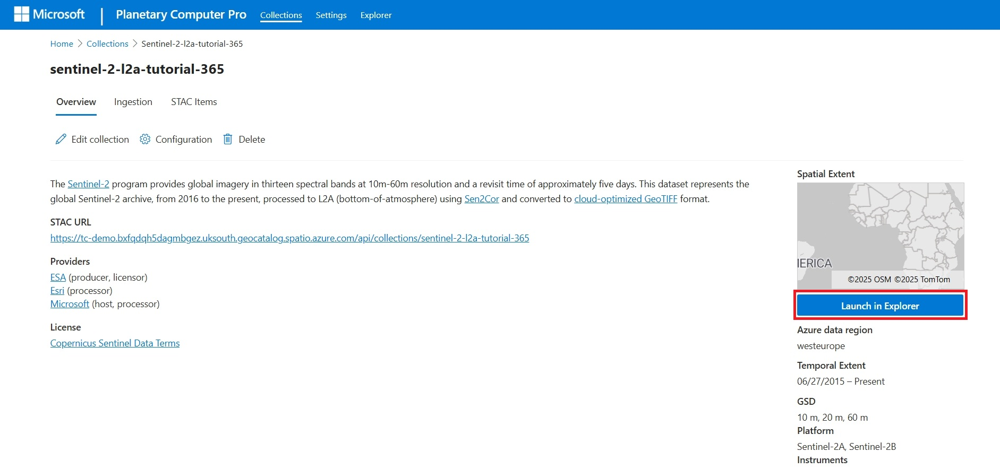 ](./media/launch-in-explorer-button.jpeg#lightbox)

> [!NOTE]
> If the "Launch In Explorer" button is gray, you must first [create a render configuration](./render-configuration.md).

## Select a dataset to explore

1. If you opened the **Explorer** tab using the top navigation bar, select a dataset to visualize.

    [ 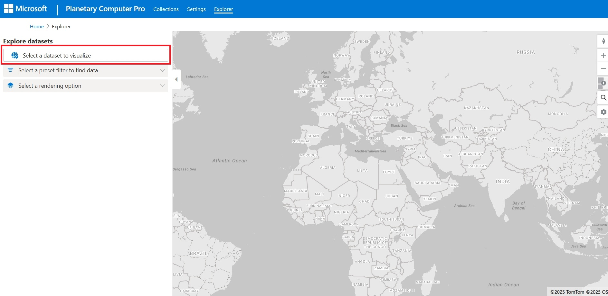 ](./media/select-dataset.jpeg#lightbox)

    Browse your available collections and select a collection.
 
    [ 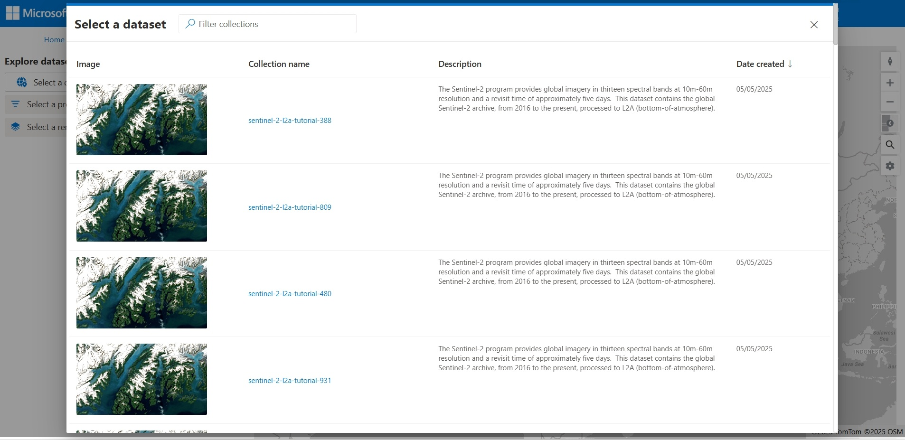 ](./media/browse-collections.jpeg#lightbox)

1. If you selected **Launch in Explorer** from the collection's **Overview** tab, the dataset is automatically selected.

## Filter a dataset

The Explorer dynamically filters your collections items and displays them in the results panel and on the map based on the map location, mosaic definition, render configuration, and queryables.

### Filter by location

You can filter the resulting items based on location.

* To find items in a general geographic area, pan and zoom in or out on the map. Items appear in the results pane according to the geographic extent of the map.
* To find items near a specific location or address, select the magnifying glass icon on the right-side of the map to reveal the **Place Finder** search tool.

[ 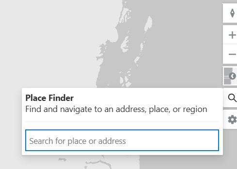 ](./media/search.jpeg#lightbox)

### Apply a mosaic definition

Applying a mosaic definition in the Explorer automatically filters the collection's items based on the mosaic's query. For example, a mosaic can filter for all items collected in the year 2022.

1. Select the filter box to show a dropdown of available mosaic definitions.
2. Select a mosaic definition to show items in the mosaic's query results.

### Select a different render configuration

 At least one render configuration is required to visualize a collection's items in Explorer. If you have multiple, you can change how the item layers are rendered on the map. For example, a render configuration could render the data as natural color, color infrared, or short wave infrared.

1. Select the Render Configuration dropdown to show the list of available render configurations.
2. Select a render configuration to render that item's layer on the map.

[ 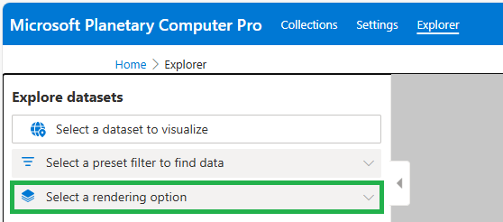 ](media/data-explorer-select-render-configuration.png#lightbox)

### Use advanced filtering

Advanced filtering allows you to expose the queryables defined for the collection and build custom queries that filter the collection's items.

1. Select Advanced.
2. Select filters to expose the list of available queryables. Select the checkbox to add a queryable to your filter.
3. Select the value or range for each queryable you wish to add to your filter.

For example, this screen capture shows the **Acquired** queryable is set to a range of dates. 

[ 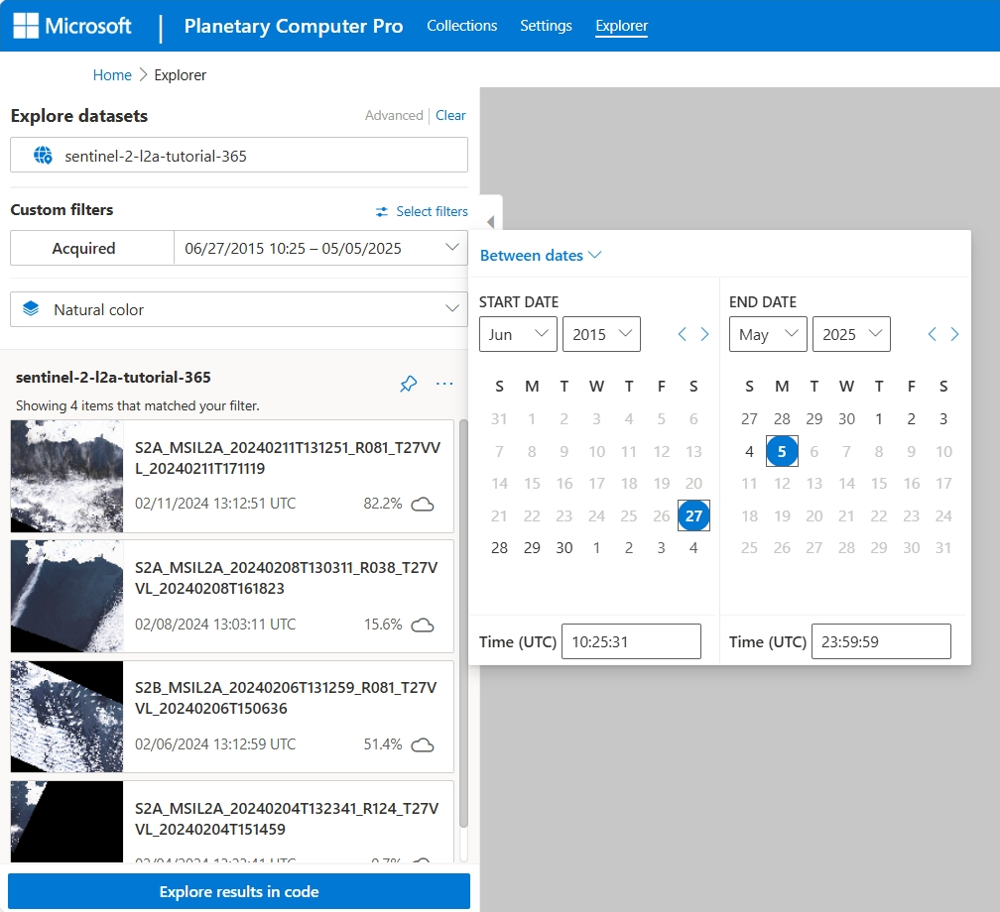 ](./media/queryables.png#lightbox)

## Manipulate the map

### Use map controls

The Explorer supports native map controls on the top right side of the map to rotate, zoom in and out, change the basemap style, search for a location, and update map settings.

[ 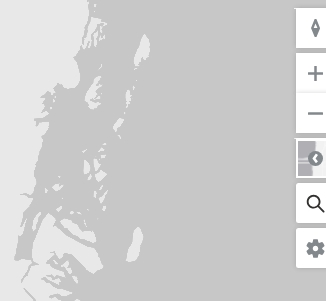 ](./media/zoom.jpeg#lightbox)

### Pin an item layer to the map

You can visualize multiple query results at once by pinning layers to the map.

1. After querying and filtering the collection items to your desired results, select the pin icon to the right of the dataset name in the **Explore Datasets** side-panel.
1. Once pinned, this layer is added to the list of map layers, displayed in the lower right corner of the map, and your query results are cleared.

### Manipulate the map layers

You can manipulate current or pinned map layers.

1. To start, select the layers icon in the bottom right corner of the map.
1. To show or hide a layer, select the eye icon.
1. To change the opacity of a layer, select the circle icon and use the layer opacity slider.
1. To change the order of the layers, select the three dots icon and select **Move layer up** or **Move layer down**.
1. To edit the layer and filter options, select the three dots icon and select Edit layer and filter options.

[ 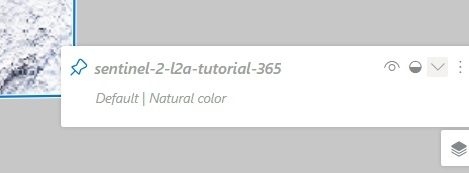 ](./media/layers.jpeg#lightbox)

> [!NOTE]
> The minimum zoom defined in your render configuration determines the map zoom level at which the rendering option should start being valid. If you don't see your item assets on the map, you might need to zoom in further.

## Select an item's code sample

The Explorer provides a Python code sample for each item in the catalog, enabling the user retrieve that item from their Python environment of choice, for example, a Python Notebook. 

1. From the item results panel, select the item of interest.
1. Select the brackets icon to expose the code sample.
1. Select **Copy** to copy the code sample to paste into your Python environment.

[ 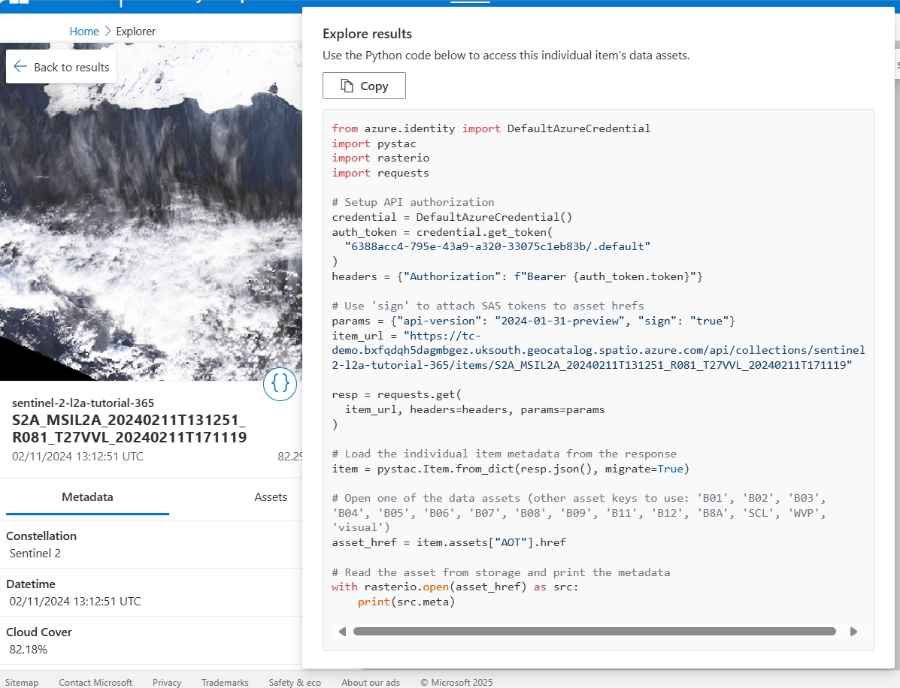 ](./media/code-sample.png#lightbox)

## Add a collection thumbnail

You can set a thumbnail for a collection, the image that represents that collection in your collections overview page.

1. In the Explorer, select a collection to display.
1. Select your desired item asset to display on the map.
1. Zoom in to your desired area.
1. Select the three dots icon to the right of the dataset name in the Explored Datasets side-panel and select **Generate Snapshot Image**.
    [ 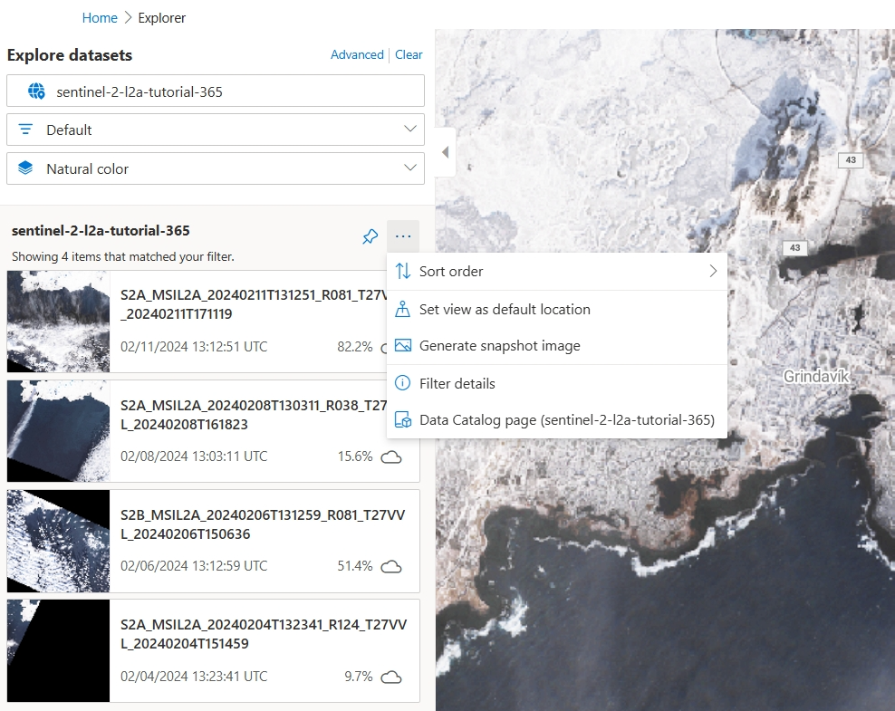 ](./media/generate-snapshot.png#lightbox)
1. Select **Draw export area** and draw a rectangular area on the map.
1. Select an image size.
1. Select **Generate image**.

    

1. After the image is prepared, select the three dots icon on the image and select **Set as collection thumbnail**.

    [ 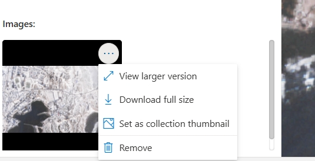 ](./media/set-thumbnail.png#lightbox)

## Related content

* [Create a GeoCatalog](./deploy-geocatalog-resource.md)
* [Create a collection](./create-stac-collection.md)
* [Ingest STAC items](./ingestion-source.md)
* [Create a Render Configuration](./render-configuration.md)
* [Configure collection Tile Settings](./tile-settings.md)
* [Mosaic Configuration](./mosaic-configurations-for-collections.md)
* [Queryables Configuration](./queryables-for-explorer-custom-search-filter.md)
