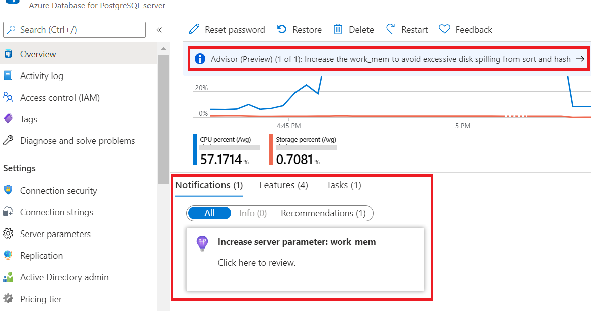

# Azure Advisor for PostgreSQL
Learn about how Azure Advisor is applied to Azure Database for PostgreSQL and get answers to common questions.
## What is Azure Advisor for PostgreSQL?
The Azure Advisor system uses telemetry to issue performance and reliability recommendations for your PostgreSQL database. 
Advisor recommendations are split among our PostgreSQL database offerings:
* Azure Database for PostgreSQL - Single Server
* Azure Database for PostgreSQL - Flexible Server
* Azure Database for PostgreSQL - Hyperscale (Citus)

Some recommendations are common to multiple product offerings, while other recommendations are based on product-specific optimizations.
## Where can I view my recommendations?
Recommendations are available from the **Overview** navigation sidebar in the Azure portal. A preview will appear as a banner notification, and details can be viewed in the **Notifications** section located just below the resource usage graphs.
  
## Recommendation Types
Azure Database for PostgreSQL prioritize the following types of recommendations:
* **Performance**: To improve the speed of your PostgreSQL server. This includes CPU usage, memory pressure, connection pooling, disk utilization, and product-specific server parameters. For more information, see [Advisor Performance recommendations](../advisor/advisor-performance-recommendations.md).
* **Reliability**: To ensure and improve the continuity of your business-critical databases. This includes storage limits, connection limits, and hyperscale data distribution recommendations. For more information, see [Advisor Reliability recommendations](../advisor/advisor-high-availability-recommendations.md).
* **Cost**: To optimize and reduce your overall Azure spending. This includes server right-sizing recommendations. For more information, see [Advisor Cost recommendations](../advisor/advisor-cost-recommendations.md).

## Understanding your recommendations
* **Daily schedule**: For Azure PostgreSQL databases, we check server telemetry and issue recommendations on a daily schedule. If you make a change to your server configuration, the recommendation will remain visible until we re-examine telemetry on the following day. 
* **Performance history**: Some of our recommendations are based on performance history. These recommendations will only appear after a server has been operating with the same configuration for 7 days. If you provision a new server or change to a new v-core configuration, these recommendations will be paused temporarily. This prevents legacy telemetry from triggering recommendations on a newly reconfigured server. However, this also means that some optimizations may not be identified until some time has passed.

## Next Steps
For more information, see [Azure Advisor Overview](../advisor/advisor-overview.md).
