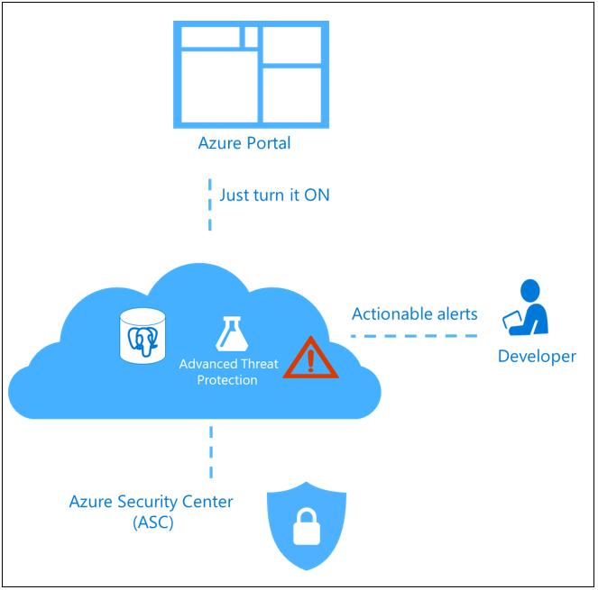

# Advanced Threat Protection in Azure Database for PostgreSQL - Single Server

Advanced Threat Protection for Azure Database for PostgreSQL detects anomalous activities indicating unusual and potentially harmful attempts to access or exploit databases.

> [!NOTE]
> Advanced Threat Protection is in public preview.

Threat Protection is part of the Advanced Threat Protection (ATP) offering, which is a unified package for advanced security capabilities. Advanced Threat Protection can be accessed and managed via the [Azure portal](https://portal.azure.com) or using [REST API](/rest/api/postgresql/serversecurityalertpolicies). The feature is available for General Purpose and Memory Optimized servers.

> [!NOTE]
> The Advanced Threat Protection feature is **not** available in the following Azure government and sovereign cloud regions: US Gov Texas, US Gov Arizona, US Gov Iowa, US, Gov Virginia, US DoD East, US DoD Central, Germany Central, Germany North, China East, China East 2. Please visit [products available by region](https://azure.microsoft.com/global-infrastructure/services/) for general product availability.

## What is Advanced Threat Protection?

Advanced Threat Protection for Azure Database for PostgreSQL provides a new layer of security, which enables customers to detect and respond to potential threats as they occur by providing security alerts on anomalous activities. Users receive an alert upon suspicious database activities, and potential vulnerabilities, as well as anomalous database access and queries patterns. Advanced Threat Protection for Azure Database for PostgreSQL integrates alerts with [Azure Security Center](https://azure.microsoft.com/services/security-center/), which includes details of suspicious activity and recommends action on how to investigate and mitigate the threat. Advanced Threat Protection for Azure Database for PostgreSQL makes it simple to address potential threats to the database without the need to be a security expert or manage advanced security monitoring systems. 

## Advanced Threat Protection alerts 
Advanced Threat Protection for Azure Database for PostgreSQL detects anomalous activities indicating unusual and potentially harmful attempts to access or exploit databases and it can trigger the following alerts:
- **Access from unusual location**: This alert is triggered when there is a change in the access pattern to the Azure Database for PostgreSQL server, where someone has logged on to the Azure Database for PostgreSQL server from an unusual geographical location. In some cases, the alert detects a legitimate action (a new application or developer maintenance). In other cases, the alert detects a malicious action (former employee, external attacker).
- **Access from unusual Azure data center**: This alert is triggered when there is a change in the access pattern to the Azure Database for PostgreSQL server, where someone has logged on to the server from an unusual Azure data center that was seen on this server during the recent period. In some cases, the alert detects a legitimate action (your new application in Azure, Power BI, Azure Database for PostgreSQL Query Editor). In other cases, the alert detects a malicious action from an Azure resource/service (former employee, external attacker).
- **Access from unfamiliar principal**: This alert is triggered when there is a change in the access pattern to the Azure Database for PostgreSQL server, where someone has logged on to the server using an unusual principal (Azure Database for PostgreSQL user). In some cases, the alert detects a legitimate action (new application, developer maintenance). In other cases, the alert detects a malicious action (former employee, external attacker).
- **Access from a potentially harmful application**: This alert is triggered when a potentially harmful application is used to access the database. In some cases, the alert detects penetration testing in action. In other cases, the alert detects an attack using common attack tools.
- **Brute force Azure Database for PostgreSQL credentials**: This alert is triggered when there is an abnormal high number of failed logins with different credentials. In some cases, the alert detects penetration testing in action. In other cases, the alert detects brute force attack.

## Next steps

* Learn more about [Azure Security Center](https://docs.microsoft.com/azure/security-center/security-center-intro)
* For more information on pricing, see the [Azure Database for PostgreSQL Pricing page](https://azure.microsoft.com/pricing/details/postgresql/) 
* Configure [Azure Database for PostgreSQL Advanced Threat Protection](howto-database-threat-protection-portal.md) using the Azure portal  
