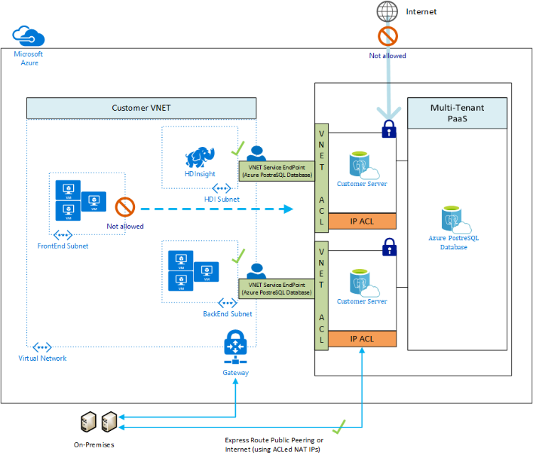

# Use Virtual Network service endpoints and rules for Azure Database for PostgreSQL

*Virtual network rules* are one firewall security feature that controls whether your Azure Database for PostgreSQL server accepts communications that are sent from particular subnets in virtual networks. This article explains why the virtual network rule feature is sometimes your best option for securely allowing communication to your Azure Database for PostgreSQL server.

To create a virtual network rule, there must first be a [virtual network][vm-virtual-network-overview] and a [virtual network service endpoint][vm-virtual-network-service-endpoints-overview-649d] for the rule to reference. The following picture illustrates how a Virtual Network service endpoint works with Azure Database for PostgreSQL:

> [!NOTE]
> For Azure Database for PostgreSQL, this feature is available in Preview in all regions of Azure public cloud.

<a name="anch-terminology-and-description-82f" />

## Terminology and description

**Virtual network:** You can have virtual networks associated with your Azure subscription.

**Subnet:** A virtual network contains **subnets**. Any Azure virtual machines (VMs) that you have are assigned to subnets. One subnet can contain multiple VMs or other compute nodes. Compute nodes that are outside of your virtual network cannot access your virtual network unless you configure your security to allow access.

**Virtual Network service endpoint:** A [Virtual Network service endpoint][vm-virtual-network-service-endpoints-overview-649d] is a subnet whose property values include one or more formal Azure service type names. In this article we are interested in the type name of **Microsoft.Sql**, which refers to the Azure service named SQL Database.

**Virtual network rule:** A virtual network rule for your SQL Database server is a subnet that is listed in the access control list (ACL) of your SQL Database server. To be in the ACL for your SQL Database, the subnet must contain the **Microsoft.Sql** type name.

A virtual network rule tells your SQL Database server to accept communications from every node that is on the subnet.

<a name="anch-benefits-of-a-vnet-rule-68b" />

## Benefits of a virtual network rule

Until you take action, the VMs on your subnets cannot communicate with your SQL Database. One action that establishes the communication is the creation of a virtual network rule. The rationale for choosing the VNet rule approach requires a compare-and-contrast discussion involving the competing security options offered by the firewall.

#### A. Allow access to Azure services

The firewall pane has an **ON/OFF** button that is labeled **Allow access to Azure services**. The **ON** setting allows communications from all Azure IP addresses and all Azure subnets. These Azure IPs or subnets might not be owned by you. This **ON** setting is probably more open than you want your SQL Database to be. The virtual network rule feature offers much finer granular control.

#### B. IP rules

The SQL Database firewall allows you to specify IP address ranges from which communications are accepted into SQL Database. This approach is fine for stable IP addresses that are outside the Azure private network. But many nodes inside the Azure private network are configured with *dynamic* IP addresses. Dynamic IP addresses might change, such as when your VM is restarted. It would be folly to specify a dynamic IP address in a firewall rule, in a production environment.

You can salvage the IP option by obtaining a *static* IP address for your VM. For details, see [Configure private IP addresses for a virtual machine by using the Azure portal][vm-configure-private-ip-addresses-for-a-virtual-machine-using-the-azure-portal-321w].

However, the static IP approach can become difficult to manage, and it is costly when done at scale. Virtual network rules are easier to establish and to manage.

#### C. Cannot yet have SQL Database on a subnet

If your Azure SQL Database server was a node on a subnet in your virtual network, all nodes within the virtual network could communicate with your SQL Database. In this case, your VMs could communicate with SQL Database without needing any virtual network rules or IP rules.

However as of September 2017, the Azure SQL Database service is not yet among the services that can be assigned to a subnet.

<a name="anch-details-about-vnet-rules-38q" />

## Details about virtual network rules

This section describes several details about virtual network rules.

#### Only one geographic region

Each Virtual Network service endpoint applies to only one Azure region. The endpoint does not enable other regions to accept communication from the subnet.

Any virtual network rule is limited to the region that its underlying endpoint applies to.

#### Server-level, not database-level

Each virtual network rule applies to your whole Azure SQL Database server, not just to one particular database on the server. In other words, virtual network rule applies at the server-level, not at the database-level.

- In contrast, IP rules can apply at either level.

#### Security administration roles

There is a separation of security roles in the administration of Virtual Network service endpoints. Action is required from each of the following roles:

- **Network Admin:** &nbsp; Turn on the endpoint.
- **Database Admin:** &nbsp; Update the access control list (ACL) to add the given subnet to the SQL Database server.

*RBAC alternative:*

The roles of Network Admin and Database Admin have more capabilities than are needed to manage virtual network rules. Only a subset of their capabilities is needed.

You have the option of using [role-based access control (RBAC)][rbac-what-is-813s] in Azure to create a single custom role that has only the necessary subset of capabilities. The custom role could be used instead of involving either the Network Admin or the Database Admin. The surface area of your security exposure is lower if you add a user to a custom role, versus adding the user to the other two major administrator roles.

> [!NOTE]
> In some cases the Azure SQL Database and the VNet-subnet are in different subscriptions. In these cases you must ensure the following configurations:
> - Both subscriptions must be in the same Azure Active Directory tenant.
> - The user has the required permissions to initiate operations, such as enabling service endpoints and adding a VNet-subnet to the given Server.

## Limitations

For Azure SQL Database, the virtual network rules feature has the following limitations:

- At present, an Azure Web App in a subnet that has **Service Endpoints** turned on does not yet function as expected. We are working on enabling this functionality.
    - Until this feature is fully implemented, we recommend that you move your Web App to a different subnet that does not have service endpoints turned on for SQL.

- In the firewall for your SQL Database, each virtual network rule references a subnet. All these referenced subnets must be hosted in the same geographic region that hosts the SQL Database.

- Each Azure SQL Database server can have up to 128 ACL entries for any given virtual network.

- Virtual network rules apply only to Azure Resource Manager virtual networks; and not to [classic deployment model][arm-deployment-model-568f] networks.

- Turning ON virtual network service endpoints to Azure SQL Database also enables the endpoints for the MySQL and PostGres Azure services. However, with endpoints ON, attempts to connect from the endpoints to your MySQL or Postgres instances will fail.
    - The underlying reason is that MySQL and PostGres do not presently support ACLing.

- On the firewall, IP address ranges do apply to the following networking items, but virtual network rules do not:
    - [Site-to-Site (S2S) virtual private network (VPN)][vpn-gateway-indexmd-608y]
    - On-premises via [ExpressRoute][expressroute-indexmd-744v]

#### ExpressRoute

If your network is connected to the Azure network through use of [ExpressRoute][expressroute-indexmd-744v], each circuit is configured with two public IP addresses at the Microsoft Edge. The two IP addresses are used to connect to Microsoft Services, such as to Azure Storage, by using Azure Public Peering.

To allow communication from your circuit to Azure SQL Database, you must create IP network rules for the public IP addresses of your circuits. In order to find the public IP addresses of your ExpressRoute circuit, open a support ticket with ExpressRoute by using the Azure portal.

## Related articles
- [Azure virtual networks][vm-virtual-network-overview]
- [Azure virtual network service endpoints][vm-virtual-network-service-endpoints-overview-649d]

<!-- Link references, to text, Within this same Github repo. -->
[vm-virtual-network-overview]: https://docs.microsoft.com/en-us/azure/virtual-network/virtual-networks-overview
[vm-virtual-network-service-endpoints-overview-649d]: https://docs.microsoft.com/azure/virtual-network/virtual-network-service-endpoints-overview