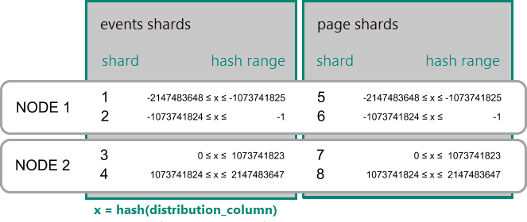
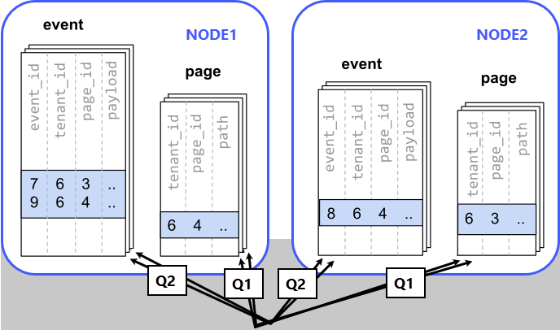
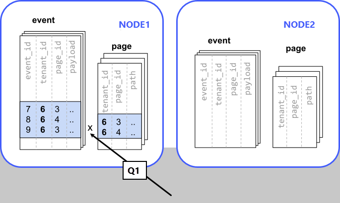

# Table colocation in Azure Database for PostgreSQL – Hyperscale (Citus) (preview)

Co-location is the practice of dividing data tactically, where one keeps
related information on the same nodes to enable efficient relational
operations, but takes advantage of the horizontal scalability for the whole
dataset.

The principle of data co-location is that all tables in the database
have a common distribution column and are sharded across nodes in the
same way, such that rows with the same distribution column value are
always on the same machine, even across different tables. As long as the
distribution column provides a meaningful grouping of data, relational
operations can be performed within the groups.

## Data co-location for hash-distributed tables

In a Hyperscale, a row is stored in a shard if the hash of the value
in the distribution column falls within the shard's hash range. To
ensure co-location, shards with the same hash range are always
placed on the same node even after rebalance operations, such that
equal distribution column values are always on the same node across
tables.



A distribution column that we've found to work well in practice is
tenant ID in multi-tenant applications. For example, SaaS applications
typically have many tenants, but every query they make is specific to a
particular tenant. While one option is providing a database or schema
for every tenant, it is often costly and impractical as there can be
many operations that span across users (data loading, migrations,
aggregations, analytics, schema changes, backups, etc). That becomes
harder to manage as the number of tenants grows.

## A practical example of co-location

Consider the following tables which might be part of a multi-tenant web
analytics SaaS:

```sql
CREATE TABLE event (
  tenant_id int,
  event_id bigint,
  page_id int,
  payload jsonb,
  primary key (tenant_id, event_id)
);

CREATE TABLE page (
  tenant_id int,
  page_id int,
  path text,
  primary key (tenant_id, page_id)
);
```

Now we want to answer queries that may be issued by a customer-facing
dashboard, such as: "Return the number of visits in the past week for
all pages starting with '/blog' in tenant six."

## Using regular PostgreSQL tables

If our data was in a single PostgreSQL node, we could easily express our
query using the rich set of relational operations offered by SQL:

```sql
SELECT page_id, count(event_id)
FROM
  page
LEFT JOIN  (
  SELECT * FROM event
  WHERE (payload->>'time')::timestamptz >= now() - interval '1 week'
) recent
USING (tenant_id, page_id)
WHERE tenant_id = 6 AND path LIKE '/blog%'
GROUP BY page_id;
```

As long as the [working set](https://en.wikipedia.org/wiki/Working_set)
for this query fits in memory, this is an appropriate solution for many
application since it offers maximum flexibility. However, even if you
don't need to scale yet, it can be useful to consider the implications
of scaling out on your data model.

## Distributing tables by ID

As the number of tenants and the data stored for each tenant grows,
query times will typically go up as the working set no longer fits in
memory or CPU becomes a bottleneck. In this case, we can shard the data
across many nodes using Citus. The first and most important choice we
need to make when sharding is the distribution column. Let's start with
a naive choice of using `event_id` for the event table and `page_id` for
the `page` table:

```sql
-- naively use event_id and page_id as distribution columns

SELECT create_distributed_table('event', 'event_id');
SELECT create_distributed_table('page', 'page_id');
```

Given that the data is dispersed across different workers, we cannot
simply perform a join as we would on a single PostgreSQL node. Instead,
we will need to issue two queries:

Across all shards of the page table (Q1):

```sql
SELECT page_id FROM page WHERE path LIKE '/blog%' AND tenant_id = 6;
```

Across all shards of the event table (Q2):

```sql
SELECT page_id, count(*) AS count
FROM event
WHERE page_id IN (/*…page IDs from first query…*/)
  AND tenant_id = 6
  AND (payload->>'time')::date >= now() - interval '1 week'
GROUP BY page_id ORDER BY count DESC LIMIT 10;
```

Afterwards, the results from the two steps need to be combined by the
application.

The data required to answer the query is scattered across the shards on
the different nodes and each of those shards will need to be queried:



In this case the data distribution creates substantial drawbacks:

-   Overhead from querying each shard, running multiple queries
-   Overhead of Q1 returning many rows to the client
-   Q2 becoming very large
-   The need to write queries in multiple steps, combine results,
    requires changes in the application

A potential upside of the relevant data being dispersed is that the queries can
be parallelised, which Hyperscale will do. However, this is only beneficial if
the amount of work that the query does is substantially greater than the
overhead of querying many shards.

## Distributing tables by tenant

Looking at our query again, we can see that all the rows that the query
needs have one dimension in common: `tenant_id`. The dashboard will only
ever query for a tenant's own data. That means that if data for the same
tenant are always co-located on a single PostgreSQL node, our original
query could be answered in a single step by that node by performing a
join on `tenant_id` and `page_id`.

In Citus, rows with the same distribution column value are guaranteed to
be on the same node. Each shard in a distributed table effectively has a
set of co-located shards from other distributed tables that contain the
same distribution column values (data for the same tenant). Starting
over, we can create our tables with `tenant_id` as the distribution
column.

```sql
-- co-locate tables by using a common distribution column
SELECT create_distributed_table('event', 'tenant_id');
SELECT create_distributed_table('page', 'tenant_id', colocate_with => 'event');
```

In this case, Citus can answer the same query that you would run on a
single PostgreSQL node without modification (Q1):

```sql
SELECT page_id, count(event_id)
FROM
  page
LEFT JOIN  (
  SELECT * FROM event
  WHERE (payload->>'time')::timestamptz >= now() - interval '1 week'
) recent
USING (tenant_id, page_id)
WHERE tenant_id = 6 AND path LIKE '/blog%'
GROUP BY page_id;
```

Because of the tenantid filter and join on tenantid, Citus knows that
the entire query can be answered using the set of co-located shards that
contain the data for that particular tenant, and the PostgreSQL node can
answer the query in a single step, which enables full SQL support.



In some cases, queries and table schemas will require minor
modifications to ensure that the tenant\_id is always included in unique
constraints and join conditions. However, this is usually a
straightforward change, and the extensive rewrite that would be required
without having co-location is avoided.

While the example above queries just one node because there is a
specific tenant\_id = 6 filter, co-location also allows us to
efficiently perform distributed joins on tenant\_id across all nodes, be
it with SQL limitations.

## Co-location means better feature support

The full list of Hyperscale features that are unlocked by co-location are:

-   Full SQL support for queries on a single set of co-located shards
-   Multi-statement transaction support for modifications on a single
    set of co-located shards
-   Aggregation through INSERT..SELECT
-   Foreign keys
-   Distributed outer joins
