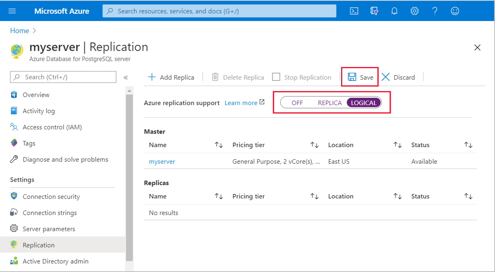
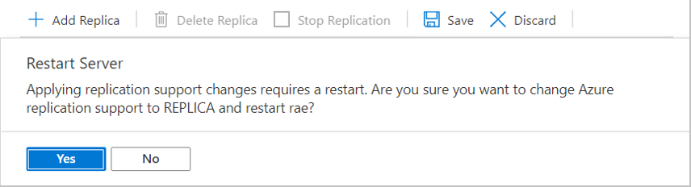

# Logical decoding
 
[Logical decoding in PostgreSQL](https://www.postgresql.org/docs/current/logicaldecoding.html) allows you to stream data changes to external consumers. Logical decoding is popularly used for event streaming and change data capture scenarios.

Logical decoding uses an output plugin to convert Postgres’s write ahead log (WAL) into a readable format. Azure Database for PostgreSQL provides two output plugins: [test_decoding](https://www.postgresql.org/docs/current/test-decoding.html) and [wal2json](https://github.com/eulerto/wal2json).

> [!NOTE]
> Logical decoding is in public preview on Azure Database for PostgreSQL - Single Server.


## Set up your server 
Logical decoding and [read replicas](concepts-read-replicas.md) both depend on the Postgres write ahead log (WAL) for information. These two features need different levels of logging from Postgres. Logical decoding needs a higher level of logging than read replicas.

To configure the right level of logging, use the Azure replication support parameter. Azure replication support has three setting options:

* **Off** - Puts the least information in the WAL. This setting is not available on most Azure Database for PostgreSQL servers.  
* **Replica** - More verbose than **Off**. This is the minimum level of logging needed for [read replicas](concepts-read-replicas.md) to work. This setting is the default on most servers.
* **Logical** - More verbose than **Replica**. This is the minimum level of logging for logical decoding to work. Read replicas also work at this setting.

The server needs to be restarted after a change of this parameter. Internally, this parameter sets the Postgres parameters `wal_level`, `max_replication_slots`, and `max_wal_senders`.

### Using Azure CLI

1. Set azure.replication_support to `logical`.
   ```
   az postgres server configuration set --resource-group mygroup --server-name myserver --name azure.replication_support --value logical
   ``` 

2. Restart the server to apply the change.
   ```
   az postgres server restart --resource-group mygroup --name myserver
   ```

### Using Azure portal

1. Set Azure replication support to **logical**. Select **Save**.

   

2. Restart the server to apply the change by selecting **Yes**.

   


## Start logical decoding

Logical decoding can be consumed via streaming protocol or SQL interface. Both methods use [replication slots](https://www.postgresql.org/docs/current/logicaldecoding-explanation.html#LOGICALDECODING-REPLICATION-SLOTS). A slot represents a stream of changes from a single database.

Using a replication slot requires Postgres's replication privileges. At this time, the replication privilege is only available for the server's admin user. 

### Streaming protocol
Consuming changes using the streaming protocol is often preferable. You can create your own consumer / connector, or use a tool like [Debezium](https://debezium.io/). 

Visit the wal2json documentation for [an example using the streaming protocol with pg_recvlogical](https://github.com/eulerto/wal2json#pg_recvlogical).


### SQL interface
In the example below, we use the SQL interface with the wal2json plugin.
 
1. Create a slot.
   ```SQL
   SELECT * FROM pg_create_logical_replication_slot('test_slot', 'wal2json');
   ```
 
2. Issue SQL commands. For example:
   ```SQL
   CREATE TABLE a_table (
      id varchar(40) NOT NULL,
      item varchar(40),
      PRIMARY KEY (id)
   );
   
   INSERT INTO a_table (id, item) VALUES ('id1', 'item1');
   DELETE FROM a_table WHERE id='id1';
   ```

3. Consume the changes.
   ```SQL
   SELECT data FROM pg_logical_slot_get_changes('test_slot', NULL, NULL, 'pretty-print', '1');
   ```

   The output will look like:
   ```
   {
         "change": [
         ]
   }
   {
         "change": [
                  {
                           "kind": "insert",
                           "schema": "public",
                           "table": "a_table",
                           "columnnames": ["id", "item"],
                           "columntypes": ["character varying(40)", "character varying(40)"],
                           "columnvalues": ["id1", "item1"]
                  }
         ]
   }
   {
         "change": [
                  {
                           "kind": "delete",
                           "schema": "public",
                           "table": "a_table",
                           "oldkeys": {
                                 "keynames": ["id"],
                                 "keytypes": ["character varying(40)"],
                                 "keyvalues": ["id1"]
                           }
                  }
         ]
   }
   ```

4. Drop the slot once you are done using it.
   ```SQL
   SELECT pg_drop_replication_slot('test_slot'); 
   ```


## Monitoring slots

You must monitor logical decoding. Any unused replication slot must be dropped. Slots hold on to Postgres WAL logs and relevant system catalogs until changes have been read by a consumer. If your consumer fails or has not been properly configured, the unconsumed logs will pile up and fill your storage. Also, unconsumed logs increase the risk of transaction ID wraparound. Both situations can cause the server to become unavailable. Therefore, it is critical that logical replication slots are consumed continuously. If a logical replication slot is no longer used, drop it immediately.

The 'active' column in the pg_replication_slots view will indicate whether there is a consumer connected to a slot.
```SQL
SELECT * FROM pg_replication_slots;
```

[Set alerts](howto-alert-on-metric.md) on *Storage used* and *Max lag across replicas* metrics to notify you when the values increase past normal thresholds. 

> [!IMPORTANT]
> You must drop unused replication slots. Failing to do so can lead to server unavailability.

## How to drop a slot
If you are not actively consuming a replication slot you should drop it.

To drop a replication slot called `test_slot` using SQL:
```SQL
SELECT pg_drop_replication_slot('test_slot');
```

> [!IMPORTANT]
> If you stop using logical decoding, change azure.replication_support back to `replica` or `off`. The WAL details retained by `logical` are more verbose, and should be disabled when logical decoding is not in use. 

 
## Next steps

* Visit the Postgres documentation to [learn more about logical decoding](https://www.postgresql.org/docs/current/logicaldecoding-explanation.html).
* Reach out to [our team](mailto:AskAzureDBforPostgreSQL@service.microsoft.com) if you have questions about logical decoding.
* Learn more about [read replicas](concepts-read-replicas.md).

