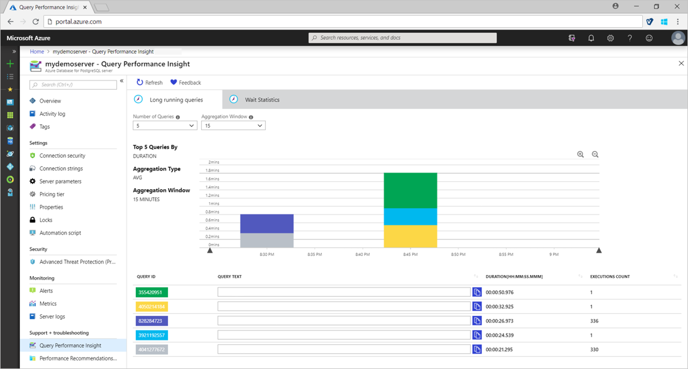
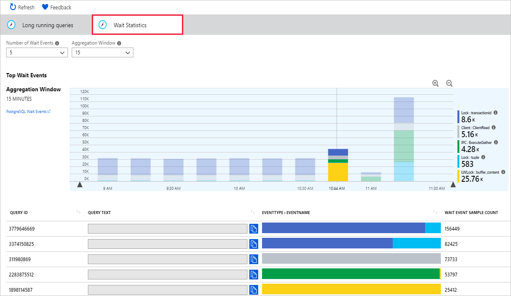

# Query Performance Insight 

**Applies to:** Azure Database for PostgreSQL - Single Server versions 9.6, 10, 11

Query Performance Insight helps you to quickly identify what your longest running queries are, how they change over time, and what waits are affecting them.

## Permissions
**Owner** or **Contributor** permissions required to view the text of the queries in Query Performance Insight. **Reader** can view charts and tables but not query text.

## Prerequisites
For Query Performance Insight to function, data must exist in the [Query Store](concepts-query-store.md).

## Viewing performance insights
The [Query Performance Insight](concepts-query-performance-insight.md) view in the Azure portal will surface visualizations on key information from Query Store. 

In the portal page of your Azure Database for PostgreSQL server, select **Query performance Insight** under the **Intelligent Performance** section of the menu bar.

The **Long running queries** tab shows the top five queries by average duration per execution, aggregated in 15-minute intervals. You can view more queries by selecting from the **Number of Queries** drop down. The chart colors may change for a specific Query ID when you do this.

You can click and drag in the chart to narrow down to a specific time window. Alternatively, use the zoom in and out icons to view a smaller or larger period of time respectively.

The table below the chart gives more details about the long-running queries in that time window.

Select the **Wait Statistics** tab to view the corresponding visualizations on waits in the server.

## Considerations
* Query Performance Insight is not available for [read replicas](concepts-read-replicas.md).

## Next steps
- Learn more about [monitoring and tuning](concepts-monitoring.md) in Azure Database for PostgreSQL.

