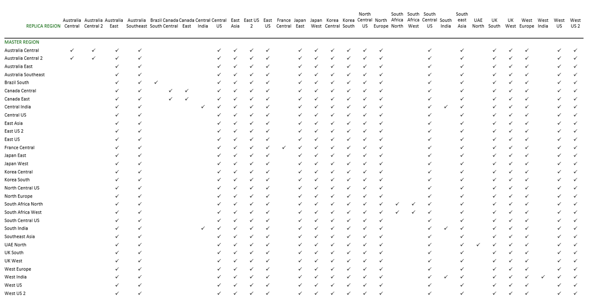

# Read replicas in Azure Database for PostgreSQL - Single Server

The read replica feature allows you to replicate data from an Azure Database for PostgreSQL server to a read-only server. You can replicate from the master server to up to five replicas. Replicas are updated asynchronously with the PostgreSQL engine native replication technology.

Replicas are new servers that you manage similar to regular Azure Database for PostgreSQL servers. For each read replica, you're billed for the provisioned compute in vCores and storage in GB/ month.

Learn how to [create and manage replicas](howto-read-replicas-portal.md).

## When to use a read replica
The read replica feature helps to improve the performance and scale of read-intensive workloads. Read workloads can be isolated to the replicas, while write workloads can be directed to the master.

A common scenario is to have BI and analytical workloads use the read replica as the data source for reporting.

Because replicas are read-only, they don't directly reduce write-capacity burdens on the master. This feature isn't targeted at write-intensive workloads.

The read replica feature uses PostgreSQL asynchronous replication. The feature isn't meant for synchronous replication scenarios. There will be a measurable delay between the master and the replica. The data on the replica eventually becomes consistent with the data on the master. Use this feature for workloads that can accommodate this delay.

## Cross-region replication
You can create a read replica in a different region from your master server. Cross-region replication can be helpful for scenarios like disaster recovery planning or bringing data closer to your users.

>[!NOTE]
> Basic tier servers only support same-region replication.

You can have a master server in any [Azure Database for PostgreSQL region](https://azure.microsoft.com/global-infrastructure/services/?products=postgresql). A master server can have a replica in its paired region or the universal replica regions. The picture below shows which replica regions are available depending on your master region.

[ ](media/concepts-read-replica/read-replica-regions.png#lightbox)

### Universal replica regions
You can always create a read replica in any of the following regions, regardless of where your master server is located. These are the universal replica regions:

Australia East, Australia Southeast, Central US, East Asia, East US, East US 2, Japan East, Japan West, Korea Central, Korea South, North Central US, North Europe, South Central US, Southeast Asia, UK South, UK West, West Europe, West US, West US 2, West Central US.

### Paired regions
In addition to the universal replica regions, you can create a read replica in the Azure paired region of your master server. If you don't know your region's pair, you can learn more from the [Azure Paired Regions article](../best-practices-availability-paired-regions.md).

If you are using cross-region replicas for disaster recovery planning, we recommend you create the replica in the paired region instead of one of the other regions. Paired regions avoid simultaneous updates and prioritize physical isolation and data residency.  

There are limitations to consider: 

* Regional availability: Azure Database for PostgreSQL is available in France Central, UAE North, and Germany Central. However, their paired regions are not available.
	
* Uni-directional pairs: Some Azure regions are paired in one direction only. These regions include West India, Brazil South. 
   This means that a master server in West India can create a replica in South India. However, a master server in South India cannot create a replica in West India. This is because West India's secondary region is South India, but South India's secondary region is not West India.


## Create a replica
When you start the create replica workflow, a blank Azure Database for PostgreSQL server is created. The new server is filled with the data that was on the master server. The creation time depends on the amount of data on the master and the time since the last weekly full backup. The time can range from a few minutes to several hours.

Every replica is enabled for storage [auto-grow](concepts-pricing-tiers.md#storage-auto-grow). The auto-grow feature allows the replica to keep up with the data replicated to it, and prevent a break in replication caused by out of storage errors.

The read replica feature uses PostgreSQL physical replication, not logical replication. Streaming replication by using replication slots is the default operation mode. When necessary, log shipping is used to catch up.

Learn how to [create a read replica in the Azure portal](howto-read-replicas-portal.md).

## Connect to a replica
When you create a replica, it doesn't inherit the firewall rules or VNet service endpoint of the master server. These rules must be set up independently for the replica.

The replica inherits the admin account from the master server. All user accounts on the master server are replicated to the read replicas. You can only connect to a read replica by using the user accounts that are available on the master server.

You can connect to the replica by using its hostname and a valid user account, as you would on a regular Azure Database for PostgreSQL server. For a server named **my replica** with the admin username **myadmin**, you can connect to the replica by using psql:

```
psql -h myreplica.postgres.database.azure.com -U myadmin@myreplica -d postgres
```

At the prompt, enter the password for the user account.

## Monitor replication
Azure Database for PostgreSQL provides two metrics for monitoring replication. The two metrics are **Max Lag Across Replicas** and **Replica Lag**. To learn how to view these metrics, see the **Monitor a replica** section of the [read replica how-to article](howto-read-replicas-portal.md).

The **Max Lag Across Replicas** metric shows the lag in bytes between the master and the most-lagging replica. This metric is available on the master server only.

The **Replica Lag** metric shows the time since the last replayed transaction. If there are no transactions occurring on your master server, the metric reflects this time lag. This metric is available for replica servers only. Replica Lag is calculated from the `pg_stat_wal_receiver` view:

```SQL
EXTRACT (EPOCH FROM now() - pg_last_xact_replay_timestamp());
```

Set an alert to inform you when the replica lag reaches a value that isn’t acceptable for your workload. 

For additional insight, query the master server directly to get the replication lag in bytes on all replicas.

In PostgreSQL version 10:

```SQL
select pg_wal_lsn_diff(pg_current_wal_lsn(), replay_lsn) 
AS total_log_delay_in_bytes from pg_stat_replication;
```

In PostgreSQL version 9.6 and earlier:

```SQL
select pg_xlog_location_diff(pg_current_xlog_location(), replay_location) 
AS total_log_delay_in_bytes from pg_stat_replication;
```

> [!NOTE]
> If a master server or read replica restarts, the time it takes to restart and catch up is reflected in the Replica Lag metric.

## Stop replication
You can stop replication between a master and a replica. The stop action causes the replica to restart and to remove its replication settings. After replication is stopped between a master server and a read replica, the replica becomes a standalone server. The data in the standalone server is the data that was available on the replica at the time the stop replication command was started. The standalone server doesn't catch up with the master server.

> [!IMPORTANT]
> The standalone server can't be made into a replica again.
> Before you stop replication on a read replica, ensure the replica has all the data that you require.

When you stop replication, the replica loses all links to its previous master and other replicas.

Learn how to [stop replication to a replica](howto-read-replicas-portal.md).

## Failover
There is no automated failover between master and replica servers. 

Since replication is asynchronous, there is lag between the master and the replica. The amount of lag can be influenced by a number of factors like how heavy the workload running on the master server is and the latency between data centers. In most cases, replica lag ranges between a few seconds to a couple minutes. You can track your actual replication lag using the metric *Replica Lag*, which is available for each replica. This metric shows the time since the last replayed transaction. We recommend that you identify what your average lag is by observing your replica lag over a period of time. You can set an alert on replica lag, so that if it goes outside your expected range, you can take action.

> [!Tip]
> If you failover to the replica, the lag at the time you delink the replica from the master will indicate how much data is lost.

Once you have decided you want to failover to a replica, 

1. Stop replication to the replica<br/>
   This step is necessary to make the replica server able to accept writes. As part of this process, the replica server will restart and be delinked from the master. Once you initiate stop replication, the backend process typically takes about 2 minutes to complete. See the [stop replication](#stop-replication) section of this article to understand the implications of this action.
	
2. Point your application to the (former) replica<br/>
   Each server has a unique connection string. Update your application to point to the (former) replica instead of the master.
	
Once your application is successfully processing reads and writes, you have completed the failover. The amount of downtime your application experiences will depend on when you detect an issue and complete steps 1 and 2 above.


## Considerations

This section summarizes considerations about the read replica feature.

### Prerequisites
Read replicas and [logical decoding](concepts-logical.md) both depend on the Postgres write ahead log (WAL) for information. These two features need different levels of logging from Postgres. Logical decoding needs a higher level of logging than read replicas.

To configure the right level of logging, use the Azure replication support parameter. Azure replication support has three setting options:

* **Off** - Puts the least information in the WAL. This setting is not available on most Azure Database for PostgreSQL servers.  
* **Replica** - More verbose than **Off**. This is the minimum level of logging needed for [read replicas](concepts-read-replicas.md) to work. This setting is the default on most servers.
* **Logical** - More verbose than **Replica**. This is the minimum level of logging for logical decoding to work. Read replicas also work at this setting.

The server needs to be restarted after a change of this parameter. Internally, this parameter sets the Postgres parameters `wal_level`, `max_replication_slots`, and `max_wal_senders`.

### New replicas
A read replica is created as a new Azure Database for PostgreSQL server. An existing server can't be made into a replica. You can't create a replica of another read replica.

### Replica configuration
A replica is created by using the same compute and storage settings as the master. After a replica is created, several settings can be changed independently from the master server: compute generation, vCores, storage, and backup retention period. The pricing tier can also be changed independently, except to or from the Basic tier.

> [!IMPORTANT]
> Before a master setting is updated to a new value, update the replica configuration to an equal or greater value. This action ensures the replica can keep up with any changes made to the master.

PostgreSQL requires the value of the `max_connections` parameter on the read replica to be greater than or equal to the master value; otherwise, the replica won't start. In Azure Database for PostgreSQL, the `max_connections` parameter value is based on the SKU. For more information, see [Limits in Azure Database for PostgreSQL](concepts-limits.md). 

If you try to update the server values described above, but don't adhere to the limits, you receive an error.

Firewall rules, virtual network rules, and parameter settings are not inherited from the master server to the replica when the replica is created or afterwards.

### Basic tier
Basic tier servers only support same-region replication.

### max_prepared_transactions
[PostgreSQL requires](https://www.postgresql.org/docs/current/runtime-config-resource.html#GUC-MAX-PREPARED-TRANSACTIONS) the value of the `max_prepared_transactions` parameter on the read replica to be greater than or equal to the master value; otherwise, the replica won't start. If you want to change `max_prepared_transactions` on the master, first change it on the replicas.

### Stopped replicas
If you stop replication between a master server and a read replica, the replica restarts to apply the change. The stopped replica becomes a standalone server that accepts both reads and writes. The standalone server can't be made into a replica again.

### Deleted master and standalone servers
When a master server is deleted, all of its read replicas become standalone servers. The replicas are restarted to reflect this change.

## Next steps
* Learn how to [create and manage read replicas in the Azure portal](howto-read-replicas-portal.md).
* Learn how to [create and manage read replicas in the Azure CLI and REST API](howto-read-replicas-cli.md).
