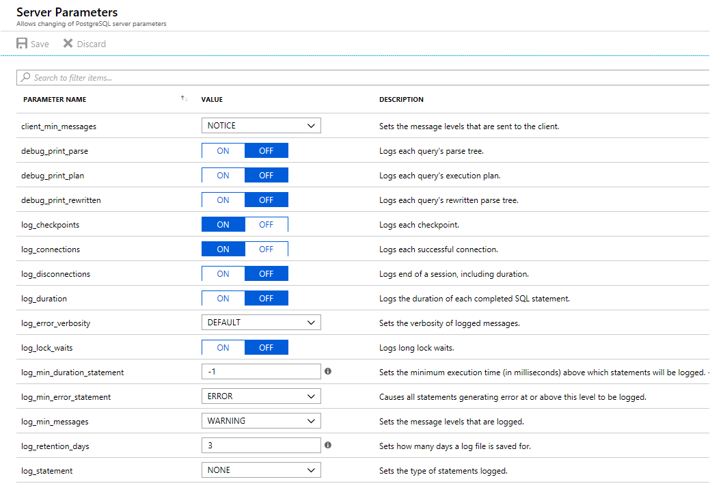

---
title: Logs - Azure Database for PostgreSQL - Single Server
description: Describes logging configuration, storage and analysis in Azure Database for PostgreSQL - Single Server
author: rachel-msft
ms.author: raagyema
ms.service: postgresql
ms.topic: conceptual
ms.date: 10/25/2019
---

# Logs in Azure Database for PostgreSQL - Single Server
Azure Database for PostgreSQL allows you to configure and access Postgres's standard logs. The logs can be used to identify, troubleshoot, and repair configuration errors and suboptimal performance. Logging information you can configure and access includes errors, query information, autovacuum records, connections, and checkpoints. (Access to transaction logs is not available).

Audit logging is made available through a Postgres extension, pgaudit. To learn more, visit the [auditing concepts](concepts-audit.md) article.


## Configure logging 
You can configure Postgres standard logging on your server using the logging server parameters. On each Azure Database for PostgreSQL server, `log_checkpoints` and `log_connections` are on by default. There are additional parameters you can adjust to suit your logging needs: 



To learn more about Postgres log parameters, visit the [When To Log](https://www.postgresql.org/docs/current/runtime-config-logging.html#RUNTIME-CONFIG-LOGGING-WHEN) and [What To Log](https://www.postgresql.org/docs/current/runtime-config-logging.html#RUNTIME-CONFIG-LOGGING-WHAT) sections of the Postgres documentation. Most, but not all, Postgres logging parameters are available to configure in Azure Database for PostgreSQL.

To learn how to configure parameters in Azure Database for PostgreSQL, see the [portal documentation](howto-configure-server-parameters-using-portal.md) or the [CLI documentation](howto-configure-server-parameters-using-cli.md). 

> [!NOTE]
> Configuring a high volume of logs, for example statement logging, can add significant performance overhead. 

## Access .log files
The default log format in Azure Database for PostgreSQL is .log. A sample line from this log looks like:

```
2019-10-14 17:00:03 UTC-5d773cc3.3c-LOG: connection received: host=101.0.0.6 port=34331 pid=16216
```

Azure Database for PostgreSQL provides a short-term storage location for the .log files. A new file begins every 1 hour or 100 MB, whichever comes first. Logs are appended to the current file as they are emitted from Postgres.  

You can set the retention period for this short-term log storage using the `log_retention_period` parameter. The default value is 3 days; the maximum value is 7 days. The short-term storage location can hold up to 1 GB of log files. After 1 GB, the oldest files, regardless of retention period, will be deleted to make room for new logs. 

For longer-term retention of logs and log analysis, you can download the .log files and move them to a third-party service. You can download the files using the [Azure portal](howto-configure-server-logs-in-portal.md), [Azure CLI](howto-configure-server-logs-using-cli.md). Alternatively, you can configure Azure Monitor diagnostic settings which automatically emits your logs (in JSON format) to longer-term locations. Learn more about this option in the section below. 

You can stop generating .log files by setting the parameter `logging_collector` to OFF. Turning off .log file generation is recommended if you are using Azure Monitor diagnostic settings. This configuration will reduce the performance impact of additional logging.

## Diagnostic logs
Azure Database for PostgreSQL is integrated with Azure Monitor diagnostic settings. Diagnostic settings allows you to send your Postgres logs in JSON format to Azure Monitor Logs for analytics and alerting, Event Hubs for streaming, and Azure Storage for archiving. 

> [!IMPORTANT]
> This diagnostic feature for server logs is only available in the General Purpose and Memory Optimized [pricing tiers](concepts-pricing-tiers.md).


### Configure diagnostic settings
You can enable diagnostic settings for your Postgres server using the Azure portal, CLI, REST API, and Powershell. The log category to select is **PostgreSQLLogs**. (There are other logs you can configure if you are using [Query Store](concepts-query-store.md).)

To enable Diagnostic logs using the Azure portal:

   1. In the portal, go to *Diagnostic Settings* in the navigation menu of your Postgres server.
   2. Select *Add Diagnostic Setting*.
   3. Name this setting. 
   4. Select your preferred endpoint (storage account, event hub, log analytics). 
   5. Select the log type **PostgreSQLLogs**.
   7. Save your setting.

To enable Diagnostic logs using Powershell, CLI, or REST API, visit the [diagnostic settings](../azure-monitor/platform/diagnostic-settings.md) article.

### Access diagnostic logs

The way you access the logs depends on which endpoint you choose. For Azure Storage, the schema is described in the [logs storage account](../azure-monitor/platform/resource-logs-collect-storage.md) article. For Event Hubs, see the [stream Azure logs](../azure-monitor/platform/resource-logs-stream-event-hubs.md) article.

For Azure Monitor Logs, logs are sent to the workspace you selected. The Postgres logs use the **AzureDiagnostics** collection mode, so they can be queried from the AzureDiagnostics table. The fields in the table are described below. Learn more about querying and alerting in the [Azure Monitor Logs query](../azure-monitor/log-query/log-query-overview.md) overview.

The following are queries you can try to get started. You can configure alerts based on queries.

Search for all Postgres logs for a particular server in the last day
```
AzureDiagnostics
| where LogicalServerName_s == 'myservername'
| where TimeGenerated > ago(1d) 
```

Search for all non-localhost connection attempts
```
AzureDiagnostics
| where Message contains "connection received" and Message !contains "host=127.0.0.1"
| where Category == "PostgreSQLLogs" and TimeGenerated > ago(6h)
```
The query above will show results over the last 6 hours for any Postgres server logging in this workspace.

### Log format

The following table describes the fields for the **PostgreSQLLogs** type. Depending on the output endpoint you choose, the fields included and the order in which they appear may vary. 

|**Field** | **Description** |
|---|---|
| TenantId | Your tenant ID |
| SourceSystem | `Azure` |
| TimeGenerated [UTC] | Time stamp when the log was recorded in UTC |
| Type | Type of the log. Always `AzureDiagnostics` |
| SubscriptionId | GUID for the subscription that the server belongs to |
| ResourceGroup | Name of the resource group the server belongs to |
| ResourceProvider | Name of the resource provider. Always `MICROSOFT.DBFORPOSTGRESQL` |
| ResourceType | `Servers` |
| ResourceId | Resource URI |
| Resource | Name of the server |
| Category | `PostgreSQLLogs` |
| OperationName | `LogEvent` |
| errorLevel | Logging level, example: LOG, ERROR, NOTICE |
| Message | Primary log message | 
| Domain | Server version, example: postgres-10 |
| Detail | Secondary log message (if applicable) |
| ColumnName | Name of the column (if applicable) |
| SchemaName | Name of the schema (if applicable) |
| DatatypeName | Name of the datatype (if applicable) |
| LogicalServerName | Name of the server | 
| _ResourceId | Resource URI |
| Prefix | Log line's prefix |


## Next steps
- Learn more about accessing logs from the [Azure portal](howto-configure-server-logs-in-portal.md) or [Azure CLI](howto-configure-server-logs-using-cli.md).
- Learn more about [Azure Monitor pricing](https://azure.microsoft.com/pricing/details/monitor/).
- Learn more about [audit logs](concepts-audit.md)
