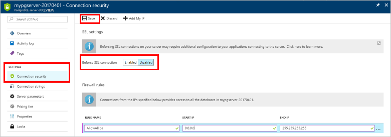

# Configure TLS connectivity in Azure Database for PostgreSQL - Single Server

Azure Database for PostgreSQL prefers connecting your client applications to the PostgreSQL service using Transport Layer Security (TLS), previously known as Secure Sockets Layer (SSL). Enforcing TLS connections between your database server and your client applications helps protect against "man-in-the-middle" attacks by encrypting the data stream between the server and your application.

By default, the PostgreSQL database service is configured to require TLS connection. You can choose to disable requiring TLS if your client application does not support TLS connectivity.

## Enforcing TLS connections

For all Azure Database for PostgreSQL servers provisioned through the Azure portal and CLI, enforcement of TLS connections is enabled by default. 

Likewise, connection strings that are pre-defined in the "Connection Strings" settings under your server in the Azure portal include the required parameters for common languages to connect to your database server using TLS. The TLS parameter varies based on the connector, for example "ssl=true" or "sslmode=require" or "sslmode=required" and other variations.

## Configure Enforcement of TLS

You can optionally disable enforcing TLS connectivity. Microsoft Azure recommends to always enable **Enforce SSL connection** setting for enhanced security.

### Using the Azure portal

Visit your Azure Database for PostgreSQL server and click **Connection security**. Use the toggle button to enable or disable the **Enforce SSL connection** setting. Then, click **Save**.



You can confirm the setting by viewing the **Overview** page to see the **SSL enforce status** indicator.

### Using Azure CLI

You can enable or disable the **ssl-enforcement** parameter using `Enabled` or `Disabled` values respectively in Azure CLI.

```azurecli
az postgres server update --resource-group myresourcegroup --name mydemoserver --ssl-enforcement Enabled
```

## Ensure your application or framework supports TLS connections

Some application frameworks that use PostgreSQL for their database services do not enable TLS by default during installation. If your PostgreSQL server enforces TLS connections but the application is not configured for TLS, the application may fail to connect to your database server. Consult your application's documentation to learn how to enable TLS connections.

## Applications that require certificate verification for TLS connectivity

In some cases, applications require a local certificate file generated from a trusted Certificate Authority (CA) certificate file (.cer) to connect securely. The certificate to connect to an Azure Database for PostgreSQL server is located at https://www.digicert.com/CACerts/BaltimoreCyberTrustRoot.crt.pem. Download the certificate file and save it to your preferred location.

### Connect using psql

The following example shows how to connect to your PostgreSQL server using the psql command-line utility. Use the `sslmode=verify-full` connection string setting to enforce TLS/SSL certificate verification. Pass the local certificate file path to the `sslrootcert` parameter.

The following command is an example of the psql connection string:

```shell
psql "sslmode=verify-full sslrootcert=BaltimoreCyberTrustRoot.crt host=mydemoserver.postgres.database.azure.com dbname=postgres user=myusern@mydemoserver"
```

> [!TIP]
> Confirm that the value passed to `sslrootcert` matches the file path for the certificate you saved.

## TLS enforcement in Azure Database for PostgreSQL Single server

Azure Database for PostgreSQL - Single server supports encryption for clients connecting to your database server using Transport Layer Security (TLS). TLS is an industry standard protocol that ensures secure network connections between your database server and client applications, allowing you to adhere to compliance requirements.

### TLS settings

Azure Database for PostgreSQL single server provides the ability to enforce the TLS version for the client connections. To enforce the TLS version, use the **Minimum TLS version** option setting. The following values are allowed for this option setting:

|  Minimum TLS setting             | Client TLS version supported                |
|:---------------------------------|-------------------------------------:|
| TLSEnforcementDisabled (default) | No TLS required                      |
| TLS1_0                           | TLS 1.0, TLS 1.1, TLS 1.2 and higher |
| TLS1_1                           | TLS 1.1, TLS 1.2 and higher          |
| TLS1_2                           | TLS version 1.2 and higher           |


For example, setting this Minimum TLS setting version to TLS 1.0 means your server will allow connections from clients using TLS 1.0, 1.1, and 1.2+. Alternatively, setting this to 1.2 means that you only allow connections from clients using TLS 1.2+ and all connections with TLS 1.0 and TLS 1.1 will be rejected.

> [!Note] 
> Azure Database for PostgreSQL defaults to TLS being disabled for all new servers.
>
> Currently the TLS versions supported by Azure Database for PostgreSQL are TLS 1.0, 1.1, and 1.2. Once enforced to a specific Minimum TLS version, you cannot
> change it to disabled.

To learn how to set the TLS setting for your Azure Database for PostgreSQL Single server, refer to [How to configure TLS setting](howto-tls-configurations.md).

## Next steps

Review various application connectivity options in [Connection libraries for Azure Database for PostgreSQL](concepts-connection-libraries.md).

- Learn how to [configure TLS](howto-tls-configurations.md)