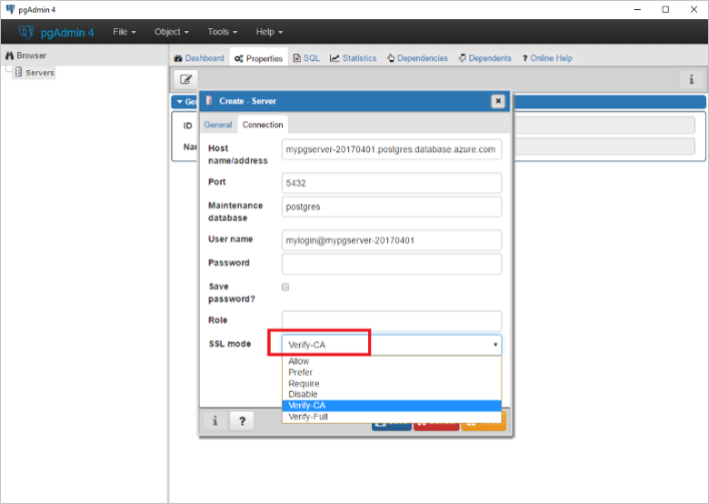

# Configure SSL connectivity in Azure Database for PostgreSQL
Azure Database for PostgreSQL prefers connecting your client applications to the PostgreSQL service using Secure Sockets Layer (SSL). Enforcing SSL connections between your database server and your client applications helps protect against "man in the middle" attacks by encrypting the data stream between the server and your application.

By default, the PostgreSQL database service is configured to require SSL connection. Optionally, you can disable requiring SSL for connecting to your database service if your client application does not support SSL connectivity. 

## Enforcing SSL connections
For all Azure Database for PostgreSQL servers provisioned through the Azure portal and CLI, enforcement of SSL connections is enabled by default. 

Likewise, connection strings that are pre-defined in the "Connection Strings" settings under your server in the Azure portal include the required parameters for common languages to connect to your database server using SSL. The SSL parameter varies based on the connector, for example "ssl=true" or "sslmode=require" or "sslmode=required" and other variations.

## Configure Enforcement of SSL
You can optionally disable enforcing SSL connectivity. Microsoft Azure recommends to always enable **Enforce SSL connection** setting for enhanced security.

### Using the Azure portal
Visit your Azure Database for PostgreSQL server and click **Connection security**. Use the toggle button to enable or disable the **Enforce SSL connection** setting. Then click **Save**. 


You can confirm the setting by viewing the **Overview** page to see the **SSL enforce status** indicator.

### Using Azure CLI
You can enable or disable the **ssl-enforcement** parameter using `Enabled` or `Disabled` values respectively in Azure CLI.

```azurecli
az postgres server update --resource-group myresourcegroup --name mypgserver-20170401 --ssl-enforcement Enabled
```

## Ensure your application or framework supports SSL connections
Many common application frameworks that use PostgreSQL for database services, such as Drupal and Django, do not enable SSL by default during installation. Enabling SSL connectivity must be done after installation or through CLI commands specific to the application. If your PostgreSQL server is enforcing SSL connections and the associated application is not configured properly, the application may fail to connect to your database server. Consult your application's documentation to learn how to enable SSL connections.


## Applications that require certificate verification for SSL connectivity
In some cases, applications require a local certificate file generated from a trusted Certificate Authority (CA) certificate file (.cer) to connect securely. See the following steps to obtain the .cer file, decode the certificate and bind it to your application.

### Download the certificate file from the Certificate Authority (CA) 
The certificate needed to communicate over SSL with your Azure Database for PostgreSQL server is located [here](https://www.digicert.com/CACerts/BaltimoreCyberTrustRoot.crt). Download the certificate file locally.

### Download and install OpenSSL on your machine 
To decode the certificate file needed for your application to connect securely to your database server, you need to install OpenSSL on your local computer.

#### For Linux, OS X, or Unix
The OpenSSL libraries are provided in source code directly from the [OpenSSL Software Foundation](http://www.openssl.org). The following instructions guide you through the steps necessary to install OpenSSL on your Linux PC. This article uses commands known to work on Ubuntu 12.04 and higher.

Open a terminal session and install OpenSSL
```bash
wget http://www.openssl.org/source/openssl-1.1.0e.tar.gz
``` 
Extract the files from the download package
```bash
tar -xvzf openssl-1.1.0e.tar.gz
```
Enter the directory where the files were extracted. By default, it should be as follows.

```bash
cd openssl-1.1.0e
```
Configure OpenSSL by executing the following command. If you want the files in a folder different than /usr/local/openssl, make sure to change the following as appropriate.

```bash
./config --prefix=/usr/local/openssl --openssldir=/usr/local/openssl
```
Now that OpenSSL is configured properly, you need to compile it to convert your certificate. To compile, run the following command:

```bash
make
```
Once compiling is complete, you're ready to install OpenSSL as an executable by running the following command:
```bash
make install
```
To confirm that you've successfully installed OpenSSL on your system, run the following command and check to make sure you get the same output.

```bash
/usr/local/openssl/bin/openssl version
```
If successful you should see the following message.
```bash
OpenSSL 1.1.0e 7 Apr 2014
```

#### For Windows
Installing OpenSSL on a Windows PC can be done in the following ways:
1. **(Recommended)** Using the built-in Bash for Windows functionality in Window 10 and above, OpenSSL is installed by default. Instructions on how to enable Bash for Windows functionality in Windows 10 can be found [here](https://msdn.microsoft.com/en-us/commandline/wsl/install_guide).
2. Through downloading a Win32/64 application provided by the community. While the OpenSSL Software Foundation does not provide or endorse any specific Windows installers, they provide a list of available installers [here](https://wiki.openssl.org/index.php/Binaries)

### Decode your certificate file
The downloaded Root CA file is in encrypted format. Use OpenSSL to decode the certificate file. To do so, run this OpenSSL command:

```dos
OpenSSL>x509 -inform DER -in BaltimoreCyberTrustRoot.cer -text -out root.crt
```

### Connecting to Azure Database for PostgreSQL with SSL certificate authentication
Now that you have successfully decoded your certificate, you can now connect to your database server securely over SSL. To allow server certificate verification, the certificate must be placed in the file ~/.postgresql/root.crt in the user's home directory. (On Microsoft Windows the file is named %APPDATA%\postgresql\root.crt.). The following provides instructions for connecting to Azure Database for PostgreSQL.

> [!NOTE]
> Currently, there is a known issue if you use "sslmode=verify-full" in your connection to the service, the connection will fail with the following error:
> _server certificate for "&lt;region&gt;.control.database.windows.net" (and 7 other names) does not match host name "&lt;servername&gt;.postgres.database.azure.com"._
> If "sslmode=verify-full" is required, please use the server naming convention **&lt;servername&gt;.database.windows.net** as your connection string host name. We plan to remove this limitation in the future. Connections using other [SSL modes](https://www.postgresql.org/docs/9.6/static/libpq-ssl.html#LIBPQ-SSL-SSLMODE-STATEMENTS) should continue to use the preferred host naming convention **&lt;servername&gt;.postgres.database.azure.com**.

#### Using psql command-line utility
The following example shows you how to successfully connect to your PostgreSQL server using the psql command-line utility. Use the `root.crt` file created and the `sslmode=verify-ca` or `sslmode=verify-full` option.

Using the PostgreSQL command-line interface, execute the following command:
```bash
psql "sslmode=verify-ca sslrootcert=root.crt host=mypgserver-20170401.postgres.database.azure.com dbname=postgres user=mylogin@mypgserver-20170401"
```
If successful, you receive the following output:
```bash
Password for user mylogin@mypgserver-20170401:
psql (9.6.2)
WARNING: Console code page (437) differs from Windows code page (1252)
     8-bit characters might not work correctly. See psql reference
     page "Notes for Windows users" for details.
SSL connection (protocol: TLSv1.2, cipher: ECDHE-RSA-AES256-SHA384, bits: 256, compression: off)
Type "help" for help.

postgres=>
```

#### Using pgAdmin GUI tool
Configuring pgAdmin 4 to connect securely over SSL requires you to set the `SSL mode = Verify-CA` or `SSL mode = Verify-Full` as follows:



## Next steps
Review various application connectivity options following [Connection libraries for Azure Database for PostgreSQL](concepts-connection-libraries.md)
