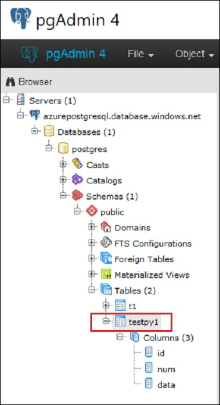

# Python reading from Azure Database for PostgreSQL


This article provides a short Python program that uses an SQL SELECT statement to read a row from a table. The article also explains how to find and install all the prerequisites needed to run the Python program.

Our sample Python program, and the Python-related tools described, all apply equally well to various platforms, including Linux, Mac, and Windows. 


## Install the Python interpreter


The Python code sample in this article is written for version 2.7 of the Python interpreter, and it cannot be run by version 3.x.

Download and install the 2.7 version of the Python interpreter, from:

- [Download the Python interpreter, from python.org](https://www.python.org/downloads/)

After the install, prove you can find and run the interpreter on a command line. Use a command such as:

`python.exe -?`


## Install pip.exe, the Python module installer


The installation of the Python interpreter might have also installed pip.exe, perhaps in a subdirectory named *Scripts/*. Pip.exe installs specialized Python modules. Prove you can find and run pip.exe.

`pip.exe`

If you cannot run pip.exe, see whether you have the Python utility program file named **get-pip.py**. If you have get-pip.py, you can run it to obtain pip.exe:

`python.exe get-pip.py`


## Install psycopg, the connection module


Our Python program needs a module that knows how to connect our program to the Azure Database for PostgreSQL server. The name of the connection module is **psycopg2**. If you would like more detail, see:

- [psycopg2 website](http://initd.org/psycopg/)

Install psycopg2 by using the following pip.exe install command:

`pip.exe install psycopg2`


## Create an Azure Database for PostgreSQL server


If you do not already have access to an Azure Database for PostgreSQL server, here is documentation that explains the ways that you can create a server:

- [Create an Azure Database for PostgreSQL by using the Azure portal](quickstart-create-server-database-portal.md)
- [Create an Azure Database for PostgreSQL by using the Azure CLI](quickstart-create-server-database-azure-cli.md)


## Obtain the connection string values


From the Azure portal, you can obtain the connection string values for your Azure Database for PostgreSQL server. You need the parameter values as described in the next table.

- The *Name* column &ndash; displays the parameter identifiers that psycopg2 requires.
- The *-Symbol* column &ndash; displays the parameter identifiers that are required by our sample Python program, *PythonDriver.py*.


| Name | -Symbol | Value example |
| :--  | :--     | :--           |
| host | -h | myazurepostgresql.database.windows.net |
| user | -U | myalias@myazurepostgresql |
| dbname | -d | postgres<br />*(All PostgreSQL servers have a database named **postgres**.)* |
| port | -p | 5432 *(Probably this specific value of 5432.)* |
| password | -P | MySecretPassword |
||||


## The Python sample program


This section provides the source code for our sample Python program. You run the program later in this article.

```python
# PythonDriver.py
# Python version 2.7

import psycopg2
import sys
import getopt

def main():

	host = ""
	user = ""
	dbname = ""
	port = ""
	password = ""

	try:
		opts, args = getopt.getopt(sys.argv[1:], "h:U:d:p:P:", [])
	except getopt.GetoptError as exc:
		print str(exc)
		usage()
		exit(2)

	for o, a in opts:
		if o == "-h": host = str(a)
		if o == "-U": user = str(a)
		if o == "-d": dbname = str(a)
		if o == "-p": port = str(a)
		if o == "-P": password = str(a)

	conn_string = "host={0} user={1} dbname={2} password={3}".format(host, user, dbname, password)

	try:
		# Create a connection.  Raise an exception if cannot connect.
		conn = psycopg2.connect(conn_string) 
		cursor = conn.cursor()

		#cursor.execute("DROP TABLE testpy1;")
		#conn.commit()

		cursor.execute("CREATE TABLE testpy1 (id serial PRIMARY KEY, num integer, data varchar);")

		cursor.execute("INSERT INTO testpy1 (num, data) VALUES (%s, %s)", (100, "First'row"))
		cursor.execute("INSERT INTO testpy1 (num, data) VALUES (%s, %s)", (110, "Second_row"))
		conn.commit()

		cursor.execute("SELECT id, num, data FROM testpy1;")
		result = cursor.fetchone()

		# Optionally, you can comment these clean-up lines to leave
		# the testpy1 table available for your inspection by pgAdmin. 
		cursor.execute("DROP TABLE testpy1;")
		conn.commit()

	except Exception as exc:
		print "FAILED ", exc
		exit(1)

	print "SUCCESS: ", result

if __name__ == "__main__":
	main()
```


## Command lines to run the sample program


This section displays the command lines used to test the Python sample program, along with the actual confirmation output.

For the parameters described earlier, you must replace the sample values displayed here with your actual connection string values.

The precise syntax for running the preceding sample Python program can vary slightly. The exact syntax depends on your operating system, and on which console type you use.


#### Windows cmd.exe console


The following code block displays an actual test run of the sample Python program. A simple cmd.exe command line was used. After each '^' line-continuation character was typed:

1. The Enter key was pressed.
2. The phrase **More?** was displayed.
3. Another portion of the whole line was typed, and so on.

This line-continuation technique was used to prevent the example from becoming so wide that it would display poorly here, or when printed.

```cmd
set Prompt=[$P\]$_$+$G$G$S

[C:\Users\myalias\AppData\Local\Programs\Python\Python27\]
>> .\python.exe ".\_myalias\PythonDriver.py" ^
More?  -h myazurepostgresql.database.windows.net ^
More?  -p 5432 ^
More?  -d postgres ^
More?  -U myalias@myazurepostgresql ^
More?  -P mySecretPassword
SUCCESS:  (1, 100, "First'row")

[C:\Users\myalias\AppData\Local\Programs\Python\Python27\]
>>
```

You can see the **SUCCESS** line as confirmation that the program ran.

As an alternative technique, the whole command line could be put into a .bat file. Then the .bat file could be run from the cmd.exe command line.


#### PowerShell file


In the PowerShell console, the command line does not support the line-continuation character. Therefore in this PowerShell section, we put the commands into a PowerShell file. Then we run the file from the PowerShell command line.

Copy the following code into a file named *PythonDriverRun.ps1*.

```powershell
# PythonDriverRun.ps1
cd C:\Users\myalias\AppData\Local\Programs\Python\Python27\

.\python.exe `
 .\_myalias\PythonDriver.py `
 -h myazurepostgresql.database.windows.net `
 -p 5432 `
 -d postgres `
 -U myalias@myazurepostgresql `
 -P mySecretPassword
```

Run PythonDriverRun.ps1 as shown next. You can see the **SUCCESS** line that the program prints as confirmation.

```cmd
[C:\Users\myalias\AppData\Local\Programs\Python\Python27\]
0 >> .\_myalias\PythonDriverRun.ps1
SUCCESS:  (1, 100, "First'row")

[C:\Users\myalias\AppData\Local\Programs\Python\Python27\]
0 >>
```

If you prefer to run PythonDriverRun.ps1 directly on the PowerShell command line, you must prepend an '&' character plus a space. Without the leading '&', the confirmation message disappears too quickly to see it.

```
[C:\Users\myalias\AppData\Local\Programs\Python\Python27\]
0 >> & .\python.exe ".\_myalias\PythonDriver.py" -h myazurepostgresql.database.windows.net -p 5432 -d postgres -U myalias@myazurepostgresql -P mySecretPassword
SUCCESS:  (1, 100, "First'row")
```


## Install pgAdmin, to inspect your server


When the PythonDriverRun.ps1 program ends, it cleans up after itself by dropping the testpy1 table that the program created. You have the option of using a '#' to comment out the source code line that issues the **DROP TABLE** statement. This option would leave the table in existence so that you could inspect the table afterward.

The pgAdmin tool enables you to inspect any PostgreSQL server, and the objects within the server. Users of Microsoft SQL Server, or of Azure SQL Database, would see similarity between SQL Server Management Studio (SSMS) and pgAdmin.

If you like, you can install **pgAdmin** to inspect your server and your **testpy1** table.


#### 1. Install pgAdmin


Install instructions for pgAdmin are available at:

- [http://www.pgadmin.org/](http://www.pgadmin.org/)

**pgAdmin4.exe** might be the name of the executable file, not simply pgAdmin.exe.

To run pgAdmin4.exe on a Windows computer, enter something similar to the following command on a command line:

`"C:\Program Files (x86)\pgAdmin 4\v1\runtime\pgAdmin4.exe"`


#### 2. Connect pgAdmin to your server

 
After the pgAdmin UI is displayed, locate the **Browser** pane. Then right-click **Servers** > **Create** > **Servers**. Here the term *Create* means to create a *connection* to any existing PostgreSQL server, including to any Azure Database for PostgreSQL server.

When the connection is made, a tree of objects is displayed in the **Browser** pane.


#### 3. Navigate in the pgAdmin tree to your table


To see your table, expand the tree elements as follows:

- **Servers** &gt; *[YourServerHere]* &gt; **Databases** &gt; postgres &gt; **Schemas** &gt; public &gt; **tables** &gt; testpy1




#### 4. Drop the testpy1 table


For final clean-up, right-click the testpy1 node, and then click **Delete/Drop**.


## Next Steps

- [Python connection to Azure SQL Database](../sql-database/sql-database-connect-query-python.md)
- [Connection libraries for Azure Database for PostgreSQL](concepts-connection-libraries.md)
