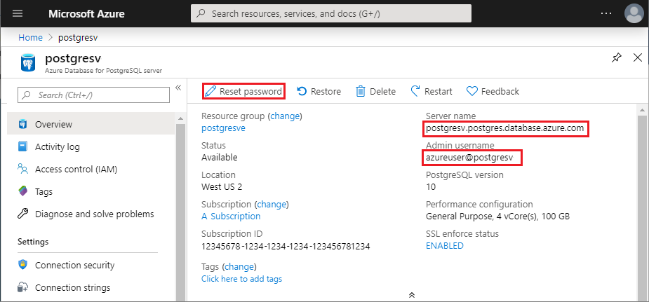

# Azure Database for PostgreSQL - Single Server: Use Python to connect and query data
This quickstart demonstrates how to use [Python](https://python.org) to connect to an Azure Database for PostgreSQL. It also demonstrates how to use SQL statements to query, insert, update, and delete data in the database from macOS, Ubuntu Linux, and Windows platforms. The steps in this article assume that you are familiar with developing using Python and are new to working with Azure Database for PostgreSQL.

## Prerequisites
This quickstart uses the resources created in either of these guides as a starting point:
- [Create DB - Portal](quickstart-create-server-database-portal.md)
- [Create DB - CLI](quickstart-create-server-database-azure-cli.md)

You also need:
- [python](https://www.python.org/downloads/) installed
- [pip](https://pip.pypa.io/en/stable/installing/) package installed (pip is already installed if you're working with Python 2 >=2.7.9 or Python 3 >=3.4 binaries downloaded from [python.org](https://python.org).

## Install the Python connection libraries for PostgreSQL
Install the [psycopg2](http://initd.org/psycopg/docs/install.html) package, which enables you to connect and query the database. psycopg2 is [available on PyPI](https://pypi.python.org/pypi/psycopg2/) in the form of [wheel](https://pythonwheels.com/) packages for the most common platforms (Linux, OSX, Windows). Use pip install to get the binary version of the module including all the dependencies.

1. On your own computer, launch a command-line interface:
    - On Linux, launch the Bash shell.
    - On macOS, launch the Terminal.
    - On Windows, launch the Command Prompt from the Start Menu.
2. Ensure that you are using the most current version of pip by running a command such as:
    ```cmd
    pip install -U pip
    ```

3. Run the following command to install the psycopg2 package:
    ```cmd
    pip install psycopg2
    ```

## Get connection information
Get the connection information needed to connect to the Azure Database for PostgreSQL. You need the fully qualified server name and login credentials.

1. Log in to the [Azure portal](https://portal.azure.com/).
2. From the left-hand menu in Azure portal, click **All resources**, and then search for the server you have created (such as **mydemoserver**).
3. Click the server name.
4. From the server's **Overview** panel, make a note of the **Server name** and **Server admin login name**. If you forget your password, you can also reset the password from this panel.
 

## How to run Python code
This article contains a total of four code samples, each of which performs a specific function. The following instructions indicate how to create a text file, insert a code block, and then save the file so that you can run it later. Be sure to create four separate files, one for each code block.

- Using your favorite text editor, create a new file.
- Copy and paste one of the code samples in the following sections into the text file. Replace the **host**, **dbname**, **user**, and **password** parameters with the values that you specified when you created the server and database.
- Save the file with the .py extension (for example postgres.py) into your project folder. If you are running on Windows, be sure to select UTF-8 encoding when saving the file. 
- Launch the Command Prompt, Terminal, or Bash shell and then change the directory to your project folder, for example `cd postgres`.
-  To run the code, type the Python command followed by the file name, for example `Python postgres.py`.

> [!NOTE]
> Starting in Python version 3, you may see the error `SyntaxError: Missing parentheses in call to 'print'` when running the following code blocks: If that happens, replace each call to the command `print "string"` with a function call using parenthesis, such as `print("string")`.

## Connect, create table, and insert data
Use the following code to connect and load the data using [psycopg2.connect](http://initd.org/psycopg/docs/connection.html) function with **INSERT** SQL statement. The [cursor.execute](http://initd.org/psycopg/docs/cursor.html#execute) function is used to execute the SQL query against PostgreSQL database. Replace the host, dbname, user, and password parameters with the values that you specified when you created the server and database.

```Python
import psycopg2

# Update connection string information obtained from the portal
host = "mydemoserver.postgres.database.azure.com"
user = "mylogin@mydemoserver"
dbname = "mypgsqldb"
password = "<server_admin_password>"
sslmode = "require"

# Construct connection string
conn_string = "host={0} user={1} dbname={2} password={3} sslmode={4}".format(host, user, dbname, password, sslmode)
conn = psycopg2.connect(conn_string) 
print "Connection established"

cursor = conn.cursor()

# Drop previous table of same name if one exists
cursor.execute("DROP TABLE IF EXISTS inventory;")
print "Finished dropping table (if existed)"

# Create table
cursor.execute("CREATE TABLE inventory (id serial PRIMARY KEY, name VARCHAR(50), quantity INTEGER);")
print "Finished creating table"

# Insert some data into table
cursor.execute("INSERT INTO inventory (name, quantity) VALUES (%s, %s);", ("banana", 150))
cursor.execute("INSERT INTO inventory (name, quantity) VALUES (%s, %s);", ("orange", 154))
cursor.execute("INSERT INTO inventory (name, quantity) VALUES (%s, %s);", ("apple", 100))
print "Inserted 3 rows of data"

# Cleanup
conn.commit()
cursor.close()
conn.close()
```

After the code runs successfully, the output appears as follows:


## Read data
Use the following code to read the data inserted using [cursor.execute](http://initd.org/psycopg/docs/cursor.html#execute) function with **SELECT** SQL statement. This function accepts a query and returns a result set that can be iterated over with the use of [cursor.fetchall()](http://initd.org/psycopg/docs/cursor.html#cursor.fetchall). Replace the host, dbname, user, and password parameters with the values that you specified when you created the server and database.

```Python
import psycopg2

# Update connection string information obtained from the portal
host = "mydemoserver.postgres.database.azure.com"
user = "mylogin@mydemoserver"
dbname = "mypgsqldb"
password = "<server_admin_password>"
sslmode = "require"

# Construct connection string
conn_string = "host={0} user={1} dbname={2} password={3} sslmode={4}".format(host, user, dbname, password, sslmode)
conn = psycopg2.connect(conn_string) 
print "Connection established"

cursor = conn.cursor()

# Fetch all rows from table
cursor.execute("SELECT * FROM inventory;")
rows = cursor.fetchall()

# Print all rows
for row in rows:
	print "Data row = (%s, %s, %s)" %(str(row[0]), str(row[1]), str(row[2]))

# Cleanup
conn.commit()
cursor.close()
conn.close()
```

## Update data
Use the following code to update the inventory row that you previously inserted using [cursor.execute](http://initd.org/psycopg/docs/cursor.html#execute) function with **UPDATE** SQL statement. Replace the host, dbname, user, and password parameters with the values that you specified when you created the server and database.

```Python
import psycopg2

# Update connection string information obtained from the portal
host = "mydemoserver.postgres.database.azure.com"
user = "mylogin@mydemoserver"
dbname = "mypgsqldb"
password = "<server_admin_password>"
sslmode = "require"

# Construct connection string
conn_string = "host={0} user={1} dbname={2} password={3} sslmode={4}".format(host, user, dbname, password, sslmode)
conn = psycopg2.connect(conn_string) 
print "Connection established"

cursor = conn.cursor()

# Update a data row in the table
cursor.execute("UPDATE inventory SET quantity = %s WHERE name = %s;", (200, "banana"))
print "Updated 1 row of data"

# Cleanup
conn.commit()
cursor.close()
conn.close()
```

## Delete data
Use the following code to delete an inventory item that you previously inserted using [cursor.execute](http://initd.org/psycopg/docs/cursor.html#execute) function with **DELETE** SQL statement. Replace the host, dbname, user, and password parameters with the values that you specified when you created the server and database.

```Python
import psycopg2

# Update connection string information obtained from the portal
host = "mydemoserver.postgres.database.azure.com"
user = "mylogin@mydemoserver"
dbname = "mypgsqldb"
password = "<server_admin_password>"
sslmode = "require"

# Construct connection string
conn_string = "host={0} user={1} dbname={2} password={3} sslmode={4}".format(host, user, dbname, password, sslmode)
conn = psycopg2.connect(conn_string) 
print "Connection established"

cursor = conn.cursor()

# Delete data row from table
cursor.execute("DELETE FROM inventory WHERE name = %s;", ("orange",))
print "Deleted 1 row of data"

# Cleanup
conn.commit()
cursor.close()
conn.close()
```

## Next steps
> [!div class="nextstepaction"]
> [Migrate your database using Export and Import](./howto-migrate-using-export-and-import.md)
