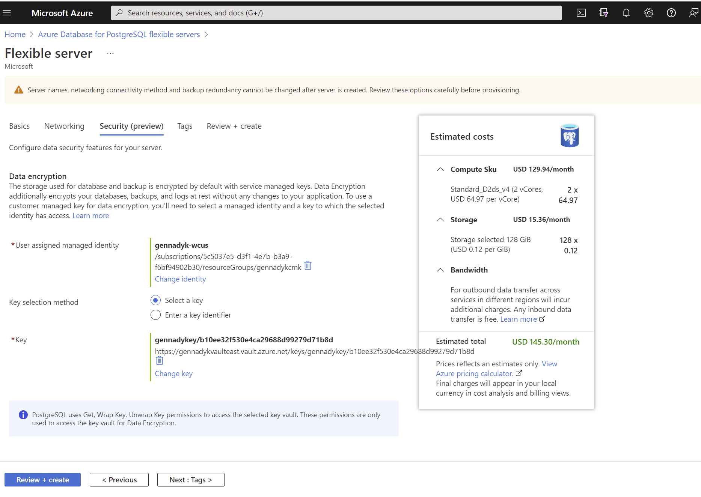
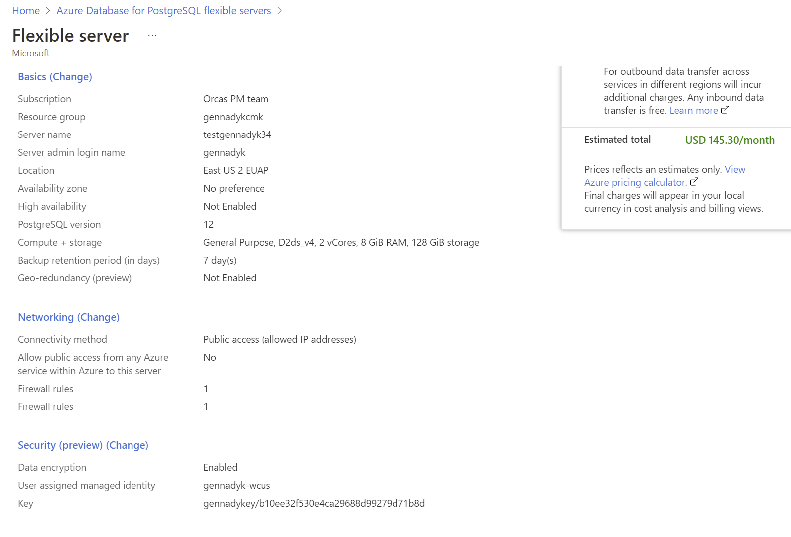
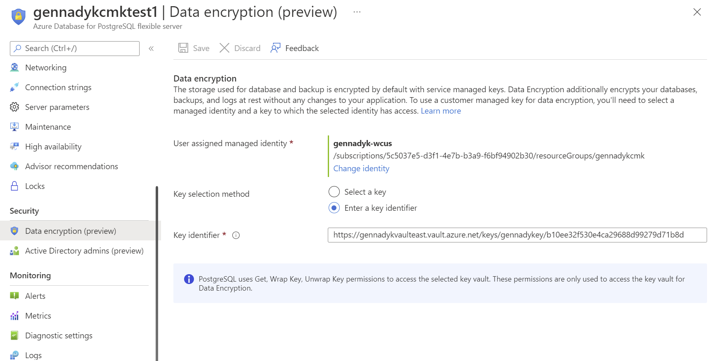
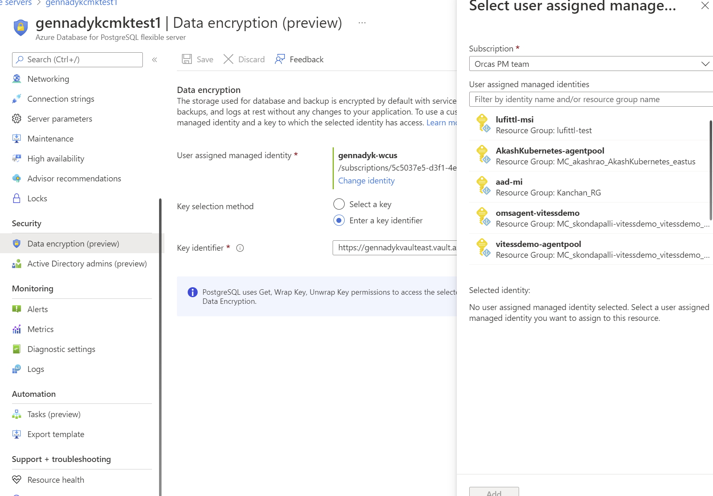
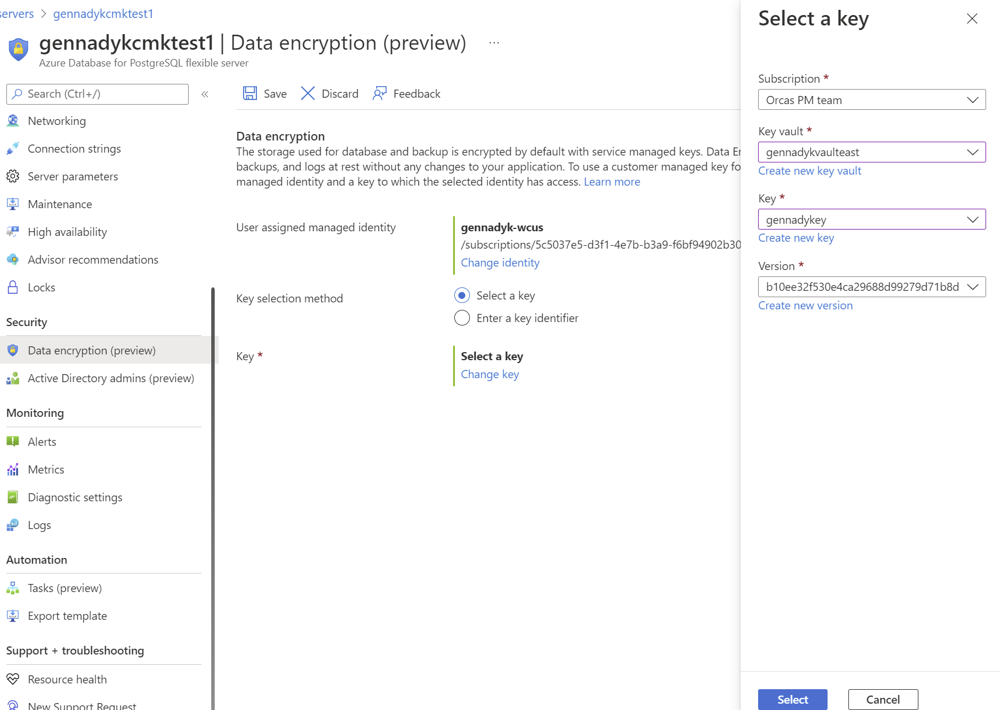

# Azure Database for PostgreSQL - Flexible Server Data Encryption with a Customer-Managed Key Preview

[!INCLUDE [applies-to-postgresql-flexible-server](../includes/applies-to-postgresql-flexible-server.md)]

Azure PostgreSQL leverages [Azure Storage encryption](../../storage/common/storage-service-encryption.md) to encrypt data at-rest by default using Microsoft-managed keys. For Azure PostgreSQL users, it is a very similar to Transparent Data Encryption (TDE) in other databases such as SQL Server. Many organizations require full control on access to the data using a customer-managed key. Data encryption with customer-managed keys for Azure Database for PostgreSQL Flexible server - Preview enables you to bring your own key (BYOK) for data protection at rest. It also allows organizations to implement separation of duties in the management of keys and data. With customer-managed encryption, you are responsible for, and in a full control of, a key's lifecycle, key usage permissions, and auditing of operations on keys.

Data encryption with customer-managed keys for Azure Database for PostgreSQL Flexible server - Preview, is set at the server-level. For a given server, a customer-managed key, called the key encryption key (KEK), is used to encrypt the data encryption key (DEK) used by the service. The KEK is an asymmetric key stored in a customer-owned and customer-managed [Azure Key Vault](https://azure.microsoft.com/services/key-vault/)) instance. The Key Encryption Key (KEK) and Data Encryption Key (DEK) is described in more detail later in this article.

Key Vault is a cloud-based, external key management system. It's highly available and provides scalable, secure storage for RSA cryptographic keys, optionally backed by FIPS 140-2 Level 2 validated hardware security modules (HSMs). It doesn't allow direct access to a stored key, but does provide services of encryption and decryption to authorized entities. Key Vault can generate the key, imported it, or have it transferred from an on-premises HSM device.

## Benefits

Data encryption with customer-managed keys for Azure Database for PostgreSQL Flexible server - Private Preview provides the following benefits:

* Data-access is fully controlled by you by the ability to remove the key and making the database inaccessible.
* Full control over the key-lifecycle, including rotation of the key to align with corporate policies.
* Central management and organization of keys in Azure Key Vault.
* Enabling encryption does not have any additional performance impact with or without customers managed key (CMK) as PostgreSQL relies on Azure storage layer for data encryption in both the scenarios ,the only difference is when CMK is used **Azure Storage Encryption Key**  which performs actual data encryption is encrypted using CMK.
* Ability to implement separation of duties between security officers, and DBA and system administrators.

## Terminology and description

**Data encryption key (DEK)**: A symmetric AES256 key used to encrypt a partition or block of data. Encrypting each block of data with a different key makes crypto analysis attacks more difficult. Access to DEKs is needed by the resource provider or application instance that is encrypting and decrypting a specific block. When you replace a DEK with a new key, only the data in its associated block must be re-encrypted with the new key.

**Key encryption key (KEK)**: An encryption key used to encrypt the DEKs. A KEK that never leaves Key Vault allows the DEKs themselves to be encrypted and controlled. The entity that has access to the KEK might be different than the entity that requires the DEK. Since the KEK is required to decrypt the DEKs, the KEK is effectively a single point by which DEKs can be effectively deleted by deletion of the KEK.

The DEKs, encrypted with the KEKs, are stored separately. Only an entity with access to the KEK can decrypt these DEKs. For more information, see [Security in encryption at rest](../../security/fundamentals/encryption-atrest.md). 

## How data encryption with a customer-managed key work

For a PostgreSQL server to use customer-managed keys stored in Key Vault for encryption of the DEK, a Key Vault administrator gives the following access rights to the server:

* **get**: For retrieving the public part and properties of the key in the key vault.
* **list**: For listing\iterating through keys in the key vault.
* **wrapKey**: To be able to encrypt the DEK. The encrypted DEK is stored in the Azure Database for PostgreSQL.
* **unwrapKey**: To be able to decrypt the DEK. Azure Database for PostgreSQL needs the decrypted DEK to encrypt/decrypt the data

The key vault administrator can also [enable logging of Key Vault audit events](https://learn.microsoft.com/azure/key-vault/general/howto-logging?tabs=azure-cli), so they can be audited later.

When the server is configured to use the customer-managed key stored in the key vault, the server sends the DEK to the key vault for encryptions. Key Vault returns the encrypted DEK, which is stored in the user database. Similarly, when needed, the server sends the protected DEK to the key vault for decryption. Auditors can use Azure Monitor to review Key Vault audit event logs, if logging is enabled.

## Requirements for configuring data encryption in preview for Azure Database for PostgreSQL Flexible server

The following are requirements for configuring Key Vault:

* Key Vault and Azure Database for PostgreSQL Flexible server must belong to the same Azure Active Directory (Azure AD) tenant. Cross-tenant Key Vault and server interactions aren't supported. Moving the Key Vault resource afterwards requires you to reconfigure the data encryption.
* The key vault must be set with 90 days for 'Days to retain deleted vaults'. If the existing key vault has been configured with a lower number, you will need to create a new key vault as it cannot be modified after creation.
* Enable the soft-delete feature on the key vault, to protect from data loss if an accidental key (or Key Vault) deletion happens. Soft-deleted resources are retained for 90 days, unless the user recovers or purges them in the meantime. The recover and purge actions have their own permissions associated in a Key Vault access policy. The soft-delete feature is off by default, but you can enable it through PowerShell or the Azure CLI (note that you can't enable it through the Azure portal).
* Enable Purge protection to enforce a mandatory retention period for deleted vaults and vault objects
* Grant the Azure Database for PostgreSQL Flexible server access to the key vault with the get, list, wrapKey, and unwrapKey permissions by using its unique managed identity.

The following are requirements for configuring the customer-managed key in Flexible Server:

* The customer-managed key to be used for encrypting the DEK can be only asymmetric, RSA 2048.
* The key activation date (if set) must be a date and time in the past. The expiration date (if set) must be a future date and time.
* The key must be in the *Enabled* state.
* If you're importing an existing key  into the key vault, make sure to provide it in the supported file formats (`.pfx`, `.byok`, `.backup`).

 Recommendations

When you're using data encryption by using a customer-managed key, here are recommendations for configuring Key Vault:

* Set a resource lock on Key Vault to control who can delete this critical resource and prevent accidental or unauthorized deletion.
* Enable auditing and reporting on all encryption keys. Key Vault provides logs that are easy to inject into other security information and event management tools. Azure Monitor Log Analytics is one example of a service that's already integrated.
* Ensure that Key Vault and Azure Database for PostgreSQL = Flexible server reside in the same region, to ensure a faster access for DEK wrap, and unwrap operations.
* Lock down the Azure KeyVault to only **disable public access* and allow only *trusted Microsoft* services to secure the resources.

    :::image type="content" source="media/concepts-encryption/keyvault-trusted-service.png" alt-text="trusted-service-with-AKV":::

Here are recommendations for configuring a customer-managed key:

* Keep a copy of the customer-managed key in a secure place, or escrow it to the escrow service.

* If Key Vault generates the key, create a key backup before using the key for the first time. You can only restore the backup to Key Vault. 

### Accidental key access revocation from Key Vault

It might happen that someone with sufficient access rights to Key Vault accidentally disables server access to the key by:

* Revoking the key vault's list, get, wrapKey, and unwrapKey permissions from the server.
* Deleting the key.
* Deleting the key vault.
* Changing the key vault's firewall rules.

* Deleting the managed identity of the server in Azure AD.

## Monitor the customer-managed key in Key Vault

To monitor the database state, and to enable alerting for the loss of transparent data encryption protector access, configure the following Azure features:

* [Azure Resource Health](../../service-health/resource-health-overview.md): An inaccessible database that has lost access to the customer key shows as "Inaccessible" after the first connection to the database has been denied.
* [Activity log](../../service-health/alerts-activity-log-service-notifications-portal.md): When access to the customer key in the customer-managed Key Vault fails, entries are added to the activity log. You can reinstate access as soon as possible, if you create alerts for these events.

* [Action groups](../../azure-monitor/alerts/action-groups.md): Define these groups to send you notifications and alerts based on your preferences.

## Restore and replicate with a customer's managed key in Key Vault

After Azure Database for PostgreSQL - Flexible Server  is encrypted with a customer's managed key stored in Key Vault, any newly created copy of the server is also encrypted. You can make this new copy either through a [PITR restore](concepts-backup-restore.md) operation, or through read replicas. 
**At this time we don't support revoking key after restoring CMK enabled server to another server**

To avoid issues while setting up customer-managed data encryption during restore or read replica creation, it's important to follow these steps on the primary and restored/replica servers:

* Initiate the restore or read replica creation process from the primary Azure Database for PostgreSQL - Flexible server.
* On the restored/replica server, you can change the customer-managed key and\or AAD identity used to access Azure Key Vault in the data encryption settings. Please make sure that the newly created server is given list, wrap and unwrap permissions to the key stored in Key Vault.
* Please do not revoke original key after restoring, as at this time we don't support key revocation after restoring CMK enabled server to another server

## Inaccessible customer-managed key condition

When you configure data encryption with a customer-managed key in Key Vault, continuous access to this key is required for the server to stay online. If the server loses access to the customer-managed key in Key Vault, the server begins denying all connections within 10 minutes. The server issues a corresponding error message, and changes the server state to *Inaccessible*.

## Setup Customer Managed Key during Server Creation

Prerequisites:

* AAD user managed identity in region where Postgres Flex Server will be created. Follow this [tutorial](../../active-directory/managed-identities-azure-resources/qs-configure-portal-windows-vm) to create identity.
* Key Vault with key in region where Postgres Flex Server will be created. Follow this [tutorial](../../key-vault/general/quick-create-portal) to create Key Vault and generate key. Follow [requirements section above](#requirements-for-configuring-data-encryption-in-preview-for-azure-database-for-postgresql-flexible-server) for required Azure Key Vault settings

Follow steps below to enable CMK while creating Postgres Flexible Server.

* Navigate to Azure Database for PostgreSQL - Flexible Server create blade via Azure Portal

* Provide required information on Basics and Networking tabs

* Navigate to Security(preview) tab, provide AAD identity that has access to the Key Vault and Key in Key Vault in the same region where you are creating this server

* On Review Summary tab make sure that you provided correct information in Security section and press Create button

* Once  is created you should be able to navigate to Data Encryption (preview) screen for the server and update identity or key if necessary

## Update Customer Managed Key on the CMK enabled Flexible Server

Prerequisites:

* AAD user managed identity in region where Postgres Flex Server will be created. Follow this [tutorial](../../active-directory/active-directory/managed-identities-azure-resources/qs-configure-portal-windows-vm) to create identity.
* Key Vault with key in region where Postgres Flex Server will be created. Follow this [tutorial](../../key-vault/general/quick-create-portal) to create Key Vault and generate key. 

Follow steps below to update CMK on CMK enabled Flexible Server:
* Navigate to Azure Database for PostgreSQL - Flexible Server create blade via Azure Portal.
* Navigate to Data Encryption (preview) screen under Security tab

* Select different identity to connect to Azure Key Vault , remembering that this identity needs to have proper access rights to the Key Vault

* Select different key by choosing subscription, Key Vault and key from dropdowns provided.

## Limitations

The following are limitations for configuring the customer-managed key in Flexible Server:

* CMK encryption can only be configured during creation of new server, not as update to existing Flexible Server.
* Once enabled CMK encryption cannot be removed. If customer desires to remove this feature it can only be done via restore of the server to non-CMK server.
* CMK encryption is not available on Burstable SKU.

The following are additional limitations for public preview of configuring the customer-managed key that we expect to remove at General Availability of this feature:

* No support for Geo backup enabled servers 
* **No support for revoking key after restoring CMK enabled server to another server**
* No support for Azure HSM Key Vault 
* No CLI or PowerShell support 

