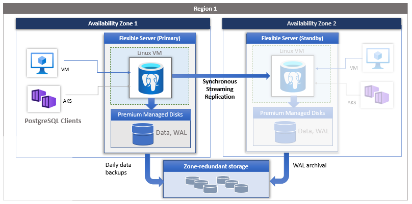
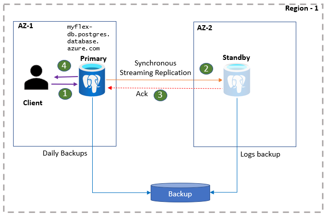
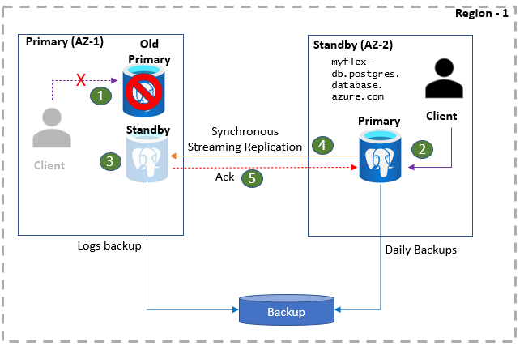

# High availability concepts in Azure Database for PostgreSQL Flexible Server (Preview)

Azure Database for PostgreSQL - Flexible Server, which is currently in public preview, offers high availability configuration with automatic failover capability using **zone redundant** server deployment. When deployed in a zone redundant configuration, flexible server automatically provisions and manages a standby replica in a different availability zone. Using PostgreSQL streaming replication, the data is replicated to the standby replica server in **synchronous** mode. 

Zone redundant configuration enables automatic failover capability with zero data loss during planned events such as user-initiated scale compute operation, and also during unplanned events such as underlying hardware and software faults, network failures, and availability zone failures. 

## Zone redundant high availability architecture

You can choose the region and the availability zone to deploy your primary database server. A standby replica server is provisioned in a different zone with the same configuration as the primary server, including compute tier, compute size, storage size, and network configuration. Transaction logs are replicated in synchronous mode to the standby replica. Automatic backups are performed periodically from the primary database server, while the transaction logs are continuously archived to the backup storage from the standby replica. 

The health of the high availability configuration is continuously monitored and reported on the overview page of Azure portal. The zone redundant high availability statuses are listed below:

| **Status** | **Description** |
| ------- | ------ |
| <b> NotEnabled | High availability is not enabled |
| <b> CreatingStandby | In the creating a new standby |
| <b> ReplicatingData | After the standby is created, it is catching up with the primary. |
| <b> FailingOver | The database server is in the process of failing over to the standby. |
| <b> Healthy | Replication is in steady state and healthy. |
| <b> RemovingStandby | Based on user action, the standby replica is in the process of deletion.| 

## Steady-state operations

PostgreSQL client applications are connected to the primary server using the DB server name. Application reads are served directly from the primary server, while commits and writes are confirmed to the application only after the data is persisted on both the primary server and the standby replica. Due to this additional round-trip requirement, applications can expect elevated latency for writes and commits. You can monitor the health of the high availability on the portal.

1. Clients connect to the flexible server and performs write operations.
2. Changes are replicated to the standby site
3. Primary receives acknowledgment  
4. Writes/commits are acknowledged.

## Failover process - planned events

Planned downtime events include Azure scheduled periodic software updates and minor version upgrades or operations such as scale compute and scale storage that are initiated by customers. When configured in high availability, these operations are first applied to the standby replica while the applications continue to access the primary server. Once the standby replica is updated, primary server connections are drained, and a failover is triggered which activates the standby replica to be the primary with the same database server name. Client applications will have to reconnect with the same database server name to the new primary server and can resume their operations. A new standby server will be established in the same zone as the old primary. The overall failover time is expected to be 60-120 seconds. 

### Reducing planned downtime with managed maintenance window

 You can schedule the Azure initiated maintenance activities by choosing a 30-minute window in a day of your preference where the activities on the databases are expected to be low. Azure maintenance tasks such as patching or minor version upgrades would happen during that window.  For flexible servers configured with high availability, these maintenance activities are performed on the standby replica first and then it is activated. Applications then reconnect to the new primary server and resume their operations while a new standby is provisioned.

## Failover process - unplanned outage
Unplanned outages include software bugs or infrastructure component failures impact the availability of the database. In the event of the database unavailability is detected by the monitoring system, the replication to the standby replica is severed and the standby replica is activated to be the primary database. Clients can reconnect to the database server and resume their operations. The overall failover time is expected to take 60-120s. However, depending on the activity in the primary database server at the time of the failover such as large transactions and recovery time, the failover may take longer.

1. Primary database server is down and the clients lose database connectivity. 
2. Standby is activated with the same database server name as primary, and client connects to the new primary. Note that the client application can be on any zone. Having application and the database server in the same zone reduces latency.
3. A new standby server is provisioned in the same AZ. 
4. Once the steady-state is established, the client application commits and writes are acknowledged after the data is persisted on both sites.

## Point-in-time restore 

Flexible servers that are configured with high availability, replicate data in real time to the standby server to keep that up to date. Any user errors on the primary server - such as an accidental drop of a table or incorrect data updates are faithfully replicated to the standby replica. So, you cannot use standby to recover from such logical errors. To recover from such errors, you have to perform point-in-time restore from backups.  Using flexible server's point-in-time restore capability, you can restore to the time before the error occurred. For databases configured with high availability, a new database server will be restored as a single zone flexible server with a user-provided name. You can then export the object from the database server and import it to your production database server. Similarly, if you want to clone your database server for testing and development purposes, or you want to restore for any other purposes, you can perform point-in-time restores.

## Zone redundant high availability - features

-   Standby replica will be deployed in an exact VM configuration same as the primary server, including vCores, storage, network settings
    (VNET, Firewall), etc.

-   Ability to add high availability for an existing database server.

-   Ability to remove standby replica by disabling high availability.

-   Ability to choose your availability zone for your primary database server.

-   Ability to stop, start, and restart both primary and standby database servers.

-   Automatic backups are performed from the primary database server and stored in a zone redundant storage.

-   After a failover, a new standby replica is provisioned in the original primary availability zone to continue to provide high availability.

-   Clients always connect to the primary database server.

-   Ability to restart both primary and standby servers to pick up any static server parameter changes.

## Zone redundant high availability - considerations

-   High availability is not supported in burstable compute tier.
-   High availability is supported only in regions where multiple zones are available.
-   Due to synchronous replication to another availability zone, primary database server can experience elevated write and commit latency.

-   Standby replica cannot be used for read-only queries.

-   Depending on the activity on the primary server at the time of failover, it might take up to 2 minutes or longer for the failover
    to complete.

-   Restarting the primary database server to pick up static parameter changes also restarts standby replica.

-   Logical decoding is not supported when configured in high availability.

-   Configuring read replicas are not supported

-   Configuring customer initiated management tasks cannot be scheduled during managed maintenance window.

-   Planned events such as scale compute and minor version upgrades happen in both primary and standby at the same time. 

## Next steps

-   Learn about [business continuity](./concepts-business-continuity.md)
-   Learn how to [manage high availability](./how-to-manage-high-availability-portal.md)
-   Learn about [backup and recovery](./concepts-backup-restore.md)