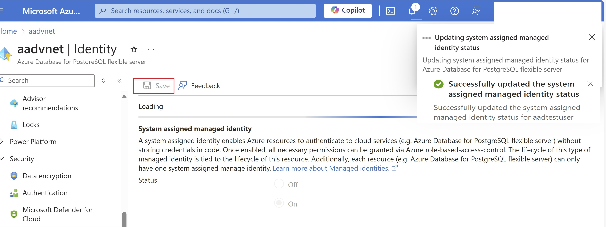
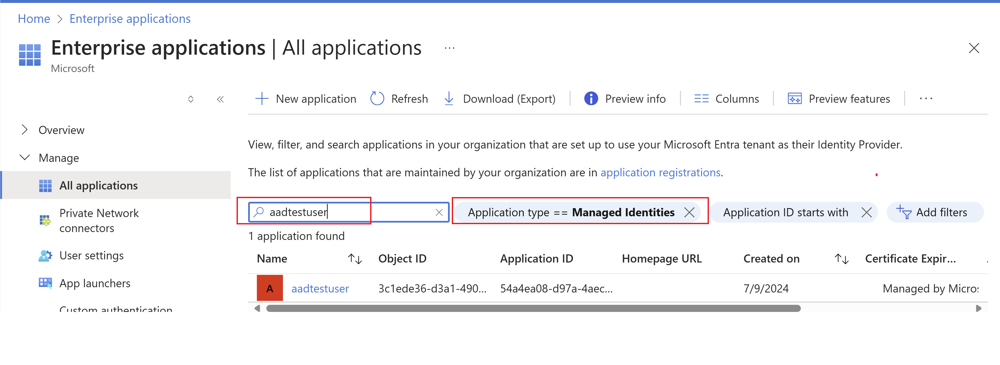

# Managed Identity in Azure Database for PostgreSQL - Flexible Server

[!INCLUDE [applies-to-postgresql-flexible-server](~/reusable-content/ce-skilling/azure/includes/postgresql/includes/applies-to-postgresql-flexible-server.md)]

A common challenge for developers is the management of secrets, credentials, certificates, and keys used to secure communication between services. Managed identities eliminate the need for developers to manage these credentials.

While developers can securely store the secrets in Azure Key Vault, services need a way to access Azure Key Vault. Managed identities provide an automatically managed identity in Microsoft Entra ID for applications to use when connecting to resources that support Microsoft Entra authentication. Applications can use managed identities to obtain Microsoft Entra tokens without having to manage any credentials.

Here are some of the benefits of using managed identities:

- You don't need to manage credentials. Credentials aren’t even accessible to you.
- You can use managed identities to authenticate to any resource that supports Microsoft Entra authentication including your own applications.
- Managed identities can be used at no extra cost.

## Managed identity types

There are two types of managed identities:

- **System-assigned**. Some Azure resources, such as virtual machines, Azure Database for PostgreSQL Flexible Server allows you to enable a managed identity directly on the resource. When you enable a system-assigned managed identity: 
    - A service principal of a special type is created in Microsoft Entra ID for the identity. The service principal is tied to the lifecycle of that Azure resource. When the Azure resource is deleted, Azure automatically deletes the service principal for you. 
    - By design, only that Azure resource can use this identity to request tokens from Microsoft Entra ID.
    - You authorize the managed identity to have access to one or more services.
    - The name of the system-assigned service principal is always the same as the name of the Azure resource it's created for. 
    

- **User-assigned**. You may also create a managed identity as a standalone Azure resource. You can create a user-assigned managed identity and assign it to one or more Azure Resources. When you enable a user-assigned managed identity:
    - A service principal of a special type is created in Microsoft Entra ID for the identity. The service principal is managed separately from the resources that use it. 
    - Multiple resources can utilize user-assigned identities.
    - You authorize the managed identity to have access to one or more services.


## How to enable System Assigned Managed Identity on your Flexible Server

## Azure portal

Follow these steps to enable System Assigned Managed Identity on your Azure Database for PostgreSQL flexible server instance.

1. In the [Azure portal](https://portal.azure.com/), select your existing Azure Database for PostgreSQL flexible server instance for which you want to enable system assigned managed identity.

2. On the Azure Database for PostgreSQL flexible server page, select **Identity**

3. In the **Identity** section, select **On** radio button.

4. Select **Save** to apply the changes.



5. A notification confirms that system assigned managed identity is enabled.

## ARM  template

Here is the ARM template to enable system assigned managed identity. You can use the 2023-06-01-preview or the latest available API.

```json
{
    "resources": [
        {
            "apiVersion": "2023-06-01-preview",
            "identity": {
                "type": "SystemAssigned"
            },
            "location": "Region name",
            "name": "flexible server name",
            "type": "Microsoft.DBforPostgreSQL/flexibleServers"
        }
    ]
}
  ```

To disable system assigned managed identity change the type to **None**
 
```json
{
    "resources": [
        {
            "apiVersion": "2023-06-01-preview",
            "identity": {
                "type": "None"
            },
            "location": "Region Name",
            "name": "flexible server name",
            "type": "Microsoft.DBforPostgreSQL/flexibleServers"
        }
    ]
}
 ```
## How to verify the newly created System Assigned Managed Identity on your Flexible Server

You can verify the managed identity created by going to **Enterprise Applications** 

1. Choose  **Application Type == Managed Identity**

2. Provide your flexible server name in **Search by application name or Identity** as shown in the screenshot.




## Related content

- [Microsoft Entra authentication](../concepts-aad-authentication.md)
- [Firewall rules for IP addresses](concepts-firewall-rules.md)
- [Private access networking with Azure Database for PostgreSQL - Flexible Server](concepts-networking.md)
