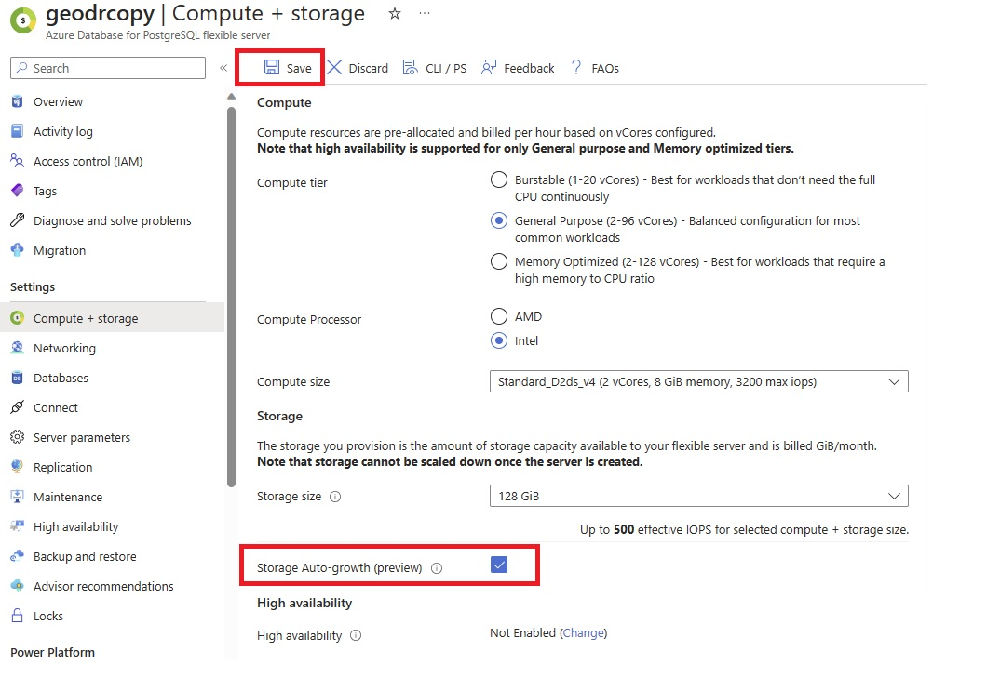
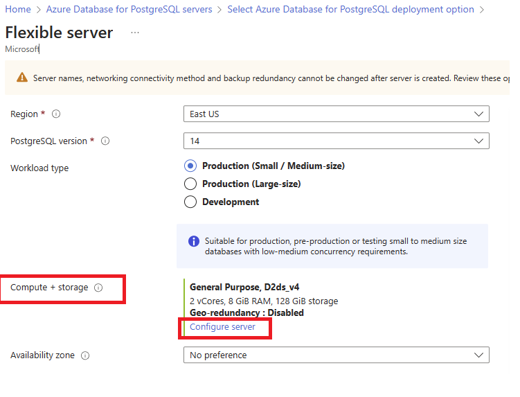
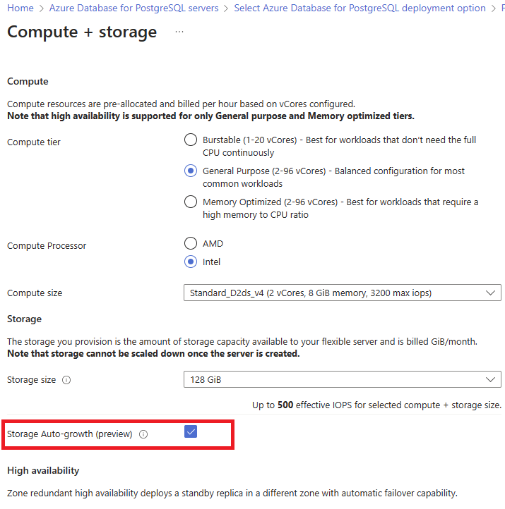

# Storage Autogrow using  Azure portal in Azure Database for PostgreSQL - Flexible Server

[!INCLUDE [applies-to-postgresql-Flexible-server](../includes/applies-to-postgresql-Flexible-server.md)]

This article describes how you can configure an Azure Database for PostgreSQL server storage to grow without impacting the workload.

When a server reaches the allocated storage limit, the server is marked as read-only. However, if you enable storage autogrow, the server storage increases to accommodate the growing data. For servers with less than 1 TiB of provisioned storage, the autogrow feature activates when storage consumption reaches 80%. For servers with 1 TB or more of storage, autogrow activates at 90% consumption. 

## Enable storage auto-grow for existing servers

Follow these steps to enable Storage Autogrow on your Azure Database for PostgreSQL Flexible server.

1. In the [Azure portal](https://portal.azure.com/), select your existing Azure Database for PostgreSQL Flexible Server.

2. On the Flexible Server page, select **Compute + storage**

3. In the **Storage Auto-growth** section, checkmark to enable storage autogrow.

4. Select **Save** to apply the changes.

   

5. A notification confirms that auto grow was successfully enabled.

  
## Enable storage auto-grow during server provisioning

1. In the Azure portal, during server provisioning, under **Compute + storage** select  **Configure server** 

    

2. In the **Storage Auto-growth** section, checkmark to enable storage auto grow. 

   

## Next steps

- Learn about [service limits](concepts-limits.md).
