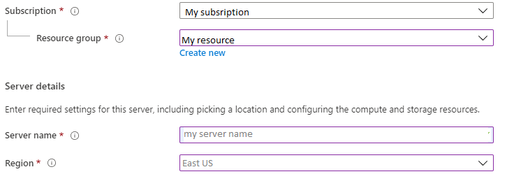

# Enable or disable zone redundant high availability configuration

This article describes how you can enable or disable zone redundant high availability configuration in your flexible server.

High availability feature provisions physically separate primary and standby replica in different zones. For more details, see [high availability concepts documentation](./concepts/../concepts-high-availability.md). You may choose to enable high availability at the time of flexible server creation or after the creation. 
This page provides guidelines how you can enable or disable high availability. This operation does not change your other settings including VNET configuration, firewall settings, and backup retention. Similarly, enabling and disabling of high availability is an online operation and does not impact your application connectivity and operations.

## Pre-requisites

Zone redundant high availability is available only in regions where multiple zones are supported. 

## Enable high availability during server creation

This section provides details specifically for HA-related fields. You can follow these steps to deploy high availability while creating your flexible server.

1.  In the [Azure portal](https://portal.azure.com/), choose Flexible Server and click create.  For details on how to fill details such as **Subscription**, **Resource group**, **server name**, **region**, and other fields, see how-to documentation for the server creation.
    

2.  Choose your **availability zone**. This is useful if you want to collocate your application in the same availability zone as the database to reduce latency. Choose **No Preference** if you want the flexible server to deploy on any availability zone.
    

3.  Click the checkbox for **Zone redundant high availability** in the Availability option.

4.  If you want to change the default compute and storage, click  **Configure server**.
 

5.  If high availability option is checked, the burstable tier will not be available to choose. You can choose either
    **General purpose** or **Memory Optimized** compute tiers.

6.  Select the **compute size** for your choice from the dropdown.

7.  Select **storage size** in GiB using the sliding bar and select the **backup retention period** between 7 days and 35 days.
    

## Enable high availability post server creation

Follow these steps to enable high availability for your existing flexible server.

1.  In the [Azure portal](https://portal.azure.com/), select your existing PostgreSQL flexible server.

2.  On the flexible server page, click **High Availability** from the left panel to open high availability page.

3.  Click on the **zone redundant high availability** checkbox to enable
    the option and click **Save** to save the change.

4.  A confirmation dialog will show that states that by enabling high
    availability, your cost will increase due to additional server and
    storage deployment.

5.  Click **Enable HA** button to enable the high availability.

6.  A notification will show up stating the high availability deployment
    is in progress.

## Disable high availability

Follow these steps to disable high availability for your flexible server
that is already configured with zone redundancy.

1.  In the [Azure portal](https://portal.azure.com/), select your existing Azure Database for PostgreSQL flexible server.

2.  On the flexible server page, click **High Availability** from the front panel to open high availability page.
    

3.  Click on the **zone redundant high availability** checkbox to disable the option and click **Save** to save the change.

4.  A confirmation dialog will be shown where you can confirm disabling
    HA.

5.  Click **Disable HA** button to disable the high availability.

6.  A notification will show up decommissioning of the high availability deployment is in progress.

## Next steps

-   Learn about [business continuity](./concepts-business-continuity.md)
-   Learn about [zone redundant high availability](./concepts-high-availability.md)
