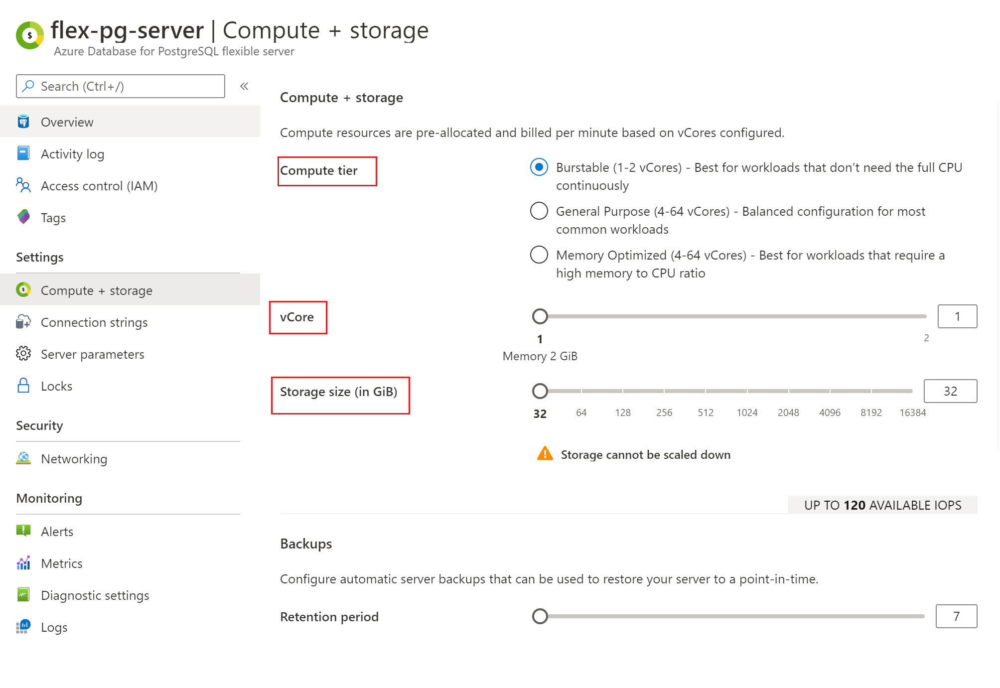

# Manage an Azure Database for PostgreSQL Flexible Server (Preview) using the Azure portal

This article shows you how to manage your Azure Database for PostgreSQL Flexible Server (Preview). Management tasks include compute and storage scaling, admin password reset, and viewing server details.

## Sign in

Sign in to the [Azure portal](https://portal.azure.com). Go to your flexible server resource in the Azure portal.

## Scale compute and storage

After server creation you can scale between the General Purpose and Memory Optimized tiers as your needs change. You can also scale compute and memory by increasing or decreasing vCores. Storage can be scaled up (however, you cannot scale storage down).

1. Select your server in the Azure portal. Select **Compute + Storage**, located in the **Settings** section.

2. You can change the **Compute Tier** , **vCore**, **Storage** to scale up the server using higher compute tier or scale up withing the same tier by increasing storage or vCores to your desired value.

   

   > [!Important]
   > - Storage cannot be scaled down.
   > - Scaling vCores causes a server restart.

3. Select **OK** to save changes.

## Update admin password

You can change the administrator role's password using the Azure portal.

1. Select your server in the Azure portal. In the **Overview** window select **Reset password**.

2. Enter a new password and confirm the password. The textbox will prompt you about password complexity requirements.

   

3. Select **Save** to save the new password.

## Delete a server

You can delete your server if you no longer need it.

1. Select your server in the Azure portal. In the **Overview** window select **Delete**.

2. Type the name of the server into the input box to confirm that this is the server you want to delete.

     

   > [!NOTE]
   > Deleting a server is irreversible.

3. Select **Delete**.

