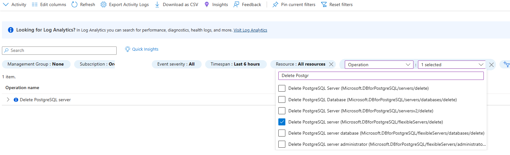
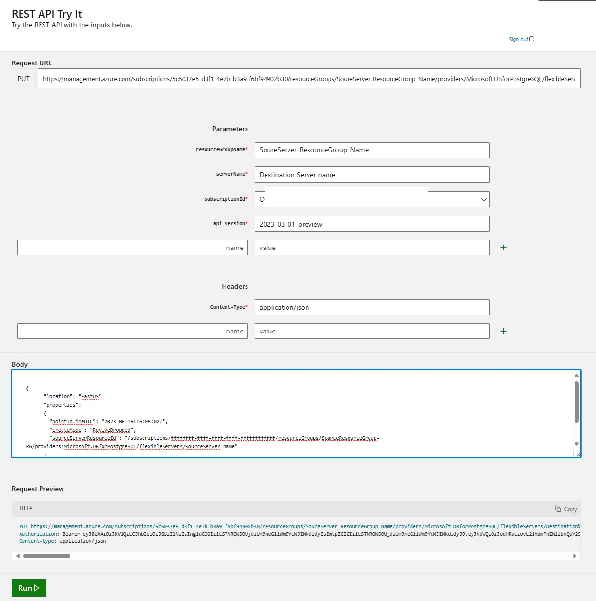

# Restore a dropped Azure Database for PostgreSQL Flexible server

[!INCLUDE [applies-to-postgresql-Flexible-server](../includes/applies-to-postgresql-Flexible-server.md)]


When a server is dropped, the database server backup is retained for five days in the service. The database backup can be accessed and restored only from the Azure subscription where the server originally resided. The following recommended steps can be followed to recover a dropped PostgreSQL server resource within five days from the time of server deletion. The recommended steps work only if the backup for the server is still available and not deleted from the system.

## Prerequisites

To restore a dropped Azure Database for PostgreSQL Flexible server, you need
- Azure Subscription name hosting the original server
- Location where the server was created
- Use the 2023-03-01-preview  **api-version** version

## Steps to restore

1. Browse to the [Azure portal](https://portal.azure.com/#blade/Microsoft_Azure_ActivityLog/ActivityLogBlade). Select the **Monitor** service, then select **Activity Log**.

2. In Activity Log, select on **Add filter** as shown and set following filters for the following

    - **Subscription** = Your Subscription hosting the deleted server
    - **Operation** = Delete PostgreSQL Server (Microsoft.DBforPostgreSQL/flexibleservers/delete)

  
      

3. Select the **Delete PostgreSQL Server** event, then select the **JSON tab**. Copy the `resourceId` and `submissionTimestamp` attributes in JSON output. The resourceId is in the following format: `/subscriptions/ffffffff-ffff-ffff-ffff-ffffffffffff/resourceGroups/TargetResourceGroup/providers/Microsoft.DBforPostgreSQL/servers/deletedserver`.

4. Browse to the PostgreSQL [Create Server REST API Page](/rest/api/postgresql/flexibleserver/servers/create) and select the **Try It** tab highlighted in green. Sign in with your Azure account.

   > [!Important]
   > Use this api-version **_2023-03-01-preview_** rather than the default before running to enable this API function as expected as detailed in the following step.

5. Provide the **resourceGroupName**, **serverName** (Target server name), **subscriptionId** properties, based on the resourceId attribute JSON value captured in the preceding step 3. The api-version property is prepopulated and can be left as-is, as shown in the following image.

    

    

6. Go to **Request Body** section and paste the following replacing the "Dropped server Location"(e.g. CentralUS, EastUS etc.), "submissionTimestamp", and "resourceId". For "pointInTimeUTC", specify a value of "submissionTimestamp" plus **5 minutes** to ensure the command doesn't error out.

    ```json
    {
      "location": "Dropped Server Location",  
      "properties": 
      {
        "pointInTimeUTC": "submissionTimestamp + 05 minutes",
        "createMode": "ReviveDropped",
        "sourceServerResourceId": "resourceId"
      }
    }
    ```

    For example, if the submission timestamp is 2023-06-15T15:58:02Z, we recommend adding a minimum of 5 minutes to restore point in time 2023-06-15T16:05:02Z and ensure that you're changing three parameters (location,pointInTimeUTC,sourceServerResourceId) as per your restore requirements.

    ```json
    {
      "location": "EastUS",  
      "properties": 
      {
        "pointInTimeUTC": "2023-06-15T16:05:02Z",
        "createMode": "ReviveDropped",
        "sourceServerResourceId": "/subscriptions/ffffffff-ffff-ffff-ffff-ffffffffffff/resourceGroups/SourceResourceGroup-Name/providers/Microsoft.DBforPostgreSQL/flexibleServers/SourceServer-Name"
      }
    }
    ```

    > [!Important]
    > There is a time limit of five days after the server was dropped. After five days, an error is expected since the backup file cannot be found.

7. If you see Response Code 201 or 202, the restore request is successfully submitted.

    The server creation can take time depending on the database size and compute resources provisioned on the original server. The restore status can be monitored from Activity log by filtering for 
   - **Subscription** = Your Subscription
   - **Resource Type** = Azure Database for PostgreSQL Flexible servers (Microsoft.DBforPostgreSQL/flexibleServers) 
   - **Operation** =  Update PostgreSQL Server Create
   


## Restore a dropped VNET enabled Server


```json
{
  "location": "EastUS",  
  "properties": {
    "createMode": "ReviveDropped",
    "sourceServerResourceId": "/subscriptions/ffffffff-ffff-ffff-ffff-ffffffffffff/resourceGroups/SourceResourceGroup-Name/providers/Microsoft.DBforPostgreSQL/flexibleServers/SourceServer-Name",
    "pointInTimeUTC": "2023-06-20T20:50:59.4078005+00:00",
    "Network": {
      "DelegatedSubnetResourceId": "/subscriptions/ffffffff-ffff-ffff-ffff-ffffffffffff/resourceGroups/SourceResourceGroup-Name/providers/Microsoft.Network/virtualNetworks/VirtualNetwork-Name/subnets/Subnet-Name",
      "PrivateDnsZoneArmResourceId": "/subscriptions/ffffffff-ffff-ffff-ffff-ffffffffffff/resourceGroups/SourceResourceGroup-Name/providers/Microsoft.Network/privateDnsZones/privatednszonename"
    }
  }
}
 ```
## Commom Errors

1. If you utilize the incorrect API version, you may experience restore failures or timeouts. Please use 2023-03-01-preview API to avoid such issues.
2. To avoid potential DNS errors, it is recommended to use a different name when initiating the restore process, as some restore operations may fail with the same name.

## Next steps

- If you're trying to restore a server within five days, and still receive an error after accurately following the steps discussed earlier, open a support incident for assistance. If you're trying to restore a dropped server after five days, an error is expected since the backup file can't be found. Don't open a support ticket in this scenario. The support team can't provide any assistance if the backup is deleted from the system. 
- To prevent accidental deletion of servers, we highly recommend using [Resource Locks](https://techcommunity.microsoft.com/t5/azure-database-for-postgresql/preventing-the-disaster-of-accidental-deletion-for-your-PostgreSQL/ba-p/825222).
