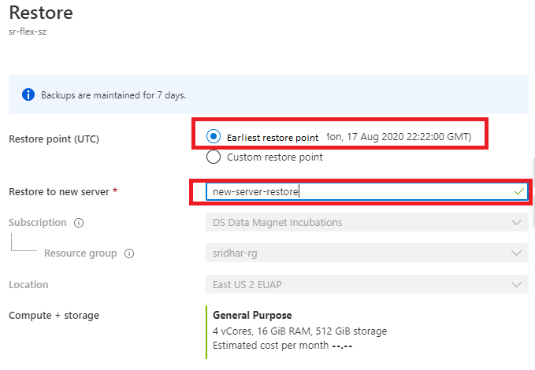

# Point-in-time restore of a flexible server

This article provides step-by-step procedure to perform point-in-time recoveries in flexible server using backups.

## Pre-requisites

To complete this how-to guide, you need:

-   You must have an Azure Database for PostgreSQL flexible server. The same procedure is also applicable for flexible server configured with zone redundancy.

## Restoring to the earliest restore point

Follow these steps to restore your flexible server using an earliest
existing backup.

1.  In the [Azure portal](https://portal.azure.com/), choose your flexible server that you want to restore the backup from.

2.  Click **Overview** from the left panel.
  
3.  From the overview page, click **Restore**.
 
4.  Restore page will be shown with an option to choose between Earliest restore point and Custom restore point.

5.  select **Earliest restore point**.

6.  Provide a new server name in the **Restore to new server** field.
7. 

8.  Click **OK**.

9.  A notification will be shown that the restore operation has been initiated.

## Restoring to a custom restore point

Follow these steps to restore your flexible server using an earliest
existing backup.

1.  In the [Azure portal](https://portal.azure.com/), choose your flexible server that you want to restore the backup from.

2.  From the overview page, click **Restore**.
    
3.  Restore page will be shown with an option to choose between Earliest restore point and Custom restore point.

4.  Choose **Custom restore point**.

5.  Select date and time. 

6.  Provide a new server name in the **Restore to new server** field. 
   
 
 
7.  Click **OK**.

8.  A notification will be shown that the restore operation has been
    initiated.

## Next steps

-   Learn about [business continuity](./concepts-business-continuity.md)
-   Learn about [zone redundant high availability](./concepts-high-availability.md)
-   Learn about [backup and recovery](./concepts-backup-restore.md)

