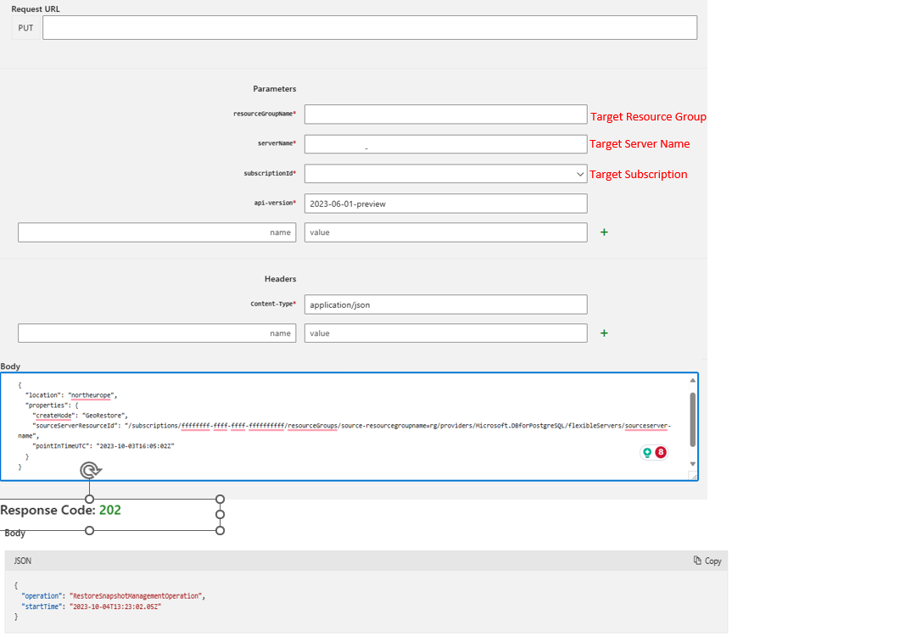

# Cross subscription and cross resource group  restore in Azure Database for PostgreSQL Flexible Server using Azure REST API

[!INCLUDE [applies-to-postgresql-flexible-server](../includes/applies-to-postgresql-flexible-server.md)]
In this article, you learn how to restore a flexible server to a different subscription or resource group using the REST API [Azure REST API](/rest/api/azure/). To learn more about backup and restore see the [overview](concepts-backup-restore.md).

### Prerequisites
An [Azure Database for PostgreSQL server](quickstart-create-server-portal.md) to be the primary server.

### Restore to a different Subscription or Resource group

 1. Browse to the PostgreSQL [Create Server REST API Page](/rest/api/postgresql/flexibleserver/servers/create) and select the **Try It** tab highlighted in green. Sign in with your Azure account.

2. Provide the **resourceGroupName**(Target Resource group name), **serverName** (Target server name), **subscriptionId** (Target subscription) properties. Please use the latest api-version that is available. For this example we're using 2023-06-01-preview.

    


3. Go to **Request Body** section and paste the following replacing the "location" (e.g. CentralUS, EastUS etc.), "pointInTimeUTC", and ))"SourceServerResourceID", For "pointInTimeUTC", specify a timestamp value  to which you want to restore. Finally, you can use createMode as **PointInTimeRestore** for performing regular restore and **GeoRestore** for restoring geo-redundant backups.

 **GeoRestore**

```json
   {
  "location": "NorthEurope",  
  "properties": 
  {
    "pointInTimeUTC": "2023-10-03T16:05:02Z",
    "SourceServerResourceID": "/subscriptions/fffffffff-ffff-ffff-fffffffffff/resourceGroups/source-resourcegroupname-rg/providers/Microsoft.DBforPostgreSQL/flexibleServers/SourceServer-Name",
       "createMode": "GeoRestore"
   }
}
```
**Point In Time Restore**

```json
    {
      "location": "EastUS",  
      "properties": 
      {
        "pointInTimeUTC": "2023-06-15T16:05:02Z",
        "createMode": "PointInTimeRestore",
        "sourceServerResourceId": "/subscriptions/ffffffff-ffff-ffff-ffff-ffffffffffff/resourceGroups/SourceResourceGroup-Name/providers/Microsoft.DBforPostgreSQL/flexibleServers/SourceServer-Name"
      }
    }
```


4. If you see Response Code 201 or 202, the restore request is successfully submitted.

    The server creation can take time depending on the database size and compute resources provisioned on the original server. The restore status can be monitored from Activity log by filtering for 
   - **Subscription** = Your Subscription
   - **Resource Type** = Azure Database for PostgreSQL Flexible servers (Microsoft.DBforPostgreSQL/flexibleServers) 
   - **Operation** =  Update PostgreSQL Server Create


## Common Errors

 - If you utilize the incorrect API version, you might experience restore failures or timeouts. Please use 2023-06-01-preview API to avoid such issues.
 - To avoid potential DNS errors, it's recommended to use a different name when initiating the restore process, as some restore operations might fail with the same name.

## Next steps

- Learn about [business continuity](./concepts-business-continuity.md).
- Learn about [zone-redundant high availability](./concepts-high-availability.md).
- Learn about [backup and recovery](./concepts-backup-restore.md).