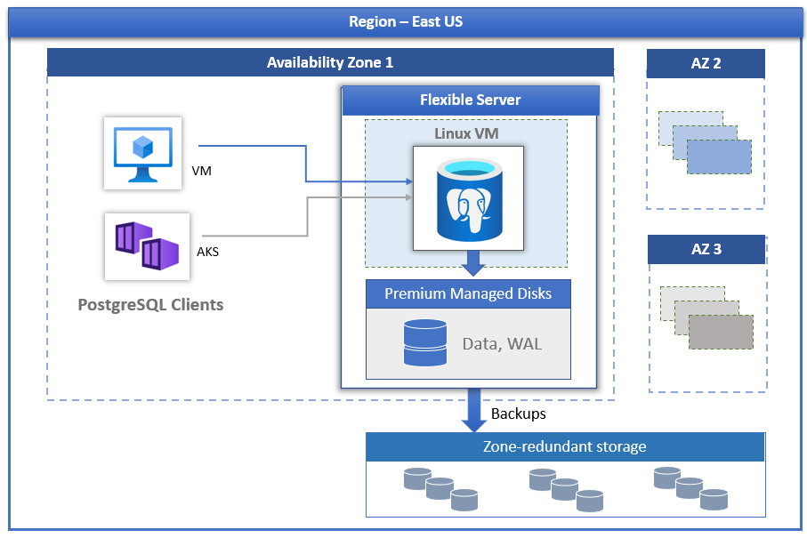

# Overview - Azure Database for PostgreSQL - Flexible Server

[!INCLUDE [applies-to-postgresql-flexible-server](../includes/applies-to-postgresql-flexible-server.md)]

[Azure Database for PostgreSQL](../overview.md) powered by the PostgreSQL community edition is available in two deployment modes:

- [Flexible Server](./overview.md) 
- [Single Server](../overview-single-server.md) 
   
In this article, we will provide an overview and introduction to core concepts of flexible server deployment model.

## Overview

Azure Database for PostgreSQL - Flexible Server is a fully managed database service designed to provide more granular control and flexibility over database management functions and configuration settings. In general, the service provides more flexibility and server configuration customizations based on the user requirements. The flexible server architecture allows users to collocate database engine with the client-tier for lower latency,  choose high availability within a single availability zone and across multiple availability zones. Flexible servers also provide better cost optimization controls with ability to stop/start your server and burstable compute tier that is ideal for workloads that do not need full compute capacity continuously. The service currently supports community version of [PostgreSQL 11, 12, 13, and 14](./concepts-supported-versions.md). The service is currently available in wide variety of  [Azure regions](https://azure.microsoft.com/global-infrastructure/services/).

Flexible servers are best suited for

- Application developments requiring better control and customizations.
- Zone redundant high availability
- Managed maintenance windows
  
## Architecture and high availability

The flexible server deployment model is designed to support high availability within a single availability zone and across multiple availability zones. The architecture separates compute and storage. The database engine runs on a container inside a Linux virtual machine, while data files reside on Azure storage. The storage maintains three locally redundant synchronous copies of the database files ensuring data durability.

If zone redundant high availability is configured, the service provisions and maintains a warm standby server across availability zone within the same Azure region. The data changes on the source server are synchronously replicated to the standby server to ensure zero data loss. With zone redundant high availability, once the planned or unplanned failover event is triggered, the standby server comes online immediately and is available to process incoming transactions. This allows the service resiliency from availability zone failure within an Azure region that supports multiple availability zones as shown in the picture below.

 :::image type="content" source="./media/business-continuity/concepts-zone-redundant-high-availability-architecture.png" alt-text="Zone redundant high availability":::

 See [High availability document](./concepts-high-availability.md) for more details.

## Automated patching with managed maintenance window

The service performs automated patching of the underlying hardware, OS, and database engine. The patching includes security and software updates. For PostgreSQL engine, minor version upgrades are also included as part of the planned maintenance release. Users can configure the patching schedule to be system managed or define their custom schedule. During the maintenance schedule, the patch is applied, and server may need to be restarted as part of the patching process to complete the update. With the custom schedule, users can make their patching cycle predictable and choose a maintenance window with minimum impact to the business. In general, the service follows monthly release schedule as part of the continuous integration and release.

## Automatic backups

The flexible server service automatically creates server backups and stores them on zone redundant storage (ZRS) within the region. Backups can be used to restore your server to any point-in-time within the backup retention period. The default backup retention period is seven days. The retention can be optionally configured up to 35 days. All backups are encrypted using AES 256-bit encryption. See [Backups](./concepts-backup-restore.md) for more details.

## Adjust performance and scale within seconds

The flexible server service is available in three compute tiers: Burstable, General Purpose, and Memory Optimized. The Burstable tier is best suited for low-cost development and low concurrency workloads that do not need full compute capacity continuously. The General Purpose and Memory Optimized are better suited for production workloads requiring high concurrency, scale, and predictable performance. You can build your first application on a small database for a few dollars a month, and then seamlessly adjust the scale to meet the needs of your solution.

## Stop/Start server to lower TCO

The flexible server service allows you to stop and start server on-demand to lower your TCO. The compute tier billing is stopped immediately when the server is stopped. This can allow you to have significant cost savings during development, testing and for time-bound predictable production workloads. The server remains in the stopped state for seven days unless restarted sooner.

## Enterprise grade security

The flexible server service uses the FIPS 140-2 validated cryptographic module for storage encryption of data at-rest. Data, including backups, and temporary files created while running queries are encrypted. The service uses the AES 256-bit cipher included in Azure storage encryption, and the keys can be system managed (default). The service encrypts data in-motion with transport layer security (SSL/TLS) enforced by default. The service enforces and supports TLS versions 1.2 only.

Flexible servers allow full private access to the servers using Azure virtual network (VNet integration). Servers in Azure virtual network can only be reached and connected through private IP addresses. With VNet integration, public access is denied and servers cannot be reached using public endpoints.

## Monitoring and alerting

The flexible server service is equipped with built-in performance monitoring and alerting features. All Azure metrics have a one-minute frequency, and each metric provides 30 days of history. You can configure alerts on the metrics. The service exposes host server metrics to monitor resources utilization and allows configuring slow query logs. Using these tools, you can quickly optimize your workloads, and configure your server for best performance.

## Built-in PgBouncer

The flexible server comes with a [built-in PgBouncer](concepts-pgbouncer.md), a connection pooler. You can optionally enable it and connect your applications to your database server via PgBouncer using the same host name and the port 6432.

## Azure regions

One advantage of running your workload in Azure is global reach. The flexible server is currently available in the following Azure regions:

| Region | V3/V4 compute availability | Zone-Redundant HA | Same-Zone HA | Geo-Redundant backup |
| --- | --- | --- | --- |--- |
| Australia East | :heavy_check_mark: | :heavy_check_mark: | :heavy_check_mark: | :heavy_check_mark: |
| Australia Southeast | :heavy_check_mark: | :x: | :heavy_check_mark: | :heavy_check_mark: |
| Brazil South | :heavy_check_mark: (v3 only) | :x: $ | :heavy_check_mark: | :x: |
| Canada Central | :heavy_check_mark: | :heavy_check_mark: | :heavy_check_mark: | :heavy_check_mark: | 
| Canada East | :heavy_check_mark: | :x: | :heavy_check_mark: | :heavy_check_mark: |
| Central India | :heavy_check_mark: | :heavy_check_mark: | :heavy_check_mark: | :heavy_check_mark: |
| Central US | :heavy_check_mark: | :heavy_check_mark: | :heavy_check_mark: | :heavy_check_mark: |
| China East 3 | :heavy_check_mark: | :x: | :heavy_check_mark: | :heavy_check_mark: | 
| China North 3 | :heavy_check_mark: | :heavy_check_mark: | :heavy_check_mark: | :heavy_check_mark: | 
| East Asia | :heavy_check_mark: | :heavy_check_mark: ** | :heavy_check_mark: | :heavy_check_mark: |
| East US | :heavy_check_mark: | :heavy_check_mark: | :heavy_check_mark: | :heavy_check_mark: |
| East US 2 | :heavy_check_mark: | :x: $ | :heavy_check_mark: | :heavy_check_mark: |
| France Central | :heavy_check_mark: | :x: $ | :heavy_check_mark: | :heavy_check_mark: |
| France South | :heavy_check_mark: | :x: | :heavy_check_mark: | :heavy_check_mark: |
| Germany West Central | :x: $$ | :x: $ | :x: $ | :x: |
| Japan East | :heavy_check_mark: | :heavy_check_mark: | :heavy_check_mark: | :heavy_check_mark: |
| Japan West | :heavy_check_mark: | :x: | :heavy_check_mark: | :heavy_check_mark: |
| Jio India West | :heavy_check_mark: (v3 only)| :x: | :heavy_check_mark: | :x: |
| Korea Central | :heavy_check_mark: | :heavy_check_mark: ** | :heavy_check_mark: | :heavy_check_mark: |
| Korea South | :heavy_check_mark: | :x: | :heavy_check_mark: | :heavy_check_mark: |
| North Central US | :heavy_check_mark: | :x: | :heavy_check_mark: | :heavy_check_mark: |
| North Europe | :heavy_check_mark: | :heavy_check_mark: | :heavy_check_mark: | :heavy_check_mark: |
| Norway East | :heavy_check_mark: | :heavy_check_mark: | :heavy_check_mark: | :x: |
| Qatar Central | :heavy_check_mark: | :x: | :heavy_check_mark: | :x: |
| South Africa North | :heavy_check_mark: | :heavy_check_mark: | :heavy_check_mark: | :x: |
| South Central US | :heavy_check_mark: | :heavy_check_mark: | :heavy_check_mark: | :heavy_check_mark: |
| South India | :heavy_check_mark: | :x: | :heavy_check_mark: | :heavy_check_mark: |
| Southeast Asia | :heavy_check_mark: | :x: $  | :heavy_check_mark: | :heavy_check_mark: |
| Sweden Central | :heavy_check_mark: | :x: | :heavy_check_mark: | :x: |
| Switzerland North | :heavy_check_mark: | :heavy_check_mark: | :heavy_check_mark: | :heavy_check_mark: |
| Switzerland West | :heavy_check_mark: | :x: | :heavy_check_mark: | :heavy_check_mark: |
| UAE North | :heavy_check_mark: | :heavy_check_mark: | :heavy_check_mark: | :x: |
| US Gov Arizona | :x: $$ | :x: | :heavy_check_mark: | :x: |
| US Gov Virginia | :heavy_check_mark: | :heavy_check_mark: | :heavy_check_mark: | :x: |
| UK South | :heavy_check_mark: | :heavy_check_mark: | :heavy_check_mark: | :heavy_check_mark: |
| UK West | :heavy_check_mark: | :x: | :heavy_check_mark: | :heavy_check_mark: |
| West Central US | :heavy_check_mark: | :x: | :heavy_check_mark: | :heavy_check_mark: |
| West Europe | :heavy_check_mark: | :x: $ | :heavy_check_mark: | :heavy_check_mark: |
| West US | :heavy_check_mark: | :x: | :heavy_check_mark: | :heavy_check_mark: |
| West US 2 | :x: $$ | :x: $ | :x: $ | :heavy_check_mark:|
| West US 3 | :heavy_check_mark: | :heavy_check_mark: ** | :heavy_check_mark: | :x: |

$ New Zone-redundant high availability deployments are temporarily blocked in these regions. Already provisioned HA servers are fully supported. 

$$ New server deployments are temporarily blocked in these regions. Already provisioned servers are fully supported.

** Zone-redundant high availability can now be deployed when you provision new servers in these regions. Any existing servers deployed in AZ with *no preference* (which you can check on the Azure portal) prior to the region started to support AZ, even when you enable zone-redundant HA, the standby will be provisioned in the same AZ (same-zone HA) as the primary server. To enable zone-redundant high availability, [follow the steps.](how-to-manage-high-availability-portal.md#enabling-zone-redundant-ha-after-the-region-supports-az).

<!-- We continue to add more regions for flexible server. -->
> [!NOTE]
> If your application requires Zone redundant HA and it's not available in your preferred Azure region, consider using other regions within the same geography where Zone redundant HA is available, such as US East for US East 2, Central US for North Central US, and so on. 

## Migration

The service runs the community version of PostgreSQL. This allows full application compatibility and requires minimal refactoring cost to migrate an existing application developed on PostgreSQL engine to Flexible Server. 

- **Single Server to Flexible Server Migration tool (Preview)** - [This tool](../migrate/concepts-single-to-flexible.md) provides an easier migration capability from Single server to Flexible Server.
- **Dump and Restore** – For offline migrations, where users can afford some downtime, dump and restore using community tools like pg_dump and pg_restore can provide fastest way to migrate. See [Migrate using dump and restore](../howto-migrate-using-dump-and-restore.md) for details.
- **Azure Database Migration Service** – For seamless and simplified migrations to flexible server with minimal downtime, Azure Database Migration Service can be leveraged. See [DMS via portal](../../dms/tutorial-postgresql-azure-postgresql-online-portal.md) and [DMS via CLI](../../dms/tutorial-postgresql-azure-postgresql-online.md). You can migrate from your Azure Database for PostgreSQL - Single Server to Flexible Server. See this [DMS article](../../dms/tutorial-azure-postgresql-to-azure-postgresql-online-portal.md) for details.

## Frequently asked questions

**1. Will Flexible Server replace Single Server? Will Single Server be retired soon?**

We continue to support Single Server and encourage you to adopt Flexible Server which has richer capabilities such as zone resilient HA, predictable performance, maximum control, custom maintenance window, cost optimization controls and simplified developer experience suitable for your enterprise workloads. If we decide to retire any service, feature, API or SKU, you'll receive advance notice including a migration or transition path. Learn more about Microsoft Lifecycle policies [here](/lifecycle/faq/general-lifecycle).

**2. What is Microsoft’s policy to address PostgreSQL engine defects?**

Please refer to  Microsoft’s current policy [here](../../postgresql/flexible-server/concepts-supported-versions.md#managing-postgresql-engine-defects)

## Contacts
For any questions or suggestions you might have on Azure Database for PostgreSQL flexible server, send an email to the Azure Database for PostgreSQL Team ([@Ask Azure DB for PostgreSQL](mailto:AskAzureDBforPostgreSQL@service.microsoft.com)). Please note that this email address isn't  a technical support alias.

In addition, consider the following points of contact as appropriate:

- To contact Azure Support, [file a ticket from the Azure portal](https://portal.azure.com/?#blade/Microsoft_Azure_Support/HelpAndSupportBlade).
- To fix an issue with your account, file a [support request](https://portal.azure.com/#blade/Microsoft_Azure_Support/HelpAndSupportBlade/newsupportrequest) in the Azure portal.
- To provide feedback or to request new features, create an entry via [UserVoice](https://feedback.azure.com/forums/597976-azure-database-for-postgresql).
  

## Next steps

Now that you've read an introduction to Azure Database for PostgreSQL flexible server deployment mode, you're ready to create your first server: [Create an Azure Database for PostgreSQL - Flexible Server using Azure portal](./quickstart-create-server-portal.md)

