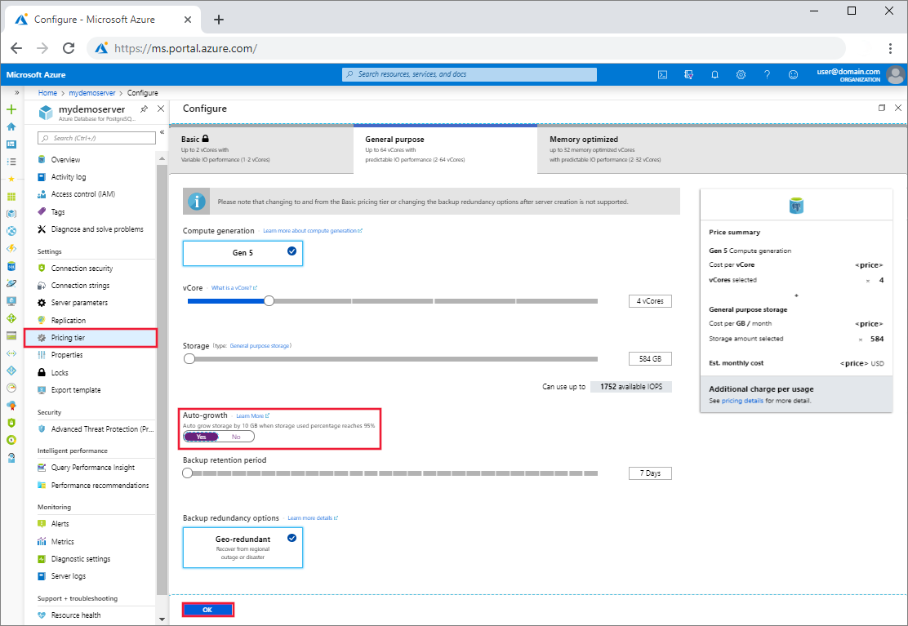

# Auto-grow Azure Database for PostgreSQL storage - Single Server using the Azure portal
This article describes how you can configure an Azure Database for PostgreSQL server storage to grow without impacting the workload.

The server [reaching the storage limit](https://docs.microsoft.com/en-us/azure/postgresql/concepts-pricing-tiers#reaching-the-storage-limit), is set to read-only. If storage auto grow is enabled then for servers with less than 100 GB provisioned storage, the provisioned storage size is increased by 5 GB as soon as the free storage is below the greater of 1 GB or 10% of the provisioned storage. For servers with more than 100 GB of provisioned storage, the provisioned storage size is increased by 5% when the free storage space is below 5% of the provisioned storage size. Maximum storage limits as specified [here](https://docs.microsoft.com/en-us/azure/postgresql/concepts-pricing-tiers#storage) apply.

## Prerequisites
To complete this how-to guide, you need:
- An [Azure Database for PostgreSQL server](quickstart-create-server-database-portal.md)

## Enable PostgreSQL server storage auto-grow 

Follow these steps to set PostgreSQL server storage auto-grow:

1. In the [Azure portal](https://portal.azure.com/), select your Azure Database for PostgreSQL server.

2. On the PostgreSQL server page, under Settings heading, click **Pricing tier** to open the Pricing tier page for the Azure Database for PostgreSQL.

3. In the configure window of the server's **Pricing tier** page, go to **Auto-growth** and Click **Yes** to confirm server storage auto-growth.

    

4. Click **OK** to save the changes.

5. Confirm server auto-grow is successful.

    

## Next steps

Learn about [how to create alerts on metrics](howto-alert-on-metric.md).
