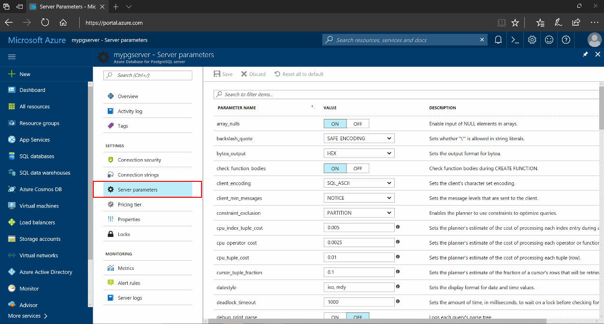
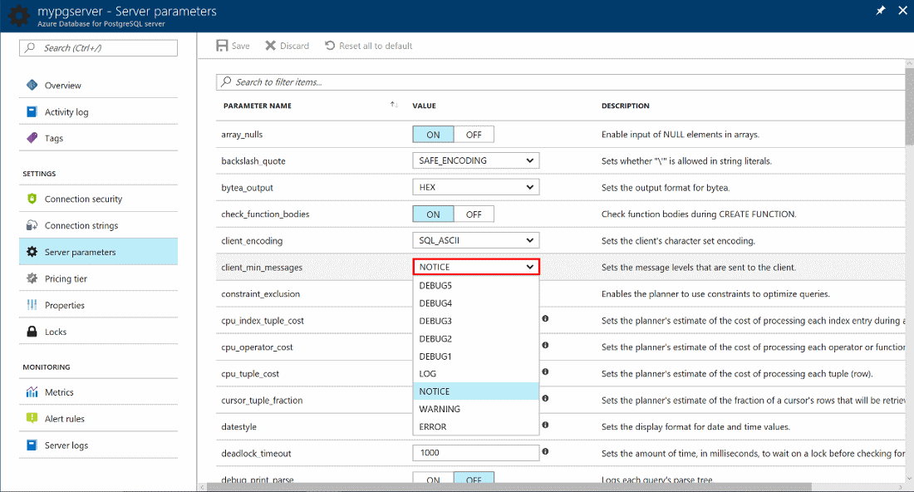
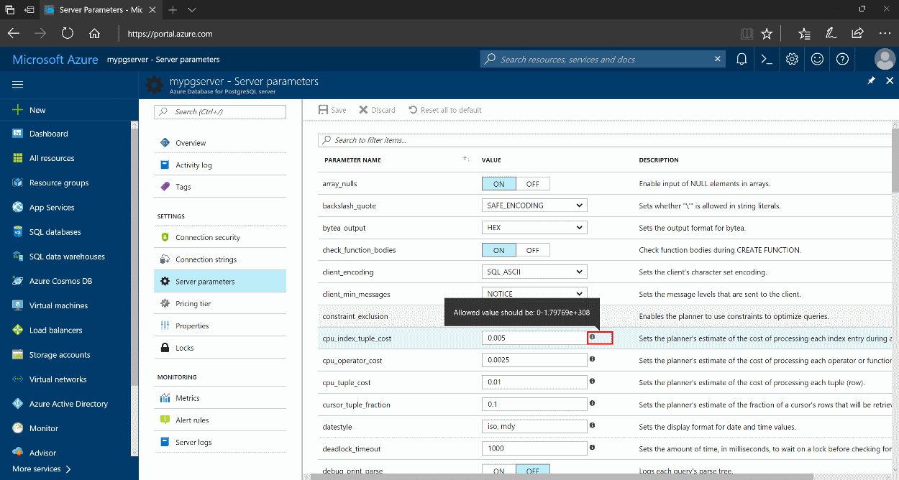
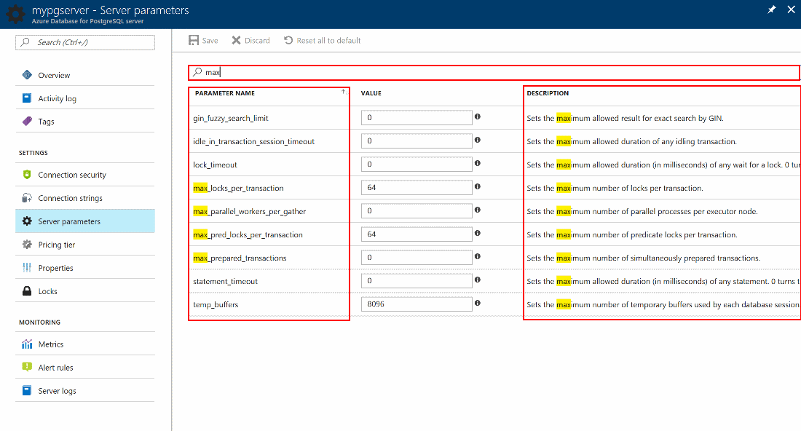
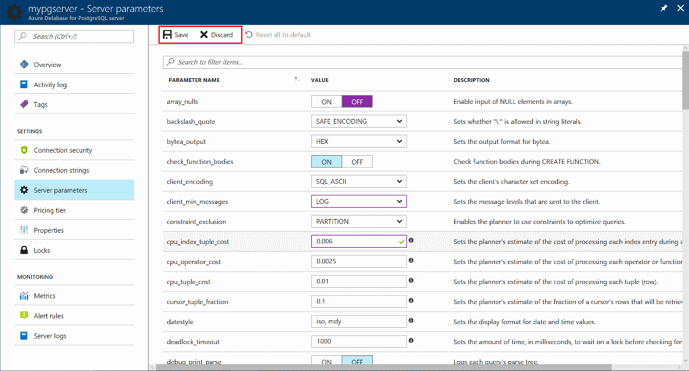
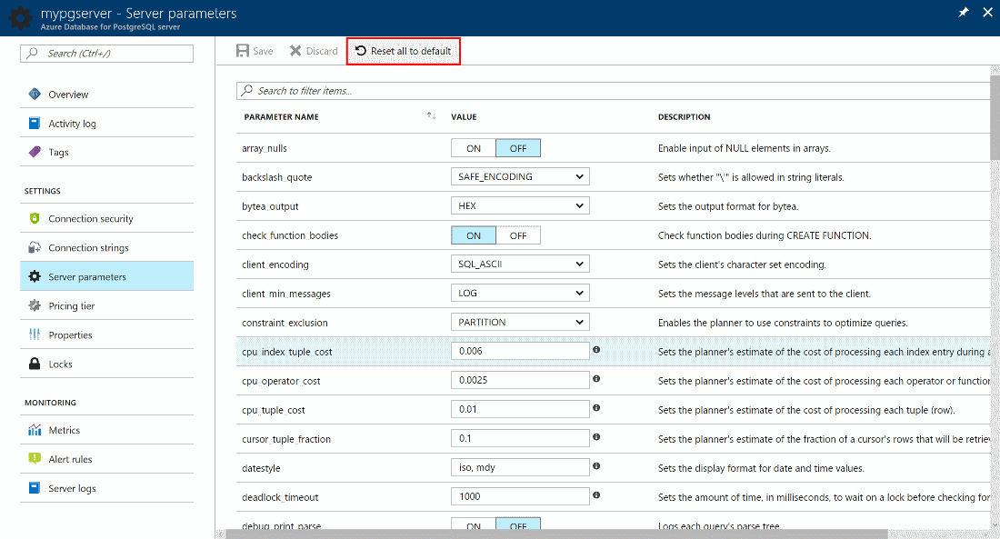

# Configure server parameters in Azure portal
You can list, show, and update configuration parameters for an Azure Database for PostgreSQL server through the Azure portal.

## Prerequisites
To step through this how-to guide you need:
- [Azure Database for PostgreSQL server](quickstart-create-server-database-portal.md)

## Viewing and editing parameters
1. Open the Azure portal.

2. Select your Azure Database for PostgreSQL server.

3. Under the **SETTINGS** section in the sidebar, select **Server parameters**. The page shows a list of parameters, their values, and descriptions.

4. Select the **drop down** button to see the possible values for enumerated-type parameters like client_min_messages.

>>Select or hover over the **i** (information) button to see the range of possible values for numeric parameters like cpu_index_tuple_cost.

5. If needed, use the **search box** to narrow down to a specific parameter. The search is on the name and description of the parameters.

6. Change the parameter values you would like to adjust. All changes you make in a session are highlighted in purple. 

>>Once you have changed the values, you can select **Save**. Or you can **Discard** your changes.

7. If you have saved new values for the parameters, you can always revert everything back to the default values by selecting **Reset all to default**.

## Next Steps
Learn about
- [Overview of server parameters in Azure Database for PostgreSQL](concepts-server-parameters.md)
- [Configuring parameters using the Azure CLI](howto-configure-server-parameters-using-cli.md)
