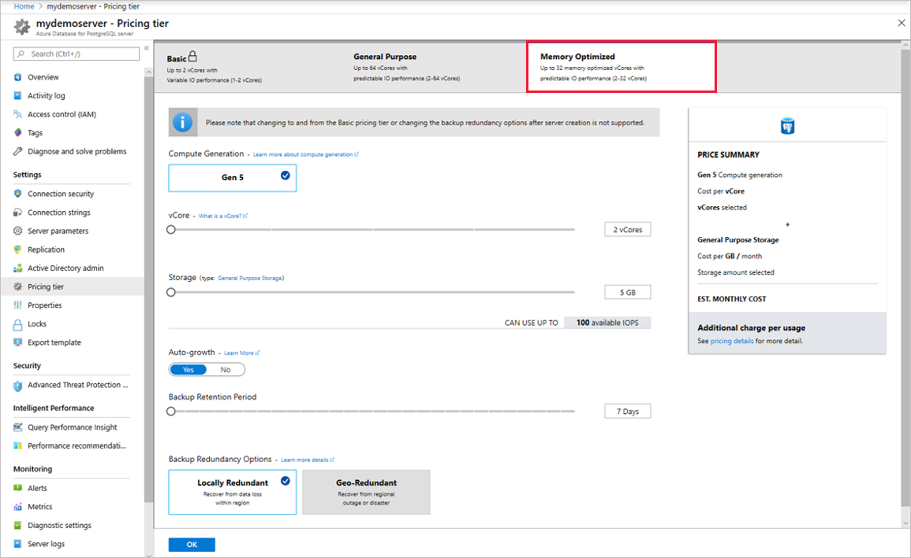
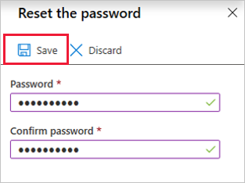
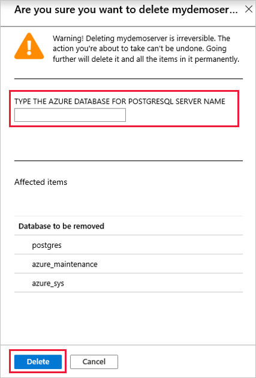

# Manage an Azure Database for PostgreSQL server using the Azure portal
This article shows you how to manage your Azure Database for PostgreSQL servers. Management tasks include compute and storage scaling, admin password reset, and viewing server details.

## Sign in
Sign in to the [Azure portal](https://portal.azure.com).

## Create a server
Visit the [quickstart](quickstart-create-server-database-portal.md) to learn how to create and get started with an Azure Database for PostgreSQL server.

## Scale compute and storage

After server creation you can scale between the General Purpose and Memory Optimized tiers as your needs change. You can also scale compute and memory by increasing or decreasing vCores. Storage can be scaled up (however, you cannot scale storage down).

### Scale between General Purpose and Memory Optimized tiers

You can scale from General Purpose to Memory Optimized and vice-versa. Changing to and from the Basic tier after server creation is not supported. 

1. Select your server in the Azure portal. Select **Pricing tier**, located in the **Settings** section.

2. Select **General Purpose** or **Memory Optimized**, depending on what you are scaling to. 

    

    > [!NOTE]
    > Changing tiers causes a server restart.

4. Select **OK** to save changes.

### Scale vCores up or down

1. Select your server in the Azure portal. Select **Pricing tier**, located in the **Settings** section.

2. Change the **vCore** setting by moving the slider to your desired value.

    

    > [!NOTE]
    > Scaling vCores causes a server restart.

3. Select **OK** to save changes.

### Scale storage up

1. Select your server in the Azure portal. Select **Pricing tier**, located in the **Settings** section.

2. Change the **Storage** setting by moving the slider up to your desired value.

    

    > [!NOTE]
    > Storage cannot be scaled down.

3. Select **OK** to save changes.

## Update admin password
You can change the administrator role's password using the Azure portal.

1. Select your server in the Azure portal. In the **Overview** window select **Reset password**.

   

2. Enter a new password and confirm the password. The textbox will prompt you about password complexity requirements.

   

3. Select **OK** to save the new password.

## Delete a server

You can delete your server if you no longer need it. 

1. Select your server in the Azure portal. In the **Overview** window select **Delete**.

    

2. Type the name of the server into the input box to confirm that this is the server you want to delete.

    

    > [!NOTE]
    > Deleting a server is irreversible.

3. Select **Delete**.

## Next steps
- Learn about [backups and server restore](howto-restore-server-portal.md)
- Learn about [tuning and monitoring options in Azure Database for PostgreSQL](concepts-monitoring.md)
