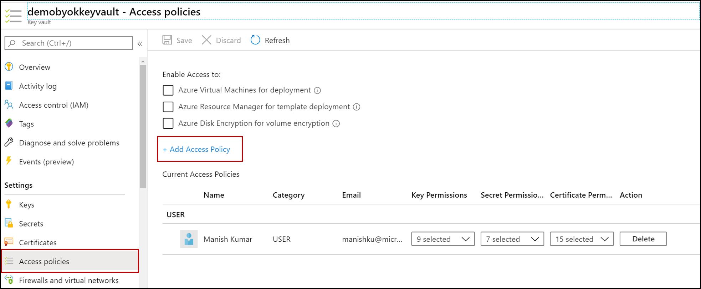
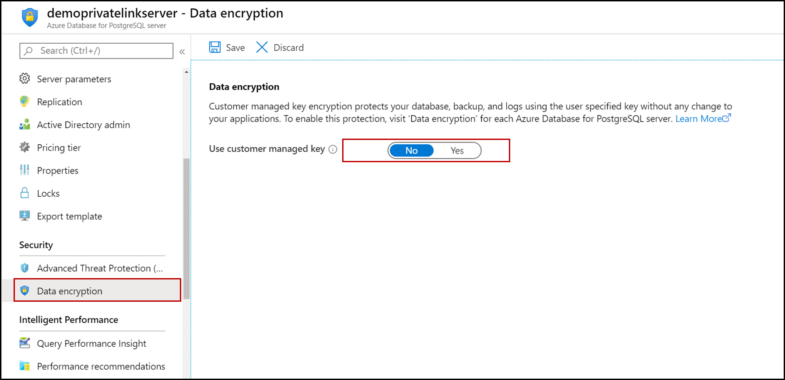
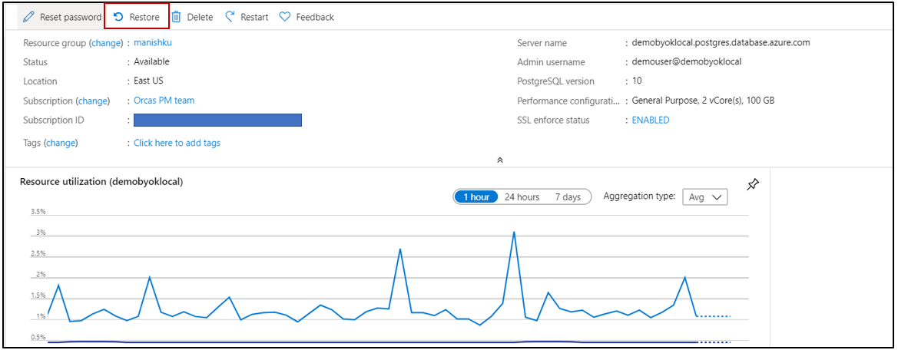
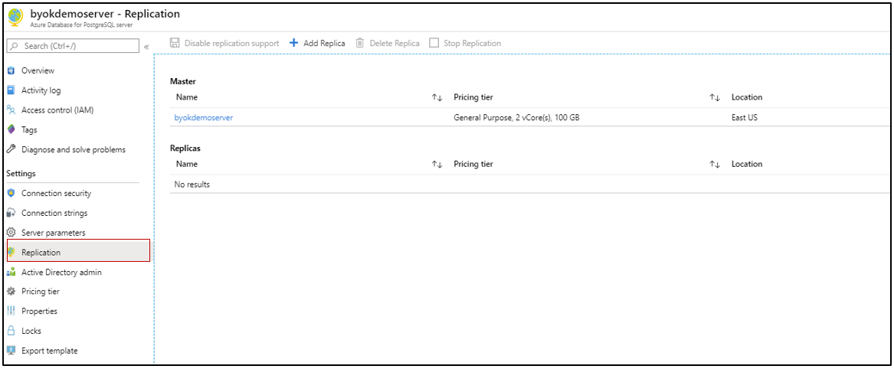
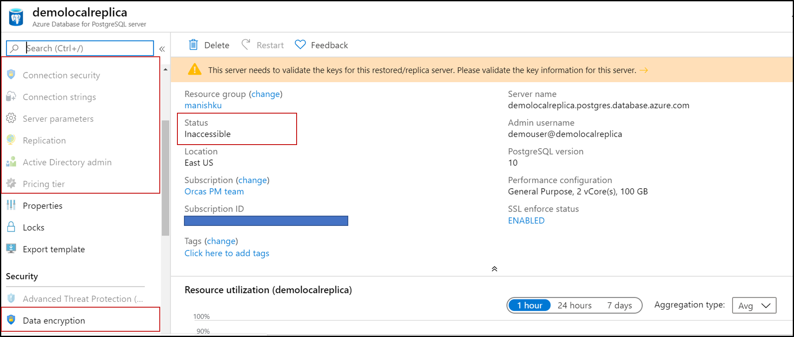
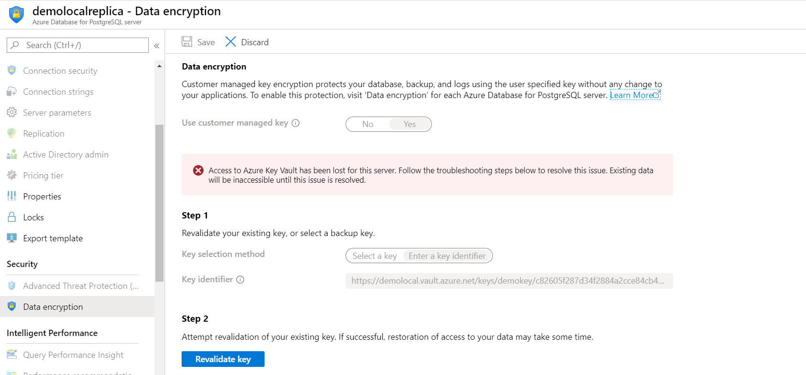
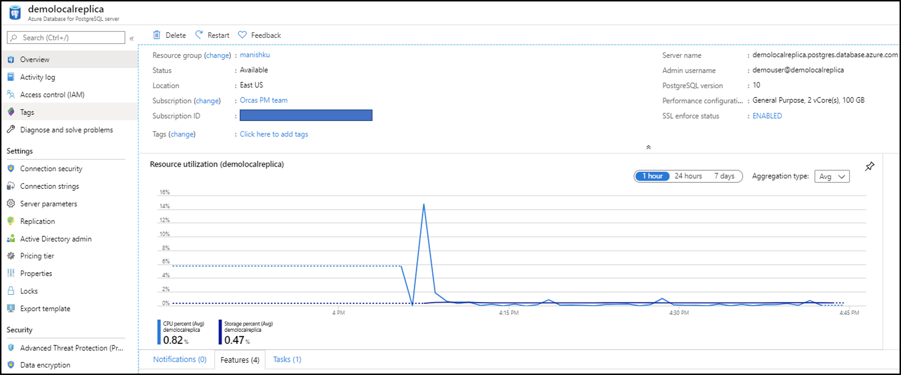

# Data encryption for Azure Database for PostgreSQL Single server by using the Azure portal

Learn how to use the Azure portal to set up and manage data encryption for your Azure Database for PostgreSQL Single server.

## Prerequisites for Azure CLI

* You must have an Azure subscription and be an administrator on that subscription.
* In Azure Key Vault, create a key vault and key to use for a customer-managed key.
* The key vault must have the following properties to use as a customer-managed key:
  * [Soft delete](../key-vault/key-vault-ovw-soft-delete.md)

    ```azurecli-interactive
    az resource update --id $(az keyvault show --name \ <key_vault_name> -test -o tsv | awk '{print $1}') --set \ properties.enableSoftDelete=true
    ```

  * [Purge protected](../key-vault/key-vault-ovw-soft-delete.md#purge-protection)

    ```azurecli-interactive
    az keyvault update --name <key_vault_name> --resource-group <resource_group_name>  --enable-purge-protection true
    ```

* The key must have the following attributes to use as a customer-managed key:
  * No expiration date
  * Not disabled
  * Able to perform get, wrap key, and unwrap key operations

## Set the right permissions for key operations

1. In Key Vault, select **Access policies** > **Add Access Policy**.

   

2. Select **Key permissions**, and select **Get**, **Wrap**, **Unwrap**, and the **Principal**, which is the name of the PostgreSQL server. If your server principal can't be found in the list of existing principals, you need to register it. You're prompted to register your server principal when you attempt to set up data encryption for the first time, and it fails.  

   

3. Select **Save**.

## Set data encryption for Azure Database for PostgreSQL Single server

1. In Azure Database for PostgreSQL, select **Data encryption** to set up the customer-managed key.

   

2. You can either select a key vault and key pair, or enter a key identifier.

   

3. Select **Save**.

4. To ensure all files (including temp files) are fully encrypted, restart the server.

## Restore or create a replica of the server

After Azure Database for PostgreSQL Single server is encrypted with a customer's managed key stored in Key Vault, any newly created copy of the server is also encrypted. You can make this new copy either through a local or geo-restore operation, or through a replica (local/cross-region) operation. So for an encrypted PostgreSQL server, you can use the following steps to create an encrypted restored server.

1. On your server, select **Overview** > **Restore**.

   

   Or for a replication-enabled server, under the **Settings** heading, select **Replication**.

   

2. After the restore operation is complete, the new server created is encrypted with the primary server's key. However, the features and options on the server are disabled, and the server is inaccessible. This prevents any data manipulation, because the new server's identity hasn't yet been given permission to access the key vault.

   

3. To make the server accessible, revalidate the key on the restored server. Select **Data Encryption** > **Revalidate key**.

   > [!NOTE]
   > The first attempt to revalidate will fail, because the new server's service principal needs to be given access to the key vault. To generate the service principal, select **Revalidate key**, which will show an error but generates the service principal. Thereafter, refer to [these steps](#set-the-right-permissions-for-key-operations) earlier in this article.

   

   You will have to give the key vault access to the new server.

4. After registering the service principal, revalidate the key again, and the server resumes its normal functionality.

   

## Using an Azure Resource Manager template to enable data encryption

Apart from Azure portal, you can also enable data encryption on your Azure Database for PostgreSQL single server using Azure Resource Manager templates for new and existing server.

### For a new server

Use one of the pre-created Azure Resource Manager templates to provision the server with data encryption enabled:
[Example with Data encryption](https://github.com/Azure/azure-postgresql/tree/master/arm-templates/ExampleWithDataEncryption)

This Azure Resource Manager template creates a Azure Database for PostgreSQL Single server and uses the **KeyVault** and **Key** passed as parameters to enable data encryption on the server.

### For an existing server
Additionally, you can use Azure Resource Manager templates to enable data encryption on your existing Azure Database for PostgreSQL Single servers.

* Pass the URI of the Azure Key Vault key that you copied earlier under the `keyVaultKeyUri` property in the properties object.

* Use *2020-01-01-preview* as the API version.

```json
{
  "$schema": "http://schema.management.azure.com/schemas/2014-04-01-preview/deploymentTemplate.json#",
  "contentVersion": "1.0.0.0",
  "parameters": {
    "location": {
      "type": "string"
    },
    "serverName": {
      "type": "string"
    },
    "keyVaultName": {
      "type": "string",
      "metadata": {
        "description": "Key vault name where the key to use is stored"
      }
    },
    "keyVaultResourceGroupName": {
      "type": "string",
      "metadata": {
        "description": "Key vault resource group name where it is stored"
      }
    },
    "keyName": {
      "type": "string",
      "metadata": {
        "description": "Key name in the key vault to use as encryption protector"
      }
    },
    "keyVersion": {
      "type": "string",
      "metadata": {
        "description": "Version of the key in the key vault to use as encryption protector"
      }
    }
  },
  "variables": {
    "serverKeyName": "[concat(parameters('keyVaultName'), '_', parameters('keyName'), '_', parameters('keyVersion'))]"
  },
  "resources": [
    {
      "type": "Microsoft.DBforPostgreSQL/servers",
      "apiVersion": "2017-12-01",
      "kind": "",
      "location": "[parameters('location')]",
      "identity": {
        "type": "SystemAssigned"
      },
      "name": "[parameters('serverName')]",
      "properties": {
      }
    },
    {
      "type": "Microsoft.Resources/deployments",
      "apiVersion": "2019-05-01",
      "name": "addAccessPolicy",
      "resourceGroup": "[parameters('keyVaultResourceGroupName')]",
      "dependsOn": [
        "[resourceId('Microsoft.DBforPostgreSQL/servers', parameters('serverName'))]"
      ],
      "properties": {
        "mode": "Incremental",
        "template": {
          "$schema": "http://schema.management.azure.com/schemas/2015-01-01/deploymentTemplate.json#",
          "contentVersion": "1.0.0.0",
          "resources": [
            {
              "type": "Microsoft.KeyVault/vaults/accessPolicies",
              "name": "[concat(parameters('keyVaultName'), '/add')]",
              "apiVersion": "2018-02-14-preview",
              "properties": {
                "accessPolicies": [
                  {
                    "tenantId": "[subscription().tenantId]",
                    "objectId": "[reference(resourceId('Microsoft.DBforPostgreSQL/servers/', parameters('serverName')), '2017-12-01', 'Full').identity.principalId]",
                    "permissions": {
                      "keys": [
                        "get",
                        "wrapKey",
                        "unwrapKey"
                      ]
                    }
                  }
                ]
              }
            }
          ]
        }
      }
    },
    {
      "name": "[concat(parameters('serverName'), '/', variables('serverKeyName'))]",
      "type": "Microsoft.DBforPostgreSQL/servers/keys",
      "apiVersion": "2020-01-01-preview",
      "dependsOn": [
        "addAccessPolicy",
        "[resourceId('Microsoft.DBforPostgreSQL/servers', parameters('serverName'))]"
      ],
      "properties": {
        "serverKeyType": "AzureKeyVault",
        "uri": "[concat(reference(resourceId(parameters('keyVaultResourceGroupName'), 'Microsoft.KeyVault/vaults/', parameters('keyVaultName')), '2018-02-14-preview', 'Full').properties.vaultUri, 'keys/', parameters('keyName'), '/', parameters('keyVersion'))]"
      }
    }
  ]
}
```

## Next steps

 To learn more about data encryption, see [Azure Database for PostgreSQL Single server data encryption with customer-managed key](concepts-data-encryption-postgresql.md).
