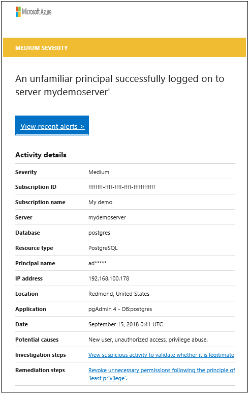
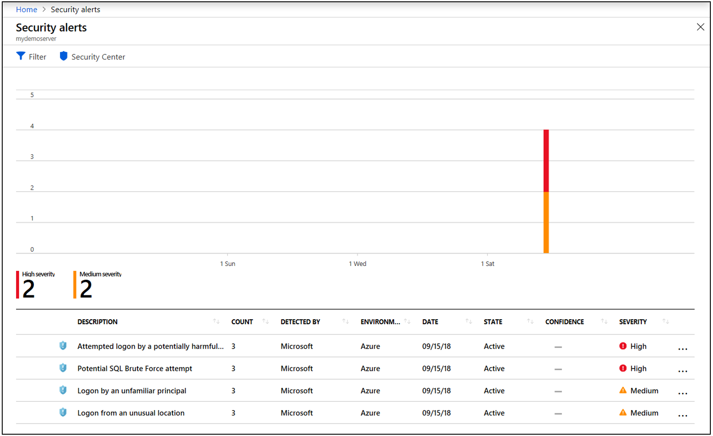

# Advanced Threat Protection for Azure Database for PostgreSQL

Advanced Threat Protection for Azure Database for PostgreSQL detects anomalous activities indicating unusual and potentially harmful attempts to access or exploit databases.

Advanced Threat Protection is part of the Advanced Data Security offering, which is a unified package for advanced security capabilities. Advanced Threat Protection can be accessed and managed via the [Azure portal](https://portal.azure.com) and is currently in preview.

> [!NOTE]
> The Advanced Threat Protection feature is **not** available in the following Azure government and sovereign cloud regions: US Gov Texas, US Gov Arizona, US Gov Iowa, US, Gov Virginia, US DoD East, US DoD Central, Germany Central, Germany North, China East, China East 2. Please visit [products available by region](https://azure.microsoft.com/en-us/global-infrastructure/services/) for general product availability.
>

## Set up threat detection for your database in the Azure portal
1. Launch the Azure portal at [https://portal.azure.com](https://portal.azure.com).
2. Navigate to the configuration page of the Azure Database for PostgreSQL server you want to protect. In the security settings, select **Advanced Threat Protection (Preview)**.
3. On the **Advanced Threat Protection (Preview)** configuration page:

   - Enable Advanced Threat Protection on the server.
   - In **Advanced Threat Protection Settings**, in the **Send alerts to** text box, provide the list of emails to receive security alerts upon detection of anomalous database activities.
  
   

## Explore anomalous database activities upon detection of a suspicious event

You receive an email notification upon detection of anomalous database activities. The email provides information on the suspicious security event including the nature of the anomalous activities, database name, server name, application name, and the event time. In addition, the email provides information on possible causes and recommended actions to investigate and mitigate the potential threat to the database.
    
1. Click the **View recent alerts** link in the email to launch the Azure portal and show the Azure Security Center alerts page, which provides an overview of active threats detected on the SQL database.

   

View active threats:

   

2. Click a specific alert to get additional details and actions for investigating this threat and remediating future threats.

      

## Explore threat detection alerts for your database in the Azure portal

Advanced Threat Protection integrates its alerts with [Azure Security Center](https://azure.microsoft.com/services/security-center/). 

Click **Security alerts** under **THREAT PROTECTION** to launch the Azure Security Center alerts page and get an overview of active SQL threats detected on the database.

  

## Next steps

* Learn more about [Azure Security Center](https://docs.microsoft.com/azure/security-center/security-center-intro)
* For more information on pricing, see the [Azure Database for PostgreSQL Pricing page](https://azure.microsoft.com/pricing/details/postgresql/)  
