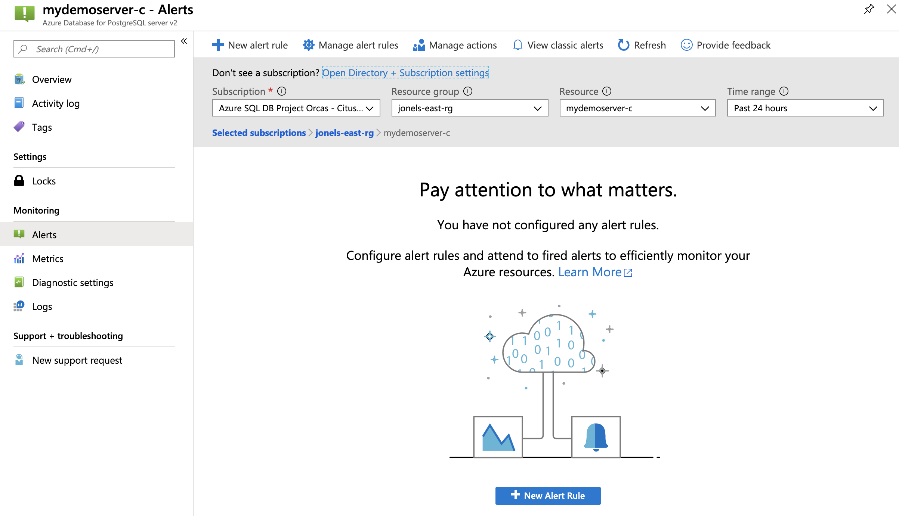
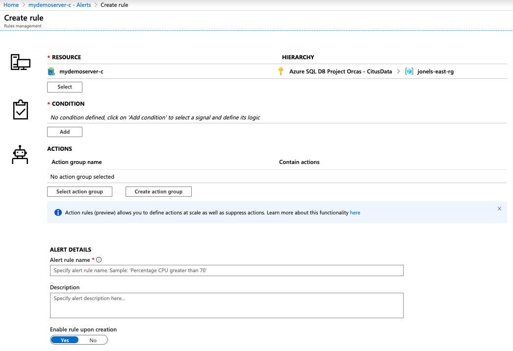
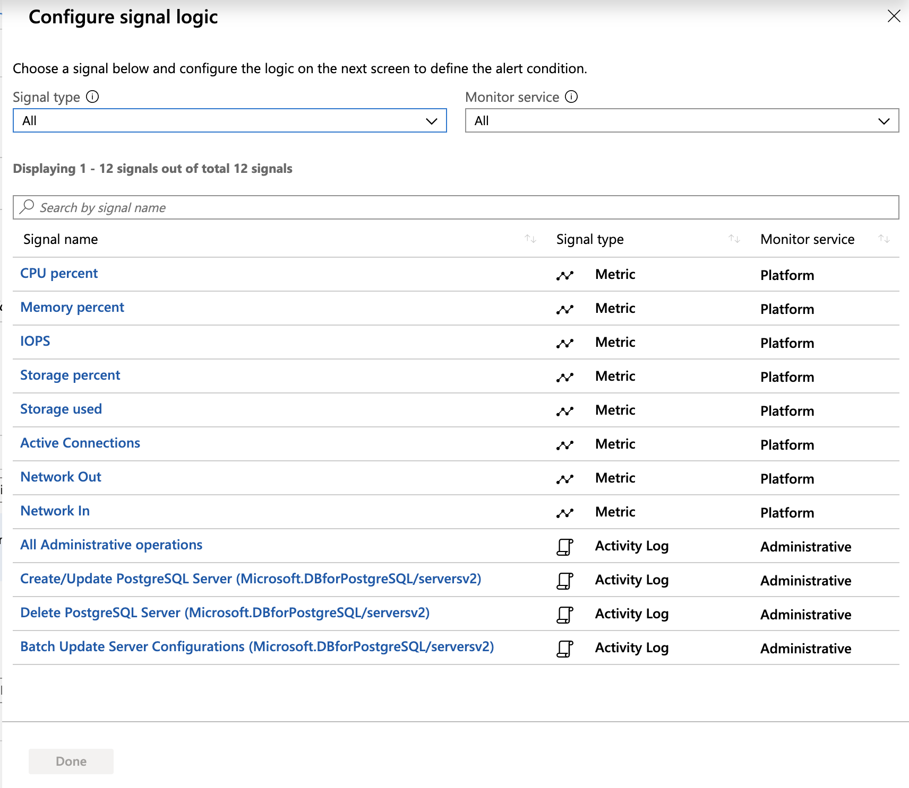
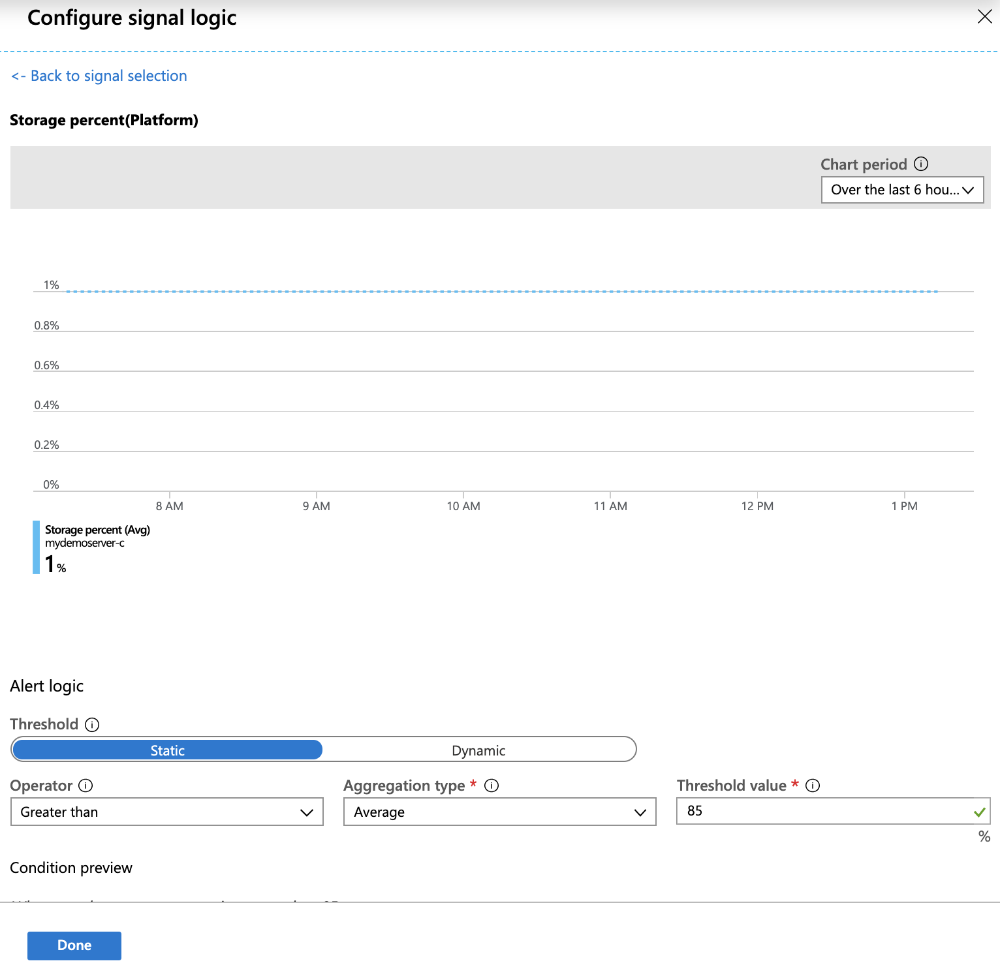
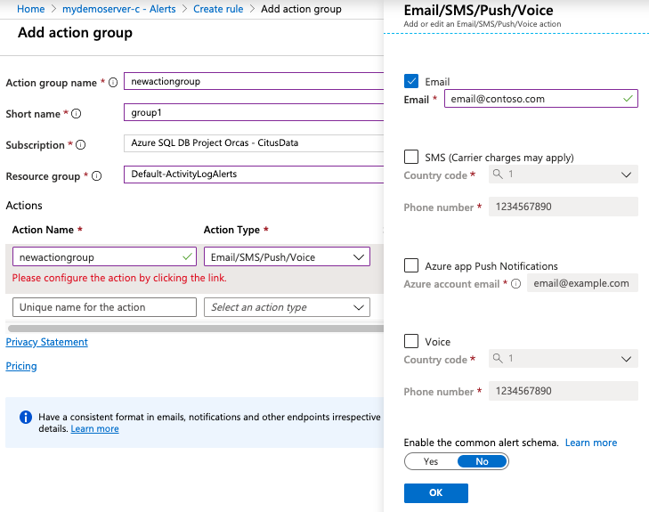
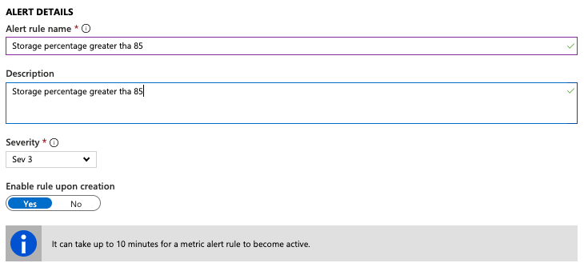

# Use the Azure portal to set up alerts on metrics for Azure Database for PostgreSQL - Hyperscale (Citus)

This article shows you how to set up Azure Database for PostgreSQL alerts using the Azure portal. You can receive an alert based on [monitoring metrics](concepts-hyperscale-monitoring.md) for your Azure services.

We'll set up an alert to trigger when the value of a specified metric crosses a threshold. The alert triggers when the condition is first met, and continues to trigger afterwards.

You can configure an alert to do the following actions when it triggers:
* Send email notifications to the service administrator and coadministrators.
* Send email to additional emails that you specify.
* Call a webhook.

You can configure and get information about alert rules using:
* [Azure portal](../azure-monitor/platform/alerts-metric.md#create-with-azure-portal)
* [Azure CLI](../azure-monitor/platform/alerts-metric.md#with-azure-cli)
* [Azure Monitor REST API](https://docs.microsoft.com/rest/api/monitor/metricalerts)

## Create an alert rule on a metric from the Azure portal
1. In the [Azure portal](https://portal.azure.com/), select the Azure Database for PostgreSQL server you want to monitor.

2. Under the **Monitoring** section of the sidebar, select **Alerts** as shown:

   

3. Select **New alert rule** (+ icon).

4. The **Create rule** page opens as shown below. Fill in the required information:

   

5. Within the **Condition** section, select **Add**.

6. Select a metric from the list of signals to be alerted on. In this example, select "Storage percent".
   
   

7. Configure the alert logic:

    * **Operator** (ex. "Greater than")
    * **Threshold value** (ex. 85 percent)
    * **Aggregation granularity** amount of time the metric rule must be satisfied before the alert triggers (ex. "Over the last 30 minutes")
    * and **Frequency of evaluation** (ex. "1 minute")
   
   Select **Done** when complete.

   

8. Within the **Action Groups** section, select **Create New** to create a new group to receive notifications on the alert.

9. Fill out the "Add action group" form with a name, short name, subscription, and resource group.

    

10. Configure an **Email/SMS/Push/Voice** action type.
    
    Choose "Email Azure Resource Manager Role" to send notifications to subscription owners, contributors, and readers.
   
    Select **OK** when completed.

    

11. Specify an Alert rule name, Description, and Severity.

     

12. Select **Create alert rule** to create the alert.

    Within a few minutes, the alert is active and triggers as previously described.

### Managing alerts

Once you've created an alert, you can select it and do the following actions:

* View a graph showing the metric threshold and the actual values from the previous day relevant to this alert.
* **Edit** or **Delete** the alert rule.
* **Disable** or **Enable** the alert, if you want to temporarily stop or resume receiving notifications.

## Suggested alerts

### Disk space

Monitoring and alerting is important for every production Hyperscale (Citus) server group. The underlying PostgreSQL database requires free disk space to operate correctly. If the disk becomes full, the database server node will go offline and refuse to start until space is available. At that point, it requires a Microsoft support request to fix the situation.

We recommend setting disk space alerts on every node in every server group, even for non-production usage. Disk space usage alerts provide the advance warning needed to intervene and keep nodes healthy. For best results, try a series of alerts at 75%, 85%, and 95% usage. The percentages to choose depend on data ingestion speed, since fast data ingestion fills up the disk faster.

As the disk approaches its space limit, try these techniques to get more free space:

* Review data retention policy. Move older data to cold storage if feasible.
* Consider [adding nodes](howto-hyperscale-scaling.md#add-worker-nodes) to the server group and rebalancing shards. Rebalancing distributes the data across more computers.
* Consider [growing the capacity](howto-hyperscale-scaling.md#increase-or-decrease-vcores-on-nodes) of worker nodes. Each worker can have up to 2 TiB of storage. However adding nodes should be attempted before resizing nodes because adding nodes completes faster.

### CPU usage

Monitoring CPU usage is useful to establish a baseline for performance. For example, you may notice that CPU usage is usually around 40-60%. If CPU usage suddenly begins hovering around 95%, you can recognize an anomaly. The CPU usage may reflect organic growth, but it may also reveal a stray query. When creating a CPU alert, set a long aggregation granularity to catch prolonged increases and ignore momentary spikes.

## Next steps
* Learn more about [configuring webhooks in alerts](../azure-monitor/platform/alerts-webhooks.md).
* Get an [overview of metrics collection](../monitoring-and-diagnostics/insights-how-to-customize-monitoring.md) to make sure your service is available and responsive.
