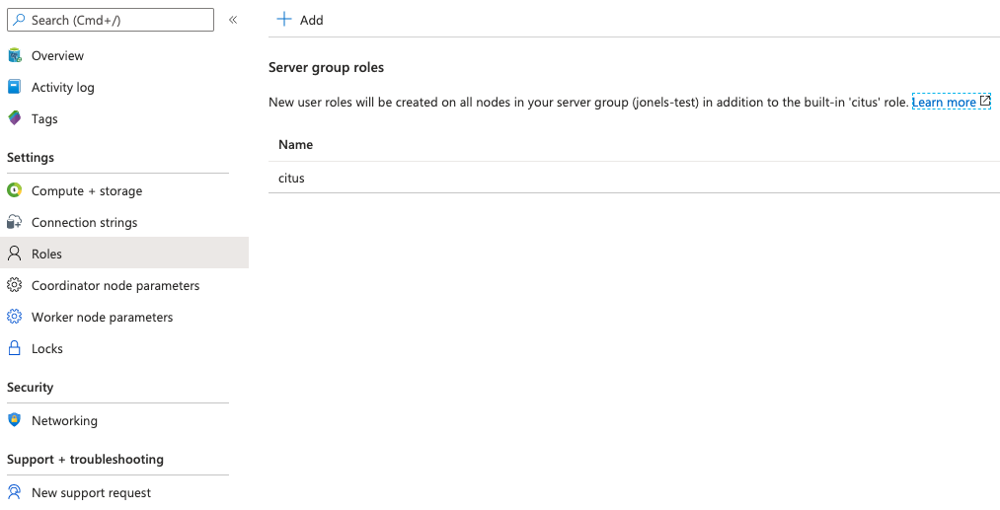

# Create users in Azure Database for PostgreSQL - Hyperscale (Citus)

> [!NOTE]
> The term "users" refers to users within a Hyperscale (Citus)
> server group. To learn instead about Azure subscription users and their
> privileges, visit the [Azure role based access control (RBAC)
> article](../role-based-access-control/built-in-roles.md) or review [how to
> customize roles](../role-based-access-control/custom-roles.md).

## The server admin account

The PostgreSQL engine uses
[roles](https://www.postgresql.org/docs/current/sql-createrole.html) to control
access to database objects, and a newly created Hyperscale (Citus) server group
comes with several roles pre-defined:

* The [default PostgreSQL roles](https://www.postgresql.org/docs/current/default-roles.html)
* `azure_pg_admin`
* `postgres`
* `citus`

Since Hyperscale is a managed PaaS service, only Microsoft can sign in with the
`postgres` super user role. For limited administrative access, Hyperscale
provides the `citus` role.

Permissions for the `citus` role:

* Read all configuration variables, even variables normally visible only to
  superusers.
* Read all pg\_stat\_\* views and use various statistics-related extensions --
  even views or extensions normally visible only to superusers.
* Execute monitoring functions that may take ACCESS SHARE locks on tables,
  potentially for a long time.
* [Create PostgreSQL extensions](concepts-hyperscale-extensions.md) (because
  the role is a member of `azure_pg_admin`).

Notably, the `citus` role has some restrictions:

* Can't create roles
* Can't create databases

## How to create additional user roles

As mentioned, the `citus` admin account lacks permission to create additional
users. To add a user, use the Azure portal interface.

1. Go to the **Roles** page for your Hyperscale server group, and click **+ Add**:

   

2. Enter the role name and password. Click **Save**.

   

The user will be created on the coordinator node of the server group,
and propagated to all the worker nodes. Roles created through the Azure
portal have the `LOGIN` attribute, which means they are true users who
can sign in to the database.

## How to modify privileges for user role

New user roles are commonly used to provide database access with restricted
privileges. To modify user privileges, use standard PostgreSQL commands, using
a tool such as PgAdmin or psql. (See [connecting with
psql](quickstart-create-hyperscale-portal.md#connect-to-the-database-using-psql)
in the Hyperscale (Citus) quickstart.)

For example, to allow `db_user` to read `mytable`, grant the permission:

```sql
GRANT SELECT ON mytable TO db_user;
```

Hyperscale (Citus) propagates single-table GRANT statements through the entire
cluster, applying them on all worker nodes. It also propagates GRANTs that are
system-wide (e.g. for all tables in a schema):

```sql
-- applies to the coordinator node and propagates to workers
GRANT SELECT ON ALL TABLES IN SCHEMA public TO db_user;
```

## How to delete a user role or change their password

To update a user, visit the **Roles** page for your Hyperscale server group,
and click the ellipses **...** next to the user. The ellipses will open a menu
to delete the user or reset their password.

   

The `citus` role is privileged and can't be deleted.

## Next steps

Open the firewall for the IP addresses of the new users' machines to enable
them to connect: [Create and manage Hyperscale (Citus) firewall rules using
the Azure portal](howto-hyperscale-manage-firewall-using-portal.md).

For more information about database user account management, see PostgreSQL
product documentation:

* [Database Roles and Privileges](https://www.postgresql.org/docs/current/static/user-manag.html)
* [GRANT Syntax](https://www.postgresql.org/docs/current/static/sql-grant.html)
* [Privileges](https://www.postgresql.org/docs/current/static/ddl-priv.html)
