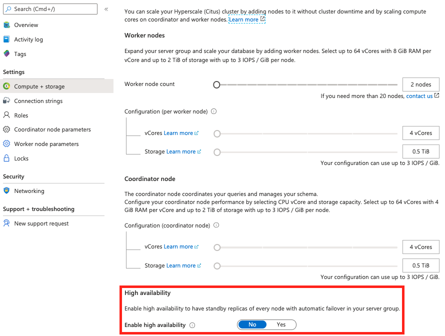

# Configure Hyperscale (Citus) high availability

Azure Database for PostgreSQL - Hyperscale (Citus) provides high availability
(HA) to avoid database downtime. With HA enabled, every node in a server group
will get a standby. If the original node becomes unhealthy, its standby will be
promoted to replace it.

> [!IMPORTANT]
> Because HA doubles the number of servers in the group, it will also double
> the cost.

Enabling HA is possible during server group creation, or afterward in the
**Configure** tab for your server group in the Azure portal. The user interface
looks similar in either case. Drag the slider for **High availability** to YES:

Click the **Save** button to apply your selection. Enabling HA can take some
time as the server group provisions standbys and streams data to them.

The **Overview** tab for the server group will list all nodes and their
standbys, along with a **High availability** column indicating whether HA is
successfully enabled for each node.

### Next steps

Learn more about [high availability](concepts-hyperscale-high-availability.md).
