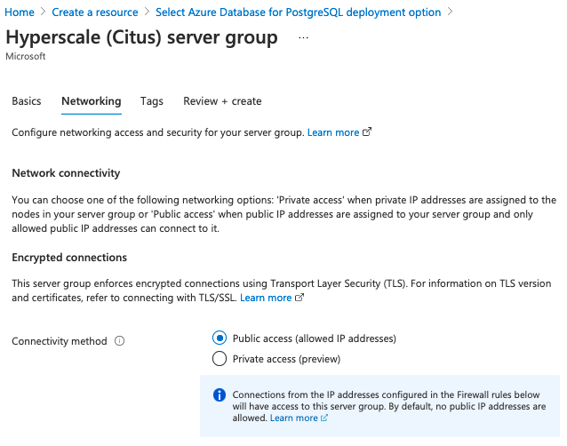
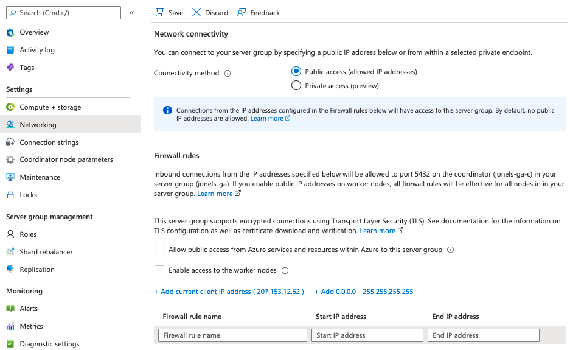
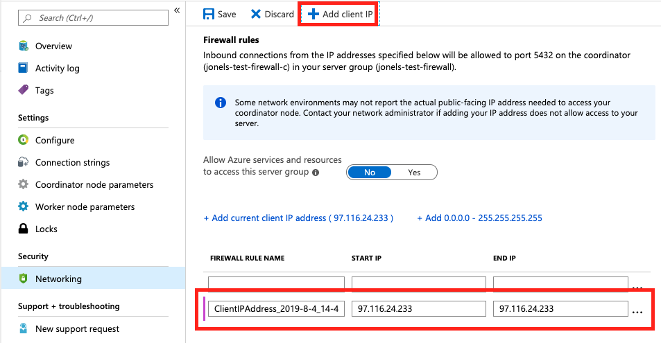

# Manage firewall rules for Azure Database for PostgreSQL - Hyperscale (Citus)
Server-level firewall rules can be used to manage access to a Hyperscale (Citus) coordinator node from a specified IP address or range of IP addresses.

## Prerequisites
To step through this how-to guide, you need:
- A server group [Create an Azure Database for PostgreSQL – Hyperscale (Citus) server group](quickstart-create-hyperscale-portal.md).

## Create a server-level firewall rule in the Azure portal

> [!NOTE]
> These settings are also accessible during the creation of an Azure Database for PostgreSQL - Hyperscale (Citus) server group. Under the **Networking** tab, click **Public endpoint**.
> 

1. On the PostgreSQL server group page, under the Security heading, click **Networking** to open the Firewall rules.

   

2. Click **Add client IP**, either on the toolbar (option A below), or in the link (option B). Either way automatically creates a firewall rule with the public IP address of your computer, as perceived by the Azure system.

   

Alternately, clicking **+Add 0.0.0.0 - 255.255.255.255** (to the right of option B) allows not just your IP, but the whole internet to access the coordinator node's port 5432. In this situation, clients still must login with the correct username and password to use the cluster. Nevertheless, we recommend allowing worldwide access for only short periods of time and for only non-production databases.

3. Verify your IP address before saving the configuration. In some situations, the IP address observed by Azure portal differs from the IP address used when accessing the internet and Azure servers. Therefore, you may need to change the Start IP and End IP to make the rule function as expected.
   Use a search engine or other online tool to check your own IP address. For example, search for "what is my IP."

   

4. Add additional address ranges. In the firewall rules, you can specify a single IP address or a range of addresses. If you want to limit the rule to a single IP address, type the same address in the field for Start IP and End IP. Opening the firewall enables administrators, users, and applications to access the coordinator node on port 5432.

5. Click **Save** on the toolbar to save this server-level firewall rule. Wait for the confirmation that the update to the firewall rules was successful.

## Connecting from Azure

There is an easy way to grant Hyperscale database access to applications hosted on Azure (such as an Azure Web Apps application, or those running in an Azure VM). Simply set the **Allow Azure services and resources to access this server group** option to **Yes** in the portal from the **Networking** pane and hit **Save**.

> [!IMPORTANT]
> This option configures the firewall to allow all connections from Azure including connections from the subscriptions of other customers. When selecting this option, make sure your login and user permissions limit access to only authorized users.

## Manage existing server-level firewall rules through the Azure portal
Repeat the steps to manage the firewall rules.
* To add the current computer, click the button to + **Add client IP**. Click **Save** to save the changes.
* To add additional IP addresses, type in the Rule Name, Start IP Address, and End IP Address. Click **Save** to save the changes.
* To modify an existing rule, click any of the fields in the rule and modify. Click **Save** to save the changes.
* To delete an existing rule, click the ellipsis […] and click **Delete** to remove the rule. Click **Save** to save the changes.

## Next steps
- Learn more about [Concept of firewall rules](concepts-hyperscale-firewall-rules.md), including how to troubleshoot connection problems.
