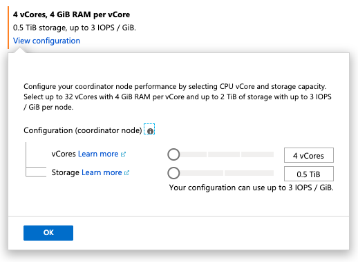

# Scale a Hyperscale (Citus) server group

Azure Database for PostgreSQL - Hyperscale (Citus) provides self-service
scaling to deal with increased load. The Azure portal makes it easy to either
add new worker nodes or increase existing nodes’ memory, disk, and CPU
capacity.

To scale worker nodes, go to the **Configure** tab in your Azure Database for
PostgreSQL server group. Adjust the sliders to change the values:


> [!NOTE]
> Once increased, the number of worker nodes cannot be decreased using the
> slider. Decreasing the worker count currently requires opening a support
> ticket.
>
> Also, the per worker vCores and Storage cannot yet be adjusted with this user
> interface. Doing so also requires opening a support ticket.

To take advantage of newly added nodes you must rebalance distributed table
[shards](concepts-hyperscale-distributed-data.md#shards), meaning move some
shards from existing nodes to the new ones. To start the shard rebalancer,
connect to the cluster coordinator node with psql and run:

```sql
SELECT rebalance_table_shards('distributed_table_name');
```

The `rebalance_table_shards` function rebalances all tables in the
[colocation](concepts-hyperscale-colocation.md) group of the table named in its
argument. Thus you do not have to call the function for every distributed
table, just call it on a representative table from each colocation group.

## Scale the coordinator node

Applications send their queries to the coordinator node, which relays them to
the relevant workers and accumulates the results. Scaling the coordinator can
improve performance for queries that require large or CPU-intensive
aggregations. To do so, click **View configuration** and adjust the sliders:



## Next steps

Learn more about server group [performance
options](concepts-hyperscale-configuration-options.md).
