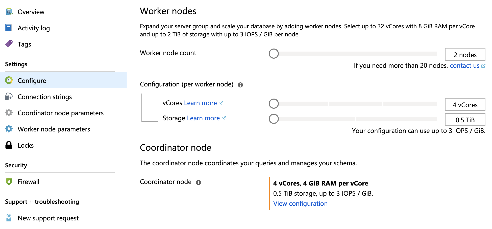

# Scale a Hyperscale (Citus) server group

Azure Database for PostgreSQL - Hyperscale (Citus) provides self-service
scaling to deal with increased load. The Azure portal makes it easy to add new
worker nodes, and to increase the vCores of existing nodes.

## Add worker nodes

To add nodes, go to the **Configure** tab in your Hyperscale (Citus) server
group.  Dragging the slider for **Worker node count** changes the value.



Click the **Save** button to make the changed value take effect.

> [!NOTE]
> Once increased and saved, the number of worker nodes cannot be decreased
> using the slider.

### Rebalance shards

To take advantage of newly added nodes you must rebalance distributed table
[shards](concepts-hyperscale-distributed-data.md#shards), which means moving
some shards from existing nodes to the new ones. First verify that the new
workers have successfully finished provisioning. Then start the shard
rebalancer, by connecting to the cluster coordinator node with psql and
running:

```sql
SELECT rebalance_table_shards('distributed_table_name');
```

The `rebalance_table_shards` function rebalances all tables in the
[colocation](concepts-hyperscale-colocation.md) group of the table named in its
argument. Thus you do not have to call the function for every distributed
table, just call it on a representative table from each colocation group.

## Increase or decrease vCores on nodes

> [!NOTE]
> This feature is currently in preview. To request a change in vCores for
nodes in your server group, please [contact Azure
support](https://portal.azure.com/?#blade/Microsoft_Azure_Support/HelpAndSupportBlade).

In addition to adding new nodes, you can increase the capabilities of existing
nodes. Adjusting compute capacity up and down can be useful for performance
experiments as well as short- or long-term changes to traffic demands.

To change the vCores for all worker nodes, adjust the **vCores** slider under
**Configuration (per worker node)**. The coordinator node's vCores can be
adjusted independently. Click the **Change configuration** link under
**coordinator node**. A dialog will appear with sliders for the vCores and
Storage capacity of the coordinator. Change the sliders as desired and select
**OK**.

## Next steps

Learn more about server group [performance
options](concepts-hyperscale-configuration-options.md).
